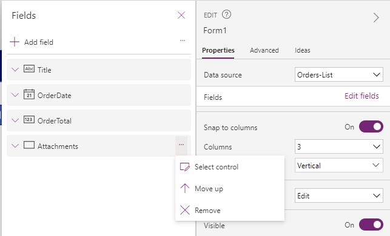
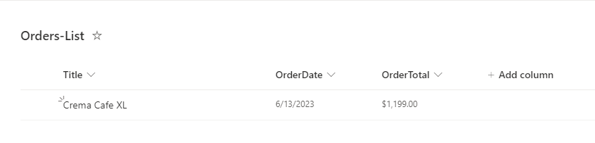

Consider a scenario where you want users within your company, Contoso, to order their own coffee machines. Contoso wants you to build an app that you can share with anyone who handles that process.

In this exercise, you'll set up a couple of SharePoint lists to store the coffee machine data and the order data. Then, you'll create a Power Apps canvas app to interact with that data and place orders.

## Create the machine list
Your first task is to create the machine list:

1. Download the [Machine Order Data](https://github.com/MicrosoftDocs/mslearn-developer-tools-power-platform/blob/master/power-apps/machine-order-data/Machine-Order-Data.xlsx) Excel file.

1. Go to a SharePoint Online site where you want to store your app data.

1. In the upper-left corner, select **New > List**.

1. Select the **From Excel** option.

   > [!div class="mx-imgBorder"]
   > 

1. Select **Upload file** and then select the **Machine-Order-Data.xlsx** file that you previously downloaded.

1. On the **Customize** page, make sure that the **Machines** table is selected from the **Select a table from this file** dropdown menu and then select **Next** in the lower-right corner.

   > [!div class="mx-imgBorder"]
   > 

1. Select the **Create** button.

When the list has been created, your browser should automatically direct you to the newly created list. All data from your Excel sheet should be loaded and ready for you to use.

## Create the orders list
Next, you'll create the orders list by following these steps:

1. Select the **Home** option in the upper-left corner, under your SharePoint site name.

1. In the upper-left corner, select **New > List**.

1. Select **Blank list**.

1. Name your list **Orders-List** and then select **Create**.

   > [!div class="mx-imgBorder"]
   > 

1. On the **Orders-List** page, select **Add column**.

1. Select **Date and time** and then select **Next**.

1. Name this column **OrderDate** and then select **Save**.

   > [!div class="mx-imgBorder"]
   > 

1. Select **Add column** again.

1. Scroll down and select **Currency** and then select **Next**.

1. Name this column **OrderTotal** and then select **Save**.

Now, you have a SharePoint list that you can use to store order data for the coffee machines.

## Create the canvas app
Follow these steps to create the canvas app in Power Apps:

1. Go to [make.powerapps.com](https://make.powerapps.com/).

1. Select the **Create** option on the left.

1. Select **Blank app**.

   > [!div class="mx-imgBorder"]
   > 

1. Select the **Create** option under **Blank canvas app**.

1. Name your app **Contoso Coffee Machine Ordering** and then select the **Create** button.

1. After a brief wait, you'll be directed to the canvas app editor where you'll design and edit your Power Apps application that interacts with your SharePoint data.

   > [!div class="mx-imgBorder"]
   > 

1. Select the **Save** icon in the upper-right corner. (By default, Power Apps automatically saves your app every two minutes, but only after the first time that you save manually; therefore, it's always a good idea to save your app after you've created it).

1. Select the **Add data** dropdown menu.

1. Search for and select **SharePoint** (the standard SharePoint option, not SharePoint Sites). You might need to scroll down the results to find it.

   > [!div class="mx-imgBorder"]
   > 

1. A panel will open on the right side of the screen. Make sure that the **Connect directly (cloud services)** option is selected and then select **Connect** in the lower part of the screen.

1. The SharePoint site where you created your machine lists should appear from the list of recent sites. If not, search for its name or enter its URL in the upper part of the screen. When the correct site appears, select it.

1. Select the **Machine-Order-Data** and **Orders-List** checkboxes.

1. Select **Connect**.

   > [!div class="mx-imgBorder"]
   > 

You've now created and connected your Power Apps application to your data so that you can read and write back to SharePoint directly through the app.

## Design the canvas app
In this task, you'll design the canvas app.

1. In the upper ribbon, select **Insert > Text label**.

   > [!div class="mx-imgBorder"]
   > 

1. Move the label that appears to the upper-left corner of the canvas and then resize it to stretch across the entire canvas.

1. On the right side of the screen, you can edit the control properties in your canvas apps by using a friendly interface and without needing to edit code. With the label still selected, change the text to **Contoso Coffee Machine Ordering**.

1. Change the **Font size** to **18**.

1. For **Text alignment**, select **center**.

1. Next to color, the letter **A** icon indicates text color and the paint bucket icon indicates the background color of that label. Select the **A** text color icon and then select **white**.

1. Select the paint bucket icon and then choose a dark blue (or any other color that you want).

   > [!div class="mx-imgBorder"]
   > 

1. In the upper ribbon, select **Insert > Vertical gallery**.

1. A pop-up window appears, prompting you to connect the gallery to a data source. Select **Machine-Order-Data**.

1. On the **Properties** pane of the gallery, on the right of the screen, next to the **Fields** property, select **Edit**.

1. Change the **Subtitle1** dropdown menu to **Price** and the **Title1** dropdown menu to **Machine Name**.

1. The text that's displaying in your gallery should change. Close the **Properties** pane. Resize the gallery to fit under the header label so that it's about half of the screen.

1. Select the first image icon in the gallery. In the upper part of the screen, in the formula bar where you can write code to change the properties of a control in Power Apps, delete the **SampleImage** text and then enter `ThisItem.Photo`.

   > [!div class="mx-imgBorder"]
   > 

1. On the left tree view, select **Subtitle1**.

   > [!div class="mx-imgBorder"]
   > 

1. In the upper part of the screen, change the formula for **Text** to be `Text(ThisItem.Price,"$##,###.00")`. This change will format the price label.

1. In the upper ribbon, select **Insert > Edit form**.

1. Reposition and resize the form to fit the right half of your canvas.

1. Make sure that the newly created form is selected. On the **Properties** pane on the right, select the **Data source** dropdown menu and then select **Orders-List**.

1. The form automatically fills in the fields from your SharePoint list and corresponding controls. On the **Properties** pane, select **Edit fields**.

1. Select the ellipsis (**...**) next to **Attachments** and then select **Remove**.

   > [!div class="mx-imgBorder"]
   > 

1. Select the **Title** card on the form. On the **Properties** pane, select the **Advanced** tab and then select the **Unlock to change properties** button.

1. Select the **OrderDate** card on the form and then unlock that card also.

1. Select the **OrderTotal** card on the form and unlock it.

1. Select the text input box under **Title** in your form.

1. Change the **Default formula** to `Gallery1.Selected.'Machine Name'`.

1. Select the date picker control under **OrderDate** and then change the formula to `Today()`.

1. Select the text input box under **OrderTotal** and then change the formula to `Gallery1.Selected.Price`.

1. Select the entire form. In the upper-left corner, the **DataSource** dropdown menu will likely show. By selecting this dropdown menu, you can choose any property that's available for a control and change the formula that's processing for that control property. In this case, you'll change the **Item** property of the form, so select that dropdown menu and then select **Item**.

   > [!div class="mx-imgBorder"]
   > 

1. In the formula for **Item**, enter `Defaults('Orders-List')`.

1. In the upper ribbon, select **Insert > Button**.

1. Move the button to the appropriate location on the right side of your screen.

1. On the **Properties** pane, change the text to **Submit Order**.

1. With the button selected, in the upper formula bar, enter `SubmitForm(Form1)`.

Now, you have an app where users can select a coffee machine, preview their order, and submit the order. Your finished app should resemble the following image.

> [!div class="mx-imgBorder"]
> 

If you select the **Play** (triangle) button in the upper-right corner, you can test your new app. Select a coffee machine and then select the **Submit Order** button. If you return to the **Orders-List** on your SharePoint site, a newly created order should display.

> [!div class="mx-imgBorder"]
> 

After completing this exercise, you can build on this app or your **Orders-List**. Additionally, you can add new properties, design, or functionality that meets the different needs of your company.
