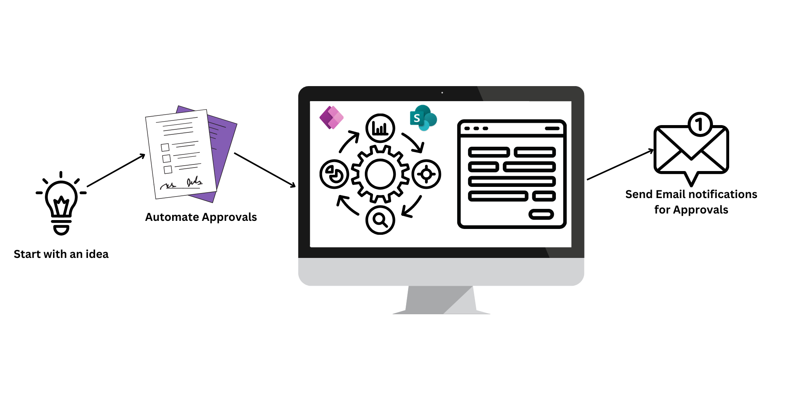
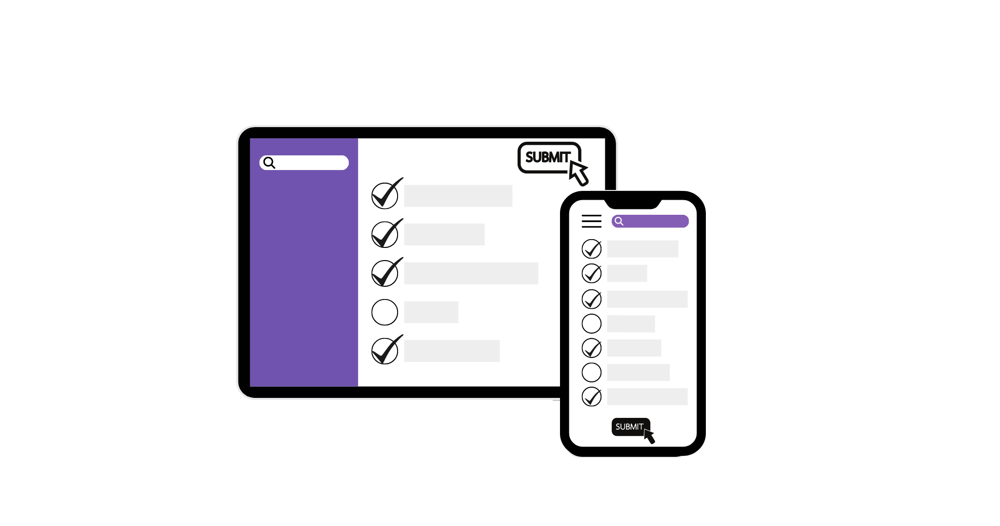

> [!VIDEO https://www.microsoft.com/videoplayer/embed/RW17oXe] 

Microsoft Power Apps can help give your business processes a modern makeover. With Power Apps, you’ll no longer need to use paper forms, outdated systems, and overly complex Microsoft Excel spreadsheets. Instead, you can use Power Apps to build exceptional apps that interact with your existing data by using its substantial collection of over 900 connectors. This module focuses on only one of those connectors that you might already be familiar with: SharePoint.

Microsoft Power Apps and SharePoint work well together to help you build custom business applications and make collaboration near effortless.

Power Apps is about making app development easier. You don't need to be a coding expert because it's a low-code platform. It has a visual interface and ready-to-use templates, controls, and connectors. With Power Apps, you can quickly create web and mobile apps that connect to different data sources, such as databases, cloud services, and SharePoint.

SharePoint is a digital hub for your team, where you can store, organize, and share information in one convenient location. Additionally, you can create sites, lists, libraries, and pages to collaborate on documents, manage tasks, and track projects. SharePoint integrates with Microsoft Office applications, making your work more streamlined.

## How Power Apps and SharePoint combine

You can embed Power Apps within SharePoint so that you can create custom forms and apps that interact with your SharePoint lists and libraries. As a result, you can extend SharePoint's capabilities and build solutions that are tailored to your needs.

Power Apps can directly connect to your SharePoint data, meaning that you can fetch, update, and manipulate your SharePoint lists and libraries directly from your Power Apps applications. By using Power Apps, you can work with your SharePoint data in a more interactive and dynamic way.

Also, you can use Power Apps to create workflows and automate processes in SharePoint. For example, you can set up approval workflows, notifications, or custom actions that start when certain conditions are met within SharePoint, thus saving you time and effort.

> [!div class="mx-imgBorder"]
> 

You can store data that you've collected in your Power Apps directly in SharePoint to ensure that everything is centralized for easier accessibility and to share with your team.

By teaming Power Apps and SharePoint, you can create personalized apps, automate workflows, and take full advantage of SharePoint's collaborative features. It's the ultimate power duo to help you boost productivity and efficiency in your organization. By bringing together Power Apps and SharePoint, you can use the strengths of both tools to create customized forms, build standalone apps with SharePoint as the data source, and enhance your user experience.

> [!div class="mx-imgBorder"]
> 
