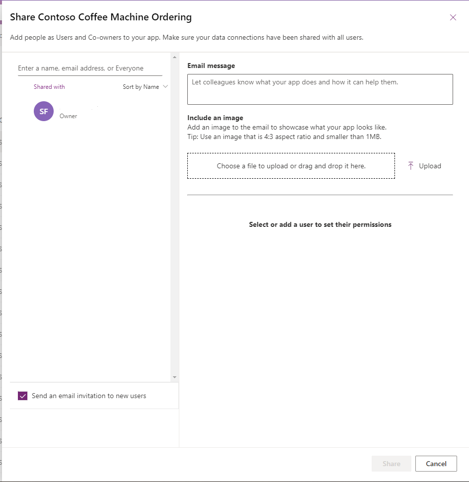
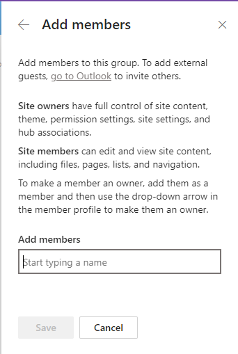
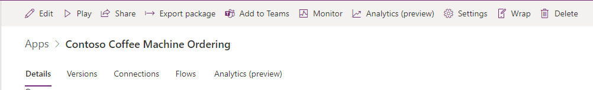

When you have a Power Apps application that you want others to use, you'll need to publish it. Publishing makes the app available to other people in your organization. The system does so by packaging the app and making it ready for others to use, including all its design, features, and connections to data. In the Power Apps editor, select the icon in the upper-right corner to save and publish your app.

After you've published your app, you'll likely want to share it with specific individuals or groups, giving them access to use or edit the Power Apps application. To do so, select the app in the maker portal (make.powerapps.com) and then select **Share**. You can share the app with an individual by entering their email address, or you can share it with a group by specifying a distribution list or security group. Selecting the **Co-owner** checkbox allows that person or group to edit the app, making them a co-owner. If you don't select the **Co-owner** checkbox, the person or group that you're sharing the app with will only be able to use the app.

> [!div class="mx-imgBorder"]
> 

Similarly, you need to share the SharePoint site that the Power Apps application is using with the same people or group that you shared the app with. On the SharePoint site, select the **X members** text in the upper-right corner of the page. Then, add the email address or group name of the users that you want to add. You can decide what type of access they have, such as read-only or editing permissions, depending on whether they're added as a member or owner.

> [!div class="mx-imgBorder"]
> 

When you use Power Apps and SharePoint together, you'll need to consider the permissions in both systems. If you embed a Power Apps application within a SharePoint site or use SharePoint as a data source in Power Apps, users need the right permissions in both systems to complete actions and view the data.

## Versions and recovery

App versioning is another useful feature in Power Apps. It allows you to manage different versions of your app over time. Whenever you make changes to your app, you can save a new version to keep track of the previous state and all modifications that you've made. This way, you can always return to a previous version if needed and have a history of the changes that you've made to the app. To view your app versions, select your app in the maker portal (make.powerapps.com), select **Details**, and then select the **Versions** tab. On this tab, you can view which version of your app is published (Live) or select any previous version of the app to restore.

> [!div class="mx-imgBorder"]
> 

SharePoint has a recycle bin feature that acts like a temporary storage for deleted items. When you delete something like a document or a list item, it goes to the recycle bin instead of being permanently deleted. If you have sufficient permissions, you can restore items from the recycle bin or delete them permanently. As a result, if you've unintentionally deleted something, you can quickly recover that data.

By understanding these concepts, you can effectively share, publish, govern, and help secure your Power Apps and SharePoint sites, making collaboration and management easier within your organization.
