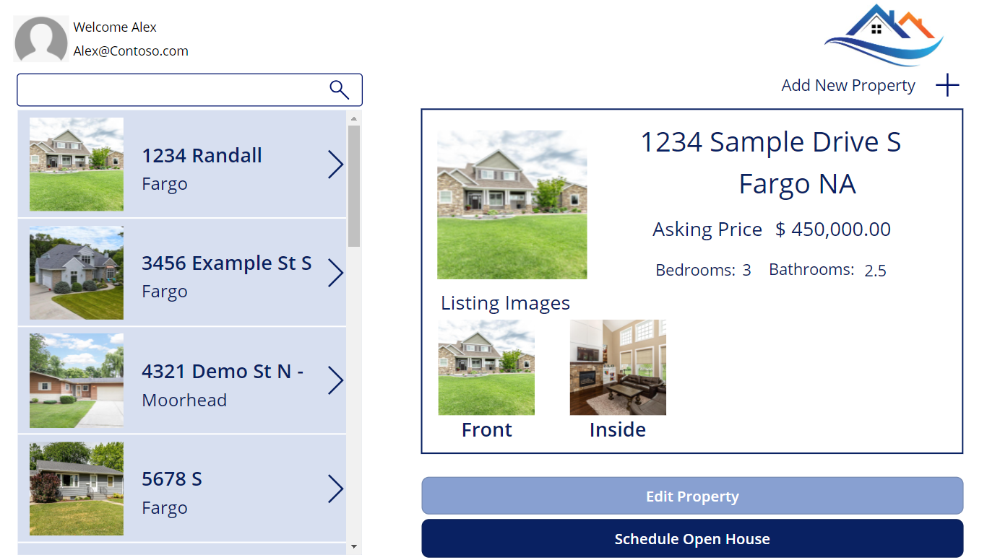
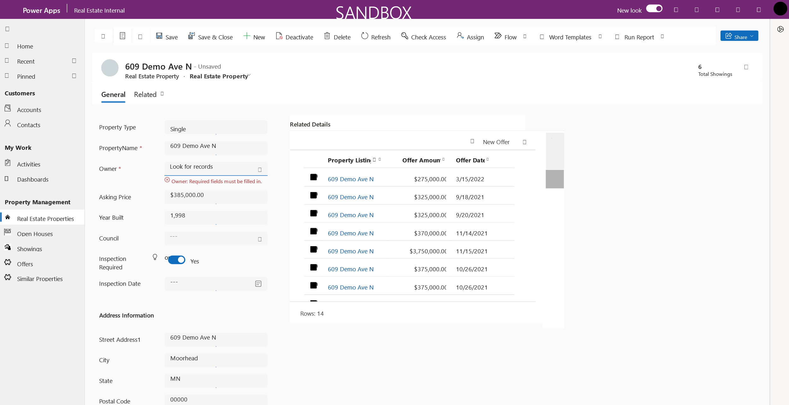

As a maker, you might find that people frequently ask you to create an application that fits a specific need. For example, you might create an app that users from a specific department can consume to help them perform a job function or task. One critical decision that you need to make is to determine which type of app to create. Determining the type of app to create depends on multiple factors, such as what you need the application to do, who plans to consume it, the data that you need to connect to, and more.

This unit provides guidance to help you determine the app type to use. Before you explore different apps for different scenarios, you should review the app types that are available in Power Apps.

## Canvas apps

Canvas apps start with a user experience. With canvas apps, you can create a highly tailored interface by using a blank canvas and then connect it to your choice of data sources. You can connect a single canvas application to multiple data sources. Additionally, you can build canvas applications to use as web, mobile, or tablet applications.

Because of its flexibility, a canvas app is the app type that most people consider when they think of Power Apps. As a maker, you have complete control over the entire process, and you have the flexibility to arrange the user experience and interface the way that you want it. Based on your specific needs, your creativity and business sense can guide your decisions about how your apps appear and behave.

Often, you would build canvas applications based on data sources, such as a SharePoint site, database, or a Power BI dashboard.

The following image shows an example of a canvas application for a real estate agent.

> [!div class="mx-imgBorder"]
> 

## Model-driven apps

Model-driven apps differ from canvas applications in that they start with a data model. Unlike canvas apps, model-driven applications are always connected to Microsoft Dataverse. The system uses this connection to generate forms, views, and other components that you can include in your model-driven application. Another advantage of model-driven applications is that they automatically generate a UI that's responsive across devices.

You can generate model-driven applications quickly because they provide elements such as forms, views, charts, dashboards, business logic, and process flows. Moreover, you can tailor each element to fit the specific needs of your app.

In addition to the built-in elements, model-driven applications can also include items, such as websites and custom pages, in your app. Custom pages provide the flexibility of canvas applications directly inside your model-driven application.

> [!div class="mx-imgBorder"]
> 

The most common use of model-driven applications is in scenarios where the data and processes that are being delivered are critical.

For more information, see the following resources for building model-driven applications:

-   [Create an app](/dynamics365/customer-engagement/customize/create-edit-app/?azure-portal=true)

-   [Create and design forms](/dynamics365/customer-engagement/customize/create-design-forms/?azure-portal=true)

-   [Create or edit views](/dynamics365/customer-engagement/customize/create-edit-views/?azure-portal=true)

-   [Create or edit a system chart](/dynamics365/customer-engagement/customize/create-edit-system-chart/?azure-portal=true)

-   [Create or edit dashboards](/dynamics365/customer-engagement/customize/create-edit-dashboards/?azure-portal=true)

-   [Add security](/dynamics365/customer-engagement/customize/manage-access-apps-security-roles/?azure-portal=true)

-   [Add business logic](/dynamics365/customer-engagement/customize/guide-staff-through-common-tasks-processes/?azure-portal=true)

-   [Converge model-driven and canvas apps using the custom page (preview)](/power-apps/maker/model-driven-apps/model-app-page-overview/?azure-portal=true)

## Cards

Cards is another option that you can use for making apps. Cards are micro apps with lightweight UI elements that you can use across multiple applications that don't require coding or IT expertise. Cards aren't as universally used as canvas and model-driven apps. However, you can quickly design and develop cards that can show business data through Microsoft Power Platform connectors, or you can use your own business logic for more customization.

For more information, see [Cards for Power Apps overview](/power-apps/cards/overview/?azure-portal=true).

## Determine which app to use

Make sure that you have a strong understanding of how canvas and model-driven applications differ. These differences should factor in your decision about which one to use.

To help with your decision making, the following table provides a high-level comparison between the two app types.

|     Use                    |     Canvas app                    |     Model-driven app                      |
|----------------------------|-------------------------------|---------------------------------------|
|     Data source            |     Not Dataverse driven      |     Dataverse driven                  |
|     App purpose            |     Task or screen focused    |     Back office / process focused     |
|     User interface (UI)    |     Custom UI                 |     Responsive / consistent UI        |
|                            |     Device integration        |     User personalization              |
|                            |     Easily embeddable         |     Data relationship navigation    |
|                            |                               |     Security trimming of UI           |

As a maker, how you determine which app to use depends on the following considerations:

-   The purpose of your app

-   Who will use the app and what they plan to do with it

-   The data that users need to access

-   Whether users need to interact with tools on a mobile device, such as a camera or email application

-   Whether the application is more task-centric or focused on network processes

For example, if you plan to connect your application to SharePoint, SQL server, SAP, or any data source that isn't Microsoft Dataverse, then you need to create a canvas application. The reason is because you can only build model-driven applications on top of Dataverse.

Similarly, if the application that you're building needs to include data from multiple data sources, you also need to create a canvas application because you can only associate canvas apps with multiple data sources.

However, exceptions might occur. For example, consider a scenario where you're building an application that primarily uses Dataverse data but needs to access data from other sources in specific cases. In this situation, the better choice might be to build a model-driven application that includes a custom page.

In that case, you should consider the purpose of your app. If the Dataverse-backed app is more task-specific, such as reporting a building issue, then a canvas app might be your best choice. If back-office staff plan to use the application, and you need to focus on their processes, then a model-driven app would be best.

As with the previous scenarios, the following scenarios can help you determine which app to use. 

**Example scenario 1**

-   **Need** - Electric cooperative workers need to capture and log meter readings monthly

-   **Data source** - Microsoft SQL Server

-   **Audience** - Internal users who work in the field

-   **Targeted app type** - Canvas

-   **Justification** - In this instance, you would create a canvas application because the data source is a SQL server. By using the prebuilt SQL connector, you can ensure that your canvas application allows users to interact with a SQL server database.

**Example scenario 2**

-   **Need** - Managers at a real estate company want to effectively manage and report on the properties that they're currently selling

-   **Data source** - Microsoft Dataverse

-   **Audience** - Back-office users

-   **Targeted app type** - Model-driven

-   **Justification** - In this instance, the best choice is to build a model-driven application because it's Dataverse-backed and more process focused.

The first two examples were straightforward; the following examples are less so.

**Example scenario 3**

-   **Need** - Maintenance staff at a college want to have an application where employees can report maintenance issues

-   **Data source** - Microsoft Dataverse

-   **Audience** - Employees

	At initial glance, you could create this app by using a canvas app or a model-driven app because it's connected to Dataverse. However, you need more information to make this decision.

-   **Extra details:**

    -   Users need to submit pictures of the maintenance issue directly from the app.

    -   You need to present the app on no more than two or three screens to make it as simple as possible.

-   **Targeted app type** - Canvas

-   **Justification** - Based on the extra information, you would likely use a canvas app in this situation. Canvas apps can interact with elements, such as cameras on mobile devices, and because of the need for fewer screens, you can accomplish that task with a canvas app.

**Example scenario 4**

-   **Need** - Maintenance staff at a college need to have an application that helps them manage and dispatch maintenance staff to the reported issues

-   **Data source** - Microsoft Dataverse

-   **Audience** - Maintenance staff

	This scenario is one where you could choose a canvas app or a model-driven app, so you need more information to decide.

-   **Extra details:**

    -   Managers want to run reports directly from the app.

    -   Managers want to provide staff with guidance on how to solve issues.

-   **Targeted app type** - Model-driven

-   **Justification** - Based on the extra information, you would likely use a model-driven app in this scenario. The reporting needs, along with the business processes, are more easily completed with model-driven apps.

