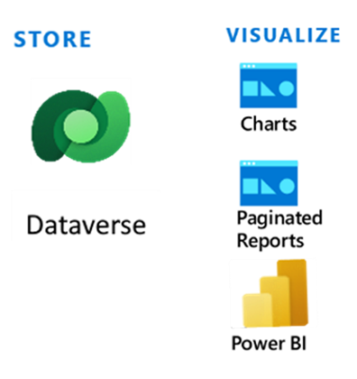
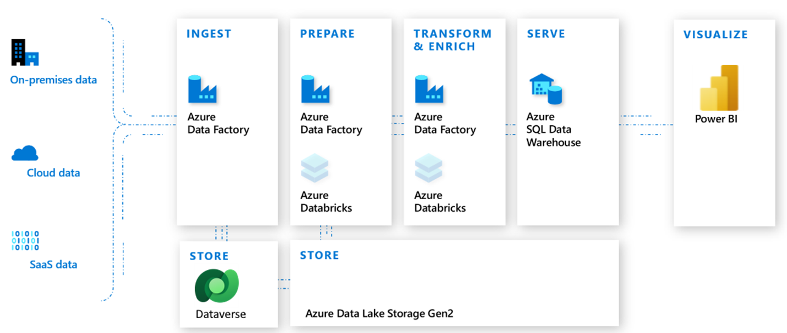

Dataverse is the data platform that comes with Power Apps, and it helps you store and model business data. It's the platform on which Microsoft Dynamics 365 apps (such as Sales, Customer Service, Field Service, Marketing, and Project Service Automation) are built. If you're a Dynamics 365 customer, then your data is already in Dataverse.

Dataverse helps you store and manage data within a set of standard and custom tables, and you can add columns to those tables when you need them. Standard and custom tables within Dataverse provide a more secure and cloud-based storage option for your data. Additionally, you can use Dataverse tables to create a business-focused definition of your organization's data for use within apps. If you're not sure whether tables are your best option, consider these benefits:

-   **Easier to manage** - Metadata and data are stored in the cloud, so the details of how they're stored are managed for you.

-   **Easier to secure** - Data is more securely stored so that users can view it only if you grant them access. With role-based security, you can control access to tables for different users within your organization.

-   **Access your Dynamics 365 data** - Dataverse stores data from your Dynamics 365 applications so that you can quickly build apps that use your Dynamics 365 data and extend your apps with Power Apps.

-   **Rich metadata** - You can use data types and relationships directly within Power Apps.

-   **Logic and validation** - Define calculated columns, business rules, workflows, and business process flows to ensure data quality and drive business processes.

-   **Productivity tools** - Tables are available within the add-ins for Microsoft Excel to increase productivity and ensure data accessibility.

## Work with any type of data

Dataverse is designed to work with any type of data, and it incorporates the major categories of data technologies that your organization needs: relational, non-relational, file, image, search, and data lake.

Dataverse includes a set of visual designers to create, edit, and interact with data. As a result, you can quickly define the tables, relationships, business rules, forms, and workflows that represent your business.

Configurable integration features are built into Dataverse, which includes deep integration with Microsoft Cloud services, such as Microsoft Azure, Dynamics 365, and Microsoft 365. Additionally, Dataverse provides access to many connectors in Power Automate and Microsoft Azure Logic Apps. As a result, Dataverse can connect to the devices, apps, systems, services, and software as a service (SaaS) offerings that contain data for your business.

With little to no code required, you can use Dataverse to help you achieve a wide range of enterprise integration scenarios. These scenarios can range from retrieving data from a spreadsheet that you receive as an email attachment to using Dataverse data in a blockchain network. Now, you can measure integration efforts in hours and minutes rather than in days and weeks.

In addition to providing the means to create data or import it from other systems, Dataverse also supports *virtual tables*. Virtual tables map data in an external data source so that it appears to exist in Dataverse. As a result, Dataverse can run real-time data operations against the external data source.

## Work with any type of app

When an organization wants to create a new app, it can realize other productivity gains by using Dataverse with Power Apps. Power Apps understands the rich metadata that's included in Dataverse. It uses this metadata in multiple ways to help you rapidly build appealing apps that are more secure and scalable and make them available across desktop, web, mobile, and Microsoft Teams.

Organizations that use Power Apps can quickly develop mobile apps for iOS and Android. You can also take advantage of Dataverse mobile offline functionality, which allows apps to collect, query, and interact with data when you're offline.

Some organizations might want to integrate Dataverse data into existing apps or write new apps by using custom code. For those organizations, Dataverse provides a powerful REST-based API, a developer SDK, and a growing list of samples for common scenarios.

Additionally, you can use Dataverse in bot-based apps that deliver intuitive, interactive dialogues with employees, partners, and customers. Whether bots are embedded within Power Apps or custom code, you can build bots by using Microsoft Copilot Studio and Dataverse-backed data.

The goal of Dataverse working with any app means that it should also work with tools that knowledge workers and professional developers use. To help increase productivity, Dataverse is integrated into tools such as Excel, Outlook, Dynamics 365 customer engagement apps, Power BI Desktop, Power Query, Microsoft Azure Data Factory, and Microsoft SQL Server Management Studio.

## Analytics and reporting

Businesses can use Dataverse to gain insights and drive business actions by using analytics and reporting. Dataverse also includes various ways to deliver data and insights to key decision makers.

> [!div class="mx-imgBorder"]
> 

With Dataverse, you can create lightweight charts and paginated reports. Additionally, you can use the data in Dataverse with Power BI to create rich, interactive reports and dashboards.

For organizations that want to employ AI to analyze their data, they can use AI Builder so that everyone in the organization can add AI capabilities to the business process flows that they create and use. AI Builder is delivered as part of Microsoft Power Platform, and it includes six prebuilt AI models that organizations can use in Power Automate and Power Apps to evaluate data within Dataverse.

To support advanced analytics and machine learning, Dataverse includes a managed data lake. Businesses can use data within the lake to run Power BI reporting, machine learning, data warehousing, and other downstream data processing.

> [!div class="mx-imgBorder"]
> 

One benefit of having data in Microsoft Azure Data Lake Storage is that organizations can take advantage of Microsoft Azure Synapse Analytics. This service can deliver added productivity by bringing together enterprise data warehousing, data exploration, code-free data orchestration, deeply integrated Apache Spark and SQL engines, and integrated AI and business intelligence.

## Security

Dataverse uses Microsoft Entra identity and access management mechanisms to help ensure that only authorized users can access the environment, data, and reports.

Dataverse uses role-based security to group together a collection of privileges. You can associate these security roles directly with users, or you can associate the roles with Dataverse teams and business units.

In Dataverse, you can share individual rows on a one-by-one basis with another user. Because row-level control of access isn't adequate for some business scenarios, Dataverse has a column-level security feature to allow more granular control of security at the column level.

Dataverse also includes two security models that you can use for hierarchies: the *manager* hierarchy and the *position* hierarchy. With the manager hierarchy, a manager must be within the same business unit as the report, or in the parent business unit of the report's business unit, to have access to the report's data. The position hierarchy allows data access across business units.

Because Dataverse is built on Azure, it benefits from the Azure platform's powerful security technologies. Encryption of data, at rest and in transit, helps preserve confidentiality.

### Logic and validation

Tables within Dataverse can take advantage of rich server-side logic and validation to ensure data quality and reduce repetitive code in each app that creates and uses data within a table.

-   **Business rules** validate data across multiple columns and tables and provide warning and error messages, regardless of the app that you use to create the data. For more information, see [Create a business rule for a table](/power-apps/maker/data-platform/data-platform-create-business-rule/?azure-portal=true).

-   **Business process flows** guide users to ensure that they enter data consistently and follow the same steps every time. Currently, business process flows are only supported for model-driven apps. For more information, see [Business process flows overview](/power-automate/business-process-flows-overview/?azure-portal=true).

-   **Workflows** allow you to automate business processes without user interaction. For more information, see [Microsoft Dataverse real-time workflows](/power-apps/maker/data-platform/overview-realtime-workflows/?azure-portal=true).

-   **Business logic with code** supports advanced developer scenarios to extend the application directly through code. For more information, see [Apply business logic using code](/power-apps/developer/data-platform/apply-business-logic-with-code/?azure-portal=true).

### Security

Dataverse has a rich security model to help protect the data integrity and privacy of users while promoting efficient data access and collaboration. You can combine business units, role-based security, row-based security, and column-based security to define the overall access to information that users have in a Microsoft Power Platform environment. For more information, see [Security in Microsoft Dataverse](/power-platform/admin/wp-security/?azure-portal=true) in the Microsoft Power Platform admin guide.

### Developer capabilities

In addition to the features that are available through the [Power Apps](https://make.powerapps.com/?utm_source=padocs&utm_medium=linkinadoc&utm_campaign=referralsfromdoc) portal, Dataverse includes features for developers to programmatically access metadata and data to create tables and business logic, in addition to interacting with data. For more information, see [Microsoft Dataverse Developer Guide](/power-apps/developer/data-platform/overview/?azure-portal=true).

For more information, see [Get started using Dataverse](/training/paths/get-started-cds/?azure-portal=true).

