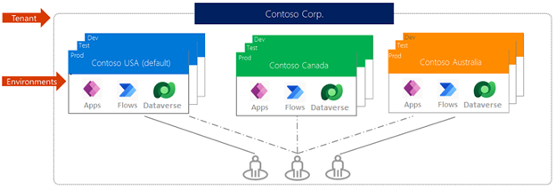

When an app maker wants to use Power Apps to create a new app, their Microsoft Power Platform administrator provides them with a specific area to build the application functionality. These areas are referred to as environments. A *Microsoft Power Platform environment* is a dedicated space to store, manage, and share your organization's business data, apps, copilots, and flows. Environments also act as containers to separate apps that might have different roles, security requirements, or target audiences.

As an app maker, you're not the person who creates environments; typically, an administrator in your organization provides you with an environment or instructs you to use a specific one.

How you choose to use environments depends on your organization and its procedures and policies around environments.

For example, your organization might decide to:

-   Require users to build apps or copilots in a single environment.

-   Use environments that group the test and production versions of your apps or copilots.

-   Create separate environments that correspond to specific teams or departments, each containing the relevant data and apps for each audience.

-   Create separate environments for different global branches of your company.

Every organization has different procedures and policies. Therefore, contact an administrator before you start building apps to ensure that you're creating them in the correct environment.

## Environment scope

Each environment is created under a Microsoft Entra ID tenant, and only users within that tenant can access its resources. Each environment is bound to a geographic location, such as the United States. When a maker creates an app in an environment, the system routes that app to datacenters in that geographic location only. Items that you create in that environment (including copilots, connections, gateways, or Power Automate flows) are also bound to their environment's location.

Every environment can have no or one Microsoft Dataverse database, which provides storage for your apps and copilots. When you create an app in an environment, you only have permissions to connect to the data sources that also deploy in that same environment, including connections, gateways, flows, and Dataverse databases. For example, consider a scenario where you create two environments named Test and Dev. You also create a Dataverse database in each environment. If you create an app in the Test environment, you only have permissions to connect to the Test database. You can import apps to a new environment. After you import the apps, they have access to corresponding items in that environment's Dataverse database.

> [!div class="mx-imgBorder"]
> 

## Environment permissions

Environments have two built-in roles that provide access to permissions within an environment:

-   **Environment Admin** - Users with this role can perform all administrative actions in an environment, such as adding or removing users, managing resources, and provisioning a Dataverse database.

-   **Environment Maker** - Users with this role can create resources in an environment, including apps, connections, custom connectors, gateways, and flows by using Power Automate.

Make sure that the Environment Maker role is assigned to your user account and that it's in the environment where you want to create your app. Otherwise, you won't be allowed to build anything.

## Types of environments

Users with the Environment Maker role can't create environments. However, multiple types of environments are available that users can create in a tenant. The environment's type indicates the purpose of the environment and determines its characteristics. As an app maker, though you're not creating environments, you should be aware of the different types of environments that are available.

-   **Production** - This environment type is for permanent work in an organization. An administrator, or anyone with a Power Apps license, can create and own this environment, assuming that a 1-GB available database capacity exists.

-   **Default** - This environment type is a special type of production environment. Each tenant has a default environment that's created automatically. All users are automatically added to the Maker role of the default environment when they sign up for Power Apps. Some organizations instruct users to build their own apps in this environment.

-   **Sandbox** - These environment types are nonproduction environments that offer features such as copy and reset. Use sandbox environments for development and testing, separate from production.

-   **Trial** - These environments are for supporting short-term testing needs, and they're automatically cleaned up after a short period of time. They expire after 30 days and are limited to one for each user.

-   **Developer** - Users who have the Developer Plan license create these environments. They're special environments that are only for use by the owner.

-   **Microsoft Dataverse for Teams** - These environments are automatically created for the selected team when you create an app in Teams by using the app for the first time or when you install an app from the app catalog.

## Environment details

Users with appropriate permissions can view some details that are related to environments by using the [Power Platform admin center](https://admin.powerplatform.microsoft.com/?azure-portal=true).

> [!div class="mx-imgBorder"]
> 

Select **Edit** to review and edit environment details.

> [!div class="mx-imgBorder"]
> 

## Managed environments

Managed Environments is a suite of premium capabilities that allow admins to manage Microsoft Power Platform at scale with more control, less effort, and more insights. Admins can use Managed Environments with any type of environment. Admins can edit certain features when they allow a Managed Environment. When an admin converts an environment to managed, it unlocks extra features across Microsoft Power Platform. As a maker, you can't convert an environment to managed; however, you might notice the impacts of working in a managed environment, such as not having limits on sharing or limited access to specific connectors.

For more information, see [Managed Environments overview](/power-platform/admin/managed-environment-overview/?azure-portal=true).

