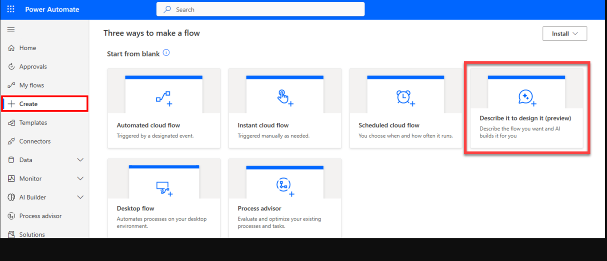
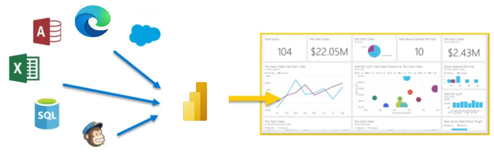
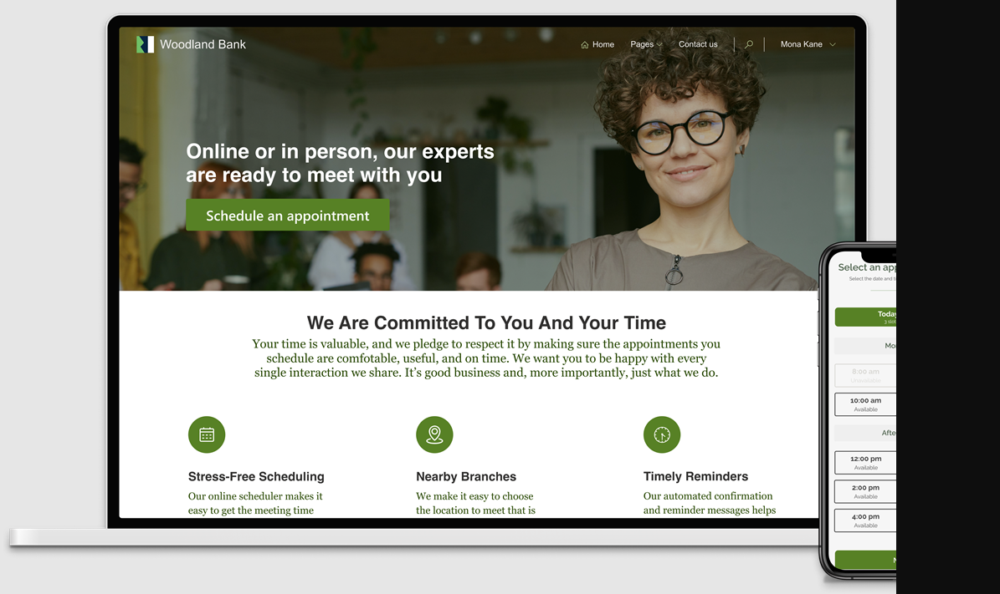

Microsoft Power Platform helps make it easier for an organization's entire team to build their own solutions through an intuitive low-code or no-code set of services. It includes the following products: 

- Microsoft Power Apps

- Microsoft Power Automate

- Microsoft Power BI

- Microsoft Power Pages

Organizations can also use Microsoft Copilot Studio, AI Builder, and Microsoft Dataverse to build solutions.

In most organizations, individual makers don't use all components of Microsoft Power Platform. Typically, they focus on two: Power Apps and Power Automate. Based on the applications that makers are building, they might use Dataverse and other products; however, it depends on the individual scenario.

The following sections examine some Microsoft Power Platform components that makers use regularly.

## Power Apps

Power Apps is a rapid, low-code development environment that app makers can use for building custom apps for business needs. It's a suite of app development services with a scalable data platform (Microsoft Dataverse) and an ability to interact with cloud and on-premises data sources. With Power Apps, app makers can create web and mobile applications that run on all devices.

Two types of applications that makers can build with Power Apps are:

-   **Canvas applications** - Canvas apps are typically task-focused apps where makers can drag and drop different components and position them how they want to create a user interface.

-   **Model-driven applications** - Model-driven apps are connected to Microsoft Dataverse. Makers build model-driven apps by adding different components, such as forms, views, charts, and dashboards, to tables by using an app designer tool.

> [!div class="mx-imgBorder"]
> 

As an app maker, you need to determine what type of application you need to create based on what you need it to do. The most common type of app is a canvas application because you can connect them to multiple data sources and the user has complete control over the UI.

This module explores when to use each type of app in more detail later.

For more information about building applications with Power Apps, see the following documentation:

-   [Create a canvas app in Power Apps](/training/paths/create-powerapps/?azure-portal=true)

-   [Create a model-driven application in Power Apps](/training/paths/create-app-models-business-processes/?azure-portal=true)

-   [Get started using Dataverse](/training/paths/get-started-cds/?azure-portal=true)

## Power Automate

Organizations can use Power Automate to build automated workflows between applications and services. Power Automate helps automate repetitive business processes, such as communication, data collections, and decision approvals. Power Automate provides enterprise-grade automation that makers can use across an entire organization. Additionally, it provides a user-friendly UI for makers and individual users to create automations that simplify their daily activities.

The four primary types of operations in Power Automate flows are:

-   **Business process flows** - Use these flows in model-driven apps to help people get work done. These flows provide a streamlined user experience that leads people through the processes that their organization has defined for interactions that need to be advanced to some type of conclusion.

-   **Cloud flows** - These flows are most frequently used. Cloud flows begin with a trigger, such as receiving an email from a specific person or a mention of your company in social media. When the flows are triggered, they also generally include one or more actions, such as creating a record in a different system or sending an approval request to someone.

-   **Desktop flows** - Use these robotic process automation (RPA) flows to record yourself performing actions on your desktop or within a web browser. Then, you can trigger a flow to perform that process for you. You can also pass data in or get data out of the process so that you can automate "manual" business processes.

-   **Process mining** - Use process mining and task mining in Power Automate to gain a better understanding of your business processes so that you can optimize them.

More organizations are beginning their automation journey with process mining. By analyzing what processes their users are performing daily, organizations can identify inefficiencies and spot areas where they can improve overall efficiencies.

For example, an organization might have a special in-house invoice application that they use for logging and paying invoices. While all individuals complete the processes similarly, you might identify ways that some individuals perform the process more efficiently than others, or you might identify specific areas where you could benefit from automation.

After you identify areas that would benefit from automation, you can determine which form or automation would work best. For example, because cloud flows rely on APIs for automation, you can use one of the 1,000 plus, prebuilt connectors to integrate with software.

> [!div class="mx-imgBorder"]
> 

For more information about creating Power Automate flows, see the following documentation:

-   [Automate a business process using Power Automate](/training/paths/automate-process-power-automate/?azure-portal=true)

-   [Create and manage automated processes by using Power Automate](/training/paths/create-manage-automated-processes-by-using-power-automate/?azure-portal=true)

-   [Get started with Power Automate for desktop](/training/paths/pad-get-started/?azure-portal=true)

-   [Get started with process mining in Power Automate](/training/paths/introduction-process-advisor/?azure-portal=true)

## Power BI

Power BI is a business analytics service that delivers insights for analyzing data. It can share those insights through data visualizations, which make up reports and dashboards to help businesses make fast, informed decisions. Power BI scales across an organization and has built-in governance and security so that businesses can focus on using data more than managing it. Many app makers and individual users consume Power BI reports and dashboards that other members of an organization create.

> [!div class="mx-imgBorder"]
> 

For more information, see [Get started with Power BI](/training/paths/get-started-power-bi/?azure-portal=true).

## Power Pages

With Power Pages, you can build sites by using the same shared business data that [Microsoft Dataverse](/power-apps/maker/data-platform/data-platform-intro/?azure-portal=true) stores, which you can use for building apps, workflows, intelligent virtual agents, reports, and analytics with other Microsoft Power Platform components in your organization. Building pages in Power Pages is user-friendly; however, an admin person completes the task of launching a Power Pages site. After you create the site, it might help individual makers and users create and modify pages within a site.

> [!div class="mx-imgBorder"]
> 

For more information, see [Get started with Power Pages](/training/paths/power-pages-get-started/?azure-portal=true).

Other tools are available that enhance the solutions that you create on Microsoft Power Platform, such as:

-   **AI Builder** - Users and developers can add AI capabilities to the workflows and Power Apps applications that they create and use. AI Builder is a turnkey solution that helps you add intelligence to your workflows or apps and predict outcomes to help improve business performance without writing code.

	For example, one common use for AI Builder is to infuse generative AI into your automation and Microsoft Power Platform solutions. With generative AI, you can have more conversational interactions with users.

	For more information, see [Bring AI to your business with AI Builder](/training/paths/bring-ai/?azure-portal=true).

-   **Microsoft Dataverse** - A scalable data service and app platform where users can store and manage data from multiple sources. With Dataverse, users can integrate data in business applications by using a common data model to ensure ease and consistency for users. Dataverse is the common factor that allows the components of Microsoft Power Platform to work together. It's the foundation that helps users consolidate, display, and manipulate data.

	Dataverse is examined in more detail in a later module.

-   **Connectors** - Users can connect apps, data, and devices in the cloud. Consider connectors as the bridge across which information and commands travel. Power Apps applications, Power Automate flows, and logic apps can use connectors. More than 900 prebuilt connectors are available for Microsoft Power Platform, which helps all your data and actions connect cohesively. Examples of popular connectors include Salesforce, Microsoft Office 365, X (formerly Twitter), Dropbox, Google services, and more.

Now that you have an overview of the primary elements of Microsoft Power Platform, you can explore the elements in more detail.
