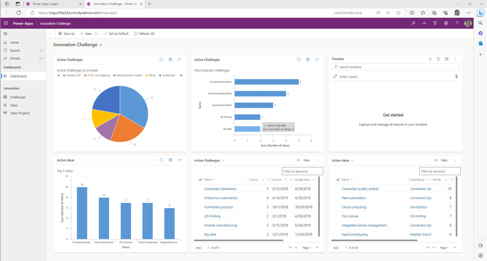

Model-driven app design is an approach that focuses on starting with data, and then adding dashboards, forms, views, and charts to interact with the data in the form of an app. Additionally, model-driven apps facilitate connecting your tables via relationships, to permit navigation between them and reduce the likelihood of repeating data. 

Using the app designer with little or no code, you can build apps that are simple or complex.

In canvas apps, the app maker has total control over the app layout. In model-driven apps, the components (dashboards, forms, views and charts) you add determine much of the layout. The emphasis is more on quickly viewing your business data and making decisions instead of on intricate app design.

> [!div class="mx-imgBorder"]
> 

## The approach to making model-driven apps

Model-driven apps have the following fundamental phases:

1. Model your business data
1. Define your business processes
1. Compose the app
1. Configure security roles
1. Share the app

### Model your business data

This is the most important step to building a model-driven app. It's appropriate to think of model-driven apps as data model driven apps. In that, you have to first build your data model in Dataverse before you can create your app. When modeling business data, you determine what data you need and how that data relates to other data. If done properly, designers can customize the app without writing code.

### Define your business processes

Defining and enforcing consistent business processes is a key aspect of model-driven app design. Consistent processes help ensure that your app users can focus on their work and not worry about having to remember to perform a set of manual steps. Processes can be simple or complex, and they often change over time.

### Compose the app

After modeling data and defining business processes, you build your app by selecting and setting up the pages you need in the App Designer. Power Apps automatically creates a site map, helping define the navigation for users.

### Configure security roles

Dataverse tables are only accessible to users with assigned security roles. Once you apply a security role to a particular table, that role access applies to any application where the data is used. Security is robust in Dataverse, allowing you to create unique roles with each table. The same tables can have different roles with different types of access, covering the ability to create, read, write, delete, append, append to, assign and share data from the table.

### Share the app

Think of model-driven app sharing as a two-step process. You have to share access to the Dataverse table then share the app itself. Once you've completed the app and assigned the user (or group of users) a security role, you can share the app with the user. If you share an app with a user that doesn't have a security role for that data, they won't be able to properly use the app.

To summarize, Power Apps makes it easy to quickly create an app on top of well-designed Dataverse tables, with little to no coding required.
