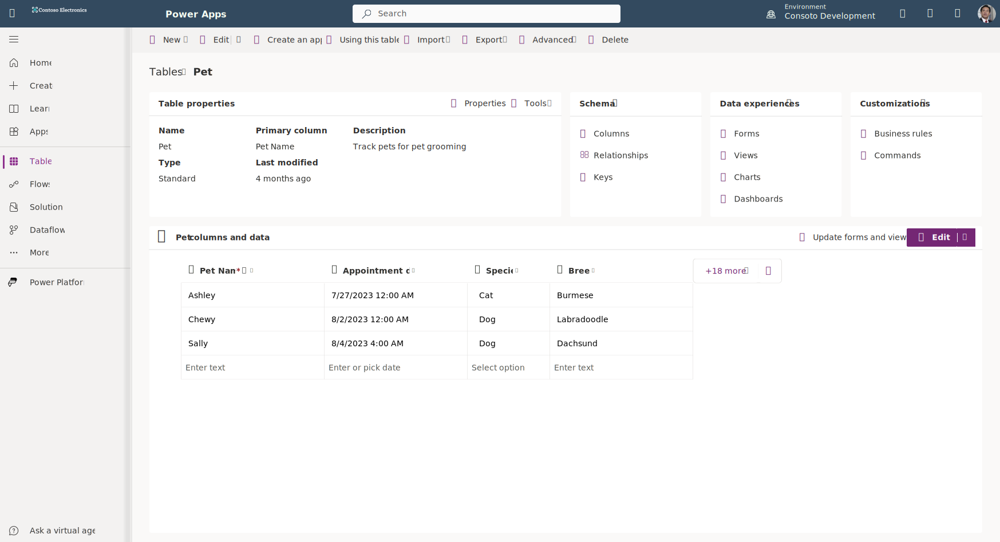
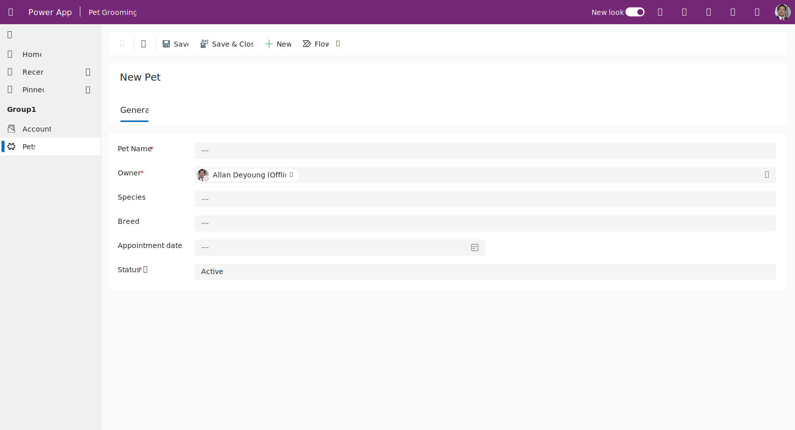

As an App Maker, before you begin building your Power Apps solution, you want to map out what you need the app to do. First, what do you want to accomplish with the app, in other words, what are your business requirements or user needs? Then, since model-driven apps start with data, you need to define and develop a data model. Keeping in mind your business requirements, you add business logic to the design, and finally you determine how you want to portray the results of the business logic as output.

Factors to consider for model-apps design:

- Business requirements
- Data Model
- Business Logic
- Output

By going through a simple design process, you can flush out any minor issues before they become a larger problem after the app is in production.

You create model-driven apps with the App Designer. You choose the tables, dashboards, Business Process flows, forms, and other components that you want to make available in your app, and then Power Apps creates the app for you. As you design your model-driven app, you need to spend more time understanding what your user needs than how it's going to look.

### Business requirements

The first step in the process is to understand your business requirements. Work with the app stakeholders to consider your security, accessibility, data, and design needs.

As mentioned in the previous unit, Dataverse has a robust security model. Consider how securing your app’s data affects your app and what security model best supports your business needs. There are lots of options available, including hierarchy security and row-level security, to name a couple. You'll need to confirm your data is secured to meet your needs, and then your app will honor that security.

Additionally, you want to identify any government regulations or authentication/authorization requirements (if applicable). You might want to implement multifactor authentication but will need to think about how such requirements will affect users connecting to your application. You don’t necessarily have to have all the answers to your questions here; you just want to flush out all of the requirements.

Finally, does your app need to be available when the user is disconnected from the internet? This availability is called Offline Mode and is supported by  Dataverse and Model-driven apps when using iOS or Android clients. It does require more design considerations.

### Data model

When conducting data modeling, here are a couple of important questions to ask yourself:

- What type of data will your solution be storing and or collecting?
- How will this data relate to the other data you're working with?

Consider the three most important elements of your data model as *table*, *column* and *relationship*. Once you've clearly defined what tables you're creating, what columns will be in each table and the relationship between the tables, then you can develop and tweak forms, views and visualizations. Data is the foundation of a model-driven app.

Remember, model-driven applications use a metadata-driven architecture. A large portion of the model-driven app is based on how your data is modeled, and there's no need to write custom code to alter the app design. To expand on this a little further, when thinking about Metadata, it means “data about data” and this data defines the structure stored in the system.

Power Apps allows you to view/modify the app metadata by reviewing tables via the Power Apps portal.

> [!div class="mx-imgBorder"]
> 

You can also view/modify the app metadata by opening the app in Play mode.

In the example above, for the Pet table, there are multiple pieces of metadata being collected, including, but not limited to:

- Pet Name
- Appointment date
- Species
- Breed

Species is a choice in our Dataverse table, connecting (or relating) to another Dataverse table called **Species**. There's metadata in the **Species** table that our **Pet** table can access because of the *relationship* between the tables, therefore, there's no reason to create additional rows in our **Pet** table to keep the metadata from the **Species** table.

As you think about your data model, also think about column types. When you add columns to your table in Dataverse, the column type you choose will determine how users enter and view that in your model-driven app. Option sets show as dropdowns and currency shows with currency symbols, while decimal numbers don’t show currency symbols. Little changes in table column settings can have a profound effect on how your user experiences your app.

> [!NOTE]
> If a column type needs to be changed to a different column type, (i.e. text column to a choice), then you will need to delete that column and recreate with the correct column type. However, doing this will cause you to lose any data associated with that column.

### User Interface (UI) and User Experience (UX)

When you build a Model-driven app, Power Apps determines most of the UI and UX for you. You define the data model to build from, and then Power Apps determines the controls used in the app. You can influence these controls by determining what table assets you include. You define in the App Designer the Forms, Views, Charts, and Dashboards for your app. You also control the navigation options. As you're planning your app, determine which components you need and then you can create them from your tables, before building your app.

Below is a simple Model-driven Form for data input.

> [!div class="mx-imgBorder"]
> 

### Business logic

When you incorporate business logic in your app, there are two primary options available. You can set **Business Rules** on your Dataverse tables or you can build **Business Process Flows**.

With **Business Rules,** you'll define behaviors at the data layer. Business rules are great for changing when a column is required, setting a default value, or even showing or hiding a column based on a criteria. An example could be a table for tracking expenses. You could have a column for type of travel and then build a business rule that says if they choose automobile then the mileage column is required, else it's optional. Business rules give you great power to make sure you maintain data consistency in all scenarios.

**Business Process Flows** are used to guide users through using your app. They're built in Power Automate, however they only work with model-driven apps. These workflows can provide visuals on next steps based on the status of the data and facilitate other actions that you want to occur as the user uses the app. Business Process Flows let you bring automation to your app and make it more of a guided experience than just a place to enter data.

### Output

A common output need for apps is to visualize the data. For this requirement, you can implement Dashboards with custom filters and visual graphics to tie all of this data together right in your app. When creating your Dashboards, make sure they're simple for your users to consume without overwhelming them with all the data. Provide high-level snapshots of your data and allow users to apply filters to dive deeper into the data if needed.

> [!div class="mx-imgBorder"]
> 

### Industry accelerators

Microsoft is working closely with representatives from various industries to make the Dataverse data model more relevant to them. Depending on the industry you are in, Health, Financial, Banking, Education, Non- Profit, Automotive, or Media, Microsoft has released many accelerators or foundational components to assist you with quickly standing up your solution. You can find a link for more information in the summary unit of this module.
