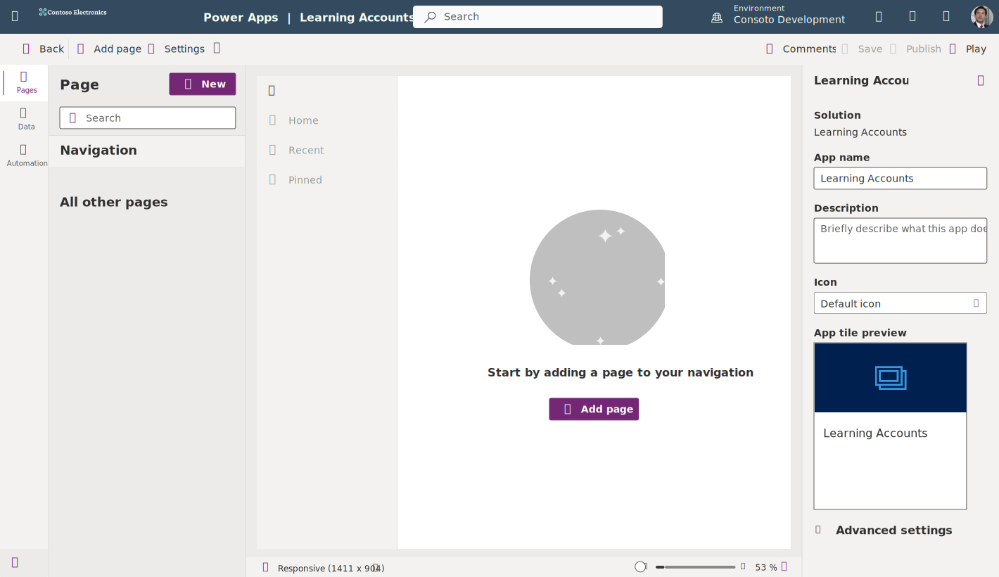
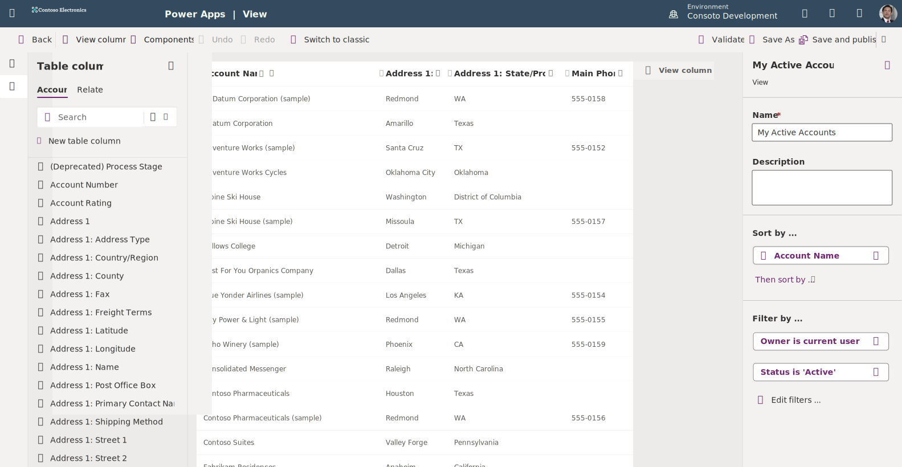

In this unit, you create a model-driven app by using one of the standard tables available in your Microsoft Power Apps environment. Before Creating a model-driven app, you must first create a **Solution** for your app to reside in.

## Create a Solution and add an existing data table

1. On the Power Apps home page, select **Solutions** (you might need to select **More** from the left side navigation panel, then you can find **Solutions**).

1. Select **New solution** from the command bar.

1. In the **New solution** panel that appears on the right side of your screen, input the following:

    Display name: Learning Accounts

    Publisher: [select one from the dropdown]

1. Select the **Create** button at the bottom of the panel.

1. Once your Solution appears, you'll see a list of **Objects** with a number in parenthesis for how many of each type of object is part of the solution. In the command bar, select **Add existing** > **Table**.

1. Find and select your **Account** table.

1. The screen will transition to the **Selected tables**, select the box **Include all objects**. Then select the **Add** button at the bottom of the screen.

After a moment, your **Account** table will show up as an object for your solution. You'll see the table appear in the list of objects.

## Create a model-driven app

1. Still in the Solution **Objects** menu, go to the command bar and select **New** > **App** > **Model-driven app**.

1. Name your app "Learning Accounts" and select **Create**

Your new app appears in the App Designer, and you can now add components to it.

## Add a page to your app

You can add pages to your app within the App Designer.

1. Select **Add Page**.

    > [!div class="mx-imgBorder"]
    > 

1. In the **New page** popup window, ensure the **Dataverse table** is selected (default) and then select **Next**. Afterwards, select **Account** and then select **Add**.

    > [!NOTE]
    > If *Account* is not an option as a table, you may not have any sample data in your environment. Refer to this exercise on [how to create sample apps and data](/training/modules/intro-model-driven-apps-common-data-service/4-template-apps/?azure-portal=true). If the sample data does not appear, refer to this documentation to add [sample data](/power-platform/admin/add-remove-sample-data/?azure-portal=true).

Go ahead and **Save** your app and **Publish** it (buttons in the top right of the command bar).

## Edit your form

When we created the app, Power Apps automatically created forms for our app. Let's do some modification to the main form. Power Apps has navigation tabs at the far left of the screen, at this point showing **Pages** as the one selected, and a **Pages** panel just to the right of that. Your app currently has one page in it. The **Navigation** shows your **Accounts view** and when expanded, it shows the **Accounts form**.

1. Under **Navigation** select **Accounts form**. Your form will show on the Power Apps canvas as it shows in the app.

1. Select **Edit form**.

1. Now, there's a lot on this preconfigured form, don't be overwhelmed. Let's do a couple of simple changes, so you can see how easy it's to modify a form. Go to the **Account information** pane and select **Ticker Symbol**.

1. Select **Delete** from the command bar to remove it from the form. When you delete this item from the form, you're not deleting this column from your data, you're simply removing it from your form. If you accidentally delete a column, Power Apps has a handy **Undo** button in the command bar.

1. Look at your **Table columns** panel on the left side of your screen. This is a list of every column in your **Accounts** table. If you want to find the **Ticker symbol** column that we deleted, enter "ticker" in the search field.

1. Clicking on any table column adds it to the part of the form under your cursor. Your cursor should currently be in the **Account Information** pane. Select **Ticker symbol** from your **Table columns** pane. Did you see how easy that is to add it back into your form?

1. At this point, if you've made any changes you want to keep, you can select **Save and publish** from the top right of the command bar.

1. Once Power Apps finishes republishing your form, select **Back** from the top right of the command bar to exit the form editor.

## Edit views

When creating this app, Power Apps made some views to go along with it. In your **Navigation** menu in the **Pages** panel, you can see any views that are already part of your app. The current view that your screen shows is the one titled **Accounts view** and your screen shows "My Active Accounts" and has a dropdown just to the right of the title.

1. Select **Accounts view** in the **Navigation** list. Notice that a panel appears on the right side of the screen showing your **Accounts** table and a tabbed list below that, currently showing **Views**, and **My Active Accounts** showing. This is the *Default* view for the app.

1. From this **Views** list you can edit any of these views, but let's keep it simple and modify the view for **My Active Accounts**. You can select **Edit view** from the command bar to go to the **View editor**.

1. Similar to how we edited our form in the **Form editor**, you see a canvas in the center showing displayed columns. Let's add the **State/Province** to the view. Find "Address 1: State/Province" from the **Table columns** list (you can input "state" into the search field), and select it to add it to the view.

1. Power Apps allows you to reposition columns easily. Let's move the **Main Phone** column to the far right of the view. Drag and drop it on top of the **Address 1: State/Province**, column.

    > [!div class="mx-imgBorder"]
    > 

1. To save your changes, select **Save and publish** from the top right of the command bar.

1. After a few moments when Power Apps is done publishing the changes, you can select the **Back** button from the command bar to close the **View editor**. Notice how you now have the State/Province on your preview canvas.

## View a chart

Power Apps includes some example interactive charts with the sample data included in the **Accounts** table. Let's explore a sample of that.

1. Within your preview canvas, select the **Show Chart** button from the app command bar.

1. The chart panel appears below the title. By selecting the dropdown at the top of the chart panel, you can change the chart view. Try switching the view between several options including: *Accounts by industry*, *Accounts by owner* and *New Accounts By Month* to see a few examples.

Notice that there are many different ways you can portray data within a view.

Below is an example of a system dashboard called **Innovation Challenge** which includes several charts to give you an idea of what's possible.

> [!div class="mx-imgBorder"]
> 

You can create a chart from any table, but that is beyond the scope of this unit.

Next, we create some security roles for the people who use this app.
