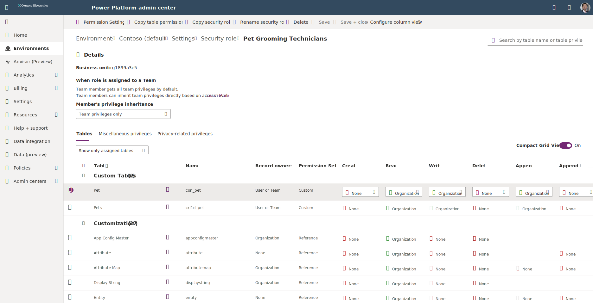
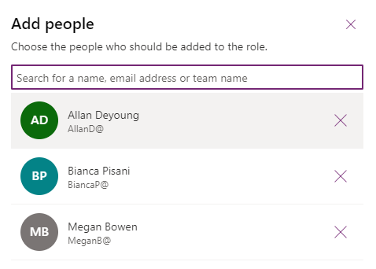

Any user trying to access a Dataverse table must have an assigned security role. Assigning security roles is the fundamental control you have for who can access restricted or sensitive data that is part of your model-driven app. Security roles define how different users can access different types of records. To control access to data and resources, you must create or modify security roles, and accordingly assign them to your users.

An important thing to note is that any table you create must have a defined security role for access. Once you create/configure a security role, you can use that role for multiple tables. A user can have multiple security roles, but every app user must have at least one (or more) assigned security role.

You can assign security roles to single users or to teams of users. Once you assign a user or a team to a role, that user or all members of that team then have the privileges associated with the role.

In this unit, you learn how to share a model-driven app so that others can use it.

Specifically, you learn how to:

- Create a security role.
- Assign users to the security role.
- Assign the security role to an app.

To share an app, you must have the Environment Admin or System Admin role.

## Scenario

> [!NOTE]
> This scenario builds on ideas and concepts from the previous units. To get the most out of this exercise, you will first need to create an app as described in the previous unit of this module and create the Pet
> table as described in unit [Create a Microsoft Dataverse table](/training/modules/get-started-with-powerapps-common-data-service/3-create-a-cds-entity/?azure-portal=true) of [Get started with Dataverse Service module](/training/modules/get-started-with-powerapps-common-data-service/?azure-portal=true).

This unit uses the example of a company named Contoso, which has a pet grooming business that services dogs and cats. An app that has a custom table for tracking the pet grooming business has already been created and published.

The app must be shared so that the pet grooming staff can use it. To share the app, an admin or app maker assigns one or more security roles to users and to the app.

## More on Security roles

The Power Apps environment includes predefined security roles, but these roles can only be used on the standard tables in your environment. These roles reflect common user tasks. The access levels that are defined follow the security best practice of providing access to the minimum amount of business data that's required to use the app.

Remember that the Contoso pet grooming app is based on a *custom* table. Because the table is custom, you must explicitly grant privileges before users can work in it. To specify privileges, you must create a custom security role to manage privileges for users of the app.

The environment that maintains the pet grooming rows is also used for other apps that the Contoso company runs. Therefore, we need to create two security roles that are specific to the pet grooming app with two different sets of access privileges:

- Pet grooming technicians just need to read, update, and attach other rows. Therefore, their security role has *read, write*, and *append* privileges.
- Pet grooming schedulers need all the privileges that pet grooming technicians have. In addition, they must be able to create, append to, delete, and share rows. Therefore, their security role has *create, read, write, append, delete, assign, append to*, and *share* privileges.

Here's a reference table for the different privileges we grant in our security roles:

| Privilege  | Description |
|------------|-------------|
| Create | Required to make a new record. |
| Read   | Required to open a record to view the contents. |
| Write  | Required to make changes to a record. |
| Delete | Required to permanently remove a record. |
| Append | Required to associate the current record with another record. For example, if users have Append rights on a note, they can attach the note to an opportunity. If there are many-to-many relationships, a user must have Append privilege for both tables being associated or disassociated. |
| Append to | Required to associate a record with the current record. For example, if users have Append To rights on an opportunity, they can add a note to the opportunity. |
| Assign | Required to give ownership of a record to another user. |
| Share  | Required to give access to a record to another user while keeping your own access. |

## Create a security role

1. Sign into the [Power Platform admin center](https://admin.powerplatform.microsoft.com/?azure-portal=true) and select an environment.

1. Select **Settings** > **Users + permissions** > **Security roles**.

1. From the command bar for the **Security roles** screen, select **+ New role**.

1. In the **Create New Role** pane, enter the following:

    - **Role Name** - `Pet Grooming Technicians`
    - **Business unit** - [pick one from the dropdown, every environment has at least one]

    - **Member's privilege inheritance** - Team privileges only

    **Save** the role.

1. Once the role is saved, you'll see a detail screen for your new role. It includes information about the role settings and a list of all of the tables that are part of the environment, so you can set privileges for specified tables. Filter the list by typing `pet` in the search field at the top right. All of your tables that include "Pet" in the title display in the filtered list.

1. Find and select your **Pet** table. Notice how dropdown option boxes appear under the table options fields. Our grooming technicians only need to **Read**, **Write** and **Append** from this table. Under these three permissions, change them from **None** to **Organization**.

    > [!div class="mx-imgBorder"]
    > 

1. The pet grooming app also has a relationship with the **Account** table. Enter `account` in the table search field and select the **Account** table.

1. For the Account table, look under **Read** and select **Organization**. We need our pet groomers to be able to read data from this table, not anything else.

1. In the command bar, select **Save + close** to return to the **Security roles** screen.

1. Now let's make our second security role. Select **+ New role**.

1. In the **Create New Role** pane on the right enter this information:

    - **Role Name** - `Pet Grooming Schedulers`
    - **Business unit** - [pick one from the dropdown]

    - **Member's privilege inheritance** - Team privileges only

    **Save** the role.

1. After a moment, the **Pet Grooming Schedulers** role viewer appears. Find the *Pet* table by entering `pet` into the search field at the top right of the view screen.

1. Select the *Pet* table, and adjust all of the dropdowns under *Create, Read, Write, Delete, Append, Append to, Assign,* and *Share* from **None** to **Organization**. (Remember: you might need to scroll to the right to see all of the fields.)

1. As we did for the pet groomers, we need to make sure that our schedulers have access to the *Account* table. But in their case, we need them to have a higher level of access. In the table search field, enter `account`.

1. Select the **Account** table.

1. Change all of the dropdowns under *Create, Read, Write, Delete, Append, Append to, Assign, and Share* from **None** to **Organization**.

1. Select **Save + close** from the command bar.

Now that we've created a pair of security roles, let's assign some of our users to them.

## Assign security roles to users

Security roles control a user's access to data through a set of access levels and permissions. The combination of access levels and permissions that's included in a specific security role sets limits on the user's view of data and interactions with that data.

### Assign a security role to the pet grooming technicians

1. From the Power Platform admin center, select **Environments** and choose your Environment.

1. Select **Settings** > **Users + permissions** > **Security roles**.

1. Search for your **Pet Grooming Technicians** role by entering `pet` in the search field at the upper right of the screen and select the three dots **(More actions)** to the right of the name. Then select **Members**.

1. Select **+ Add people**.

1. In the **Add people** pane on the right side of the screen, you can search for someone in the organization. When you find them from a resulting dropdown, select them from the dropdown. You can continue searching to keep adding people. Each time you select a name, it's added. You can remove them by selecting the **x** to the right of their name.

    > [!div class="mx-imgBorder"]
    > 

1. Once you've added a few names to the list, select **Add**.

1. The members you selected show up in a list under Pet Grooming Technicians.

### Assign a security role to the Pet Grooming Schedulers

1. Return to your list of **Security roles** and search for your **Pet Grooming Schedulers** security role.

1. Select the three dots **(More actions)** to the right of the name and select **Members**.

1. Select the **+ Add people** button and add several names by searching for them, and then selecting the person.

1. Select **Add**.

Now that we've assigned specific users to our security groups, we can share the app with these users.

## Share the app with your users

1. Go back to [make.powerapps.com](https://make.powerapps.com/?azure-portal=true).

1. Select **Apps** in the left side navigation, find your *Pet Grooming* app, and select the **Share** button from the command bar.

1. Add groups or users to share the app with.

1. Select **Share**.

As long as your users are part of that environment and have proper licensing, they should now be able to use the app with the new security roles you created.
