In the [exercise](/training/modules/get-started-with-powerapps-common-data-service/4a-use-data-cds-exercise/?azure-portal=true) from the previous module of this learning path, you created the Prospects table in Microsoft Dataverse and imported the existing leads.

## Scenario

In this exercise, you use that data to create a model-driven app.

If you don't have the **Prospects** table, then refer to the previous [exercise](/training/modules/get-started-with-powerapps-common-data-service/4a-use-data-cds-exercise/?azure-portal=true). This app helps keep the managers up to date on the current leads and forecasted revenue.

### Create the model-driven app for the prospects table

You need the *Prospects* table from the previous [exercise](/training/modules/get-started-with-powerapps-common-data-service/4a-use-data-cds-exercise/?azure-portal=true) to build the model-driven app in this exercise.

1. Sign in to [Power Apps](https://make.powerapps.com/?azure-portal=true) by using your organizational account.

1. Select the environment you want, or go to the [Power Apps admin center](https://admin.powerplatform.microsoft.com/?azure-portal=true) to create a new one.

1. On the **Home** page, select the **Start with a page design** and then **Blank page with navigation** .

> [!div class="mx-imgBorder"]
   > 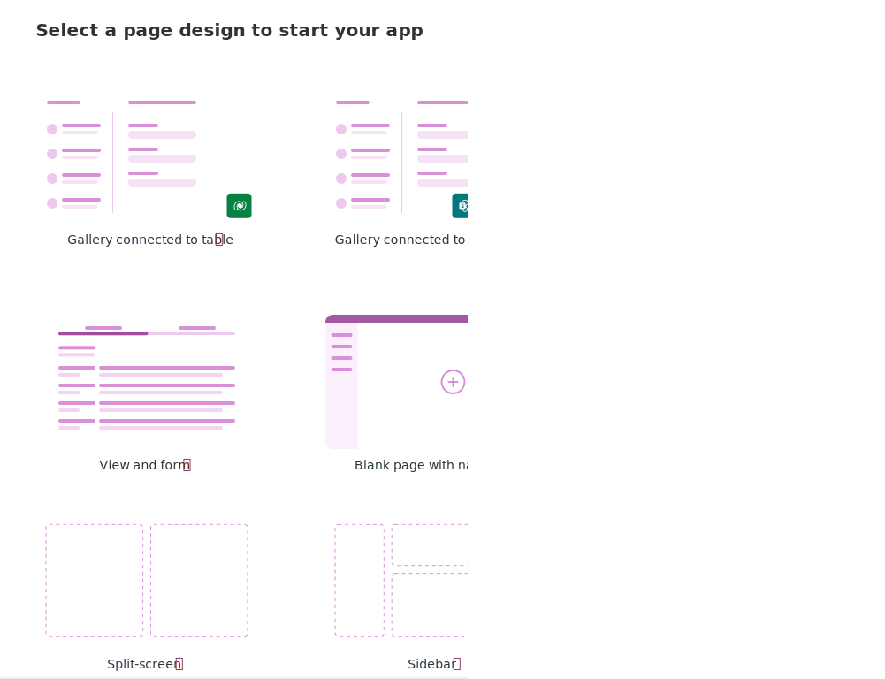

1. Enter the following for the Name and Select **Create**.

   **Name:**  `Prospect Entry`

1. Select **+ Add page**.

1. Under **Choose content for the page** select **Dataverse table** and then **Next**.

1. With **Select existing table** selected, find your **Prospects** table by scrolling through the list or by entering `Prospects` in the search field.

1. Select **Prospects** and then **Add**. After a few moments, your new app will appear in the app editor screen.

1. Select **Save**.

1. Select **Publish**. Now that you have an app, let's work on some features for your app.

### Create a chart

1. Inside of your app, select the **Data** tab from the left-side navigation ribbon.

1. Select/expand **In your app** and then find/select your *Prospects* table, then select the ellipsis to the right and select the **Open** Option. This opens your table editor in a separate browser tab.

   > [!div class="mx-imgBorder"]
   > 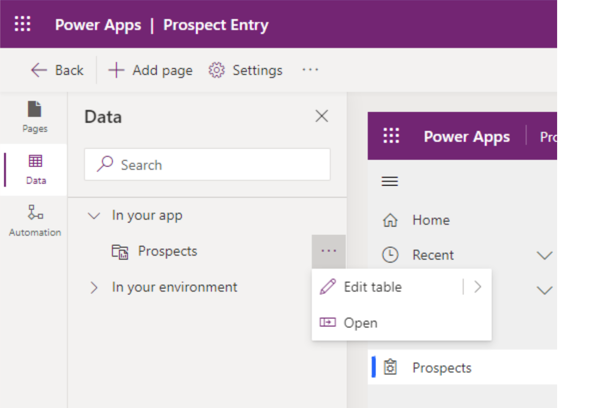

1. Select **Charts** under **Data experiences**.

   > [!div class="mx-imgBorder"]
   > 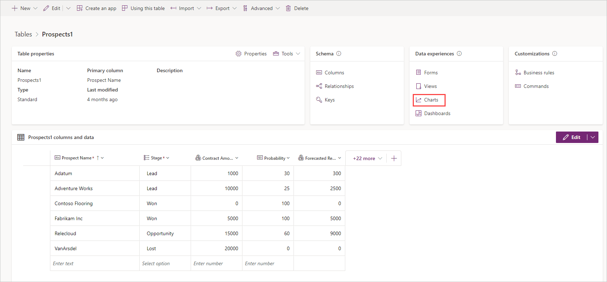

1. Select **New chart** from the header ribbon. The **Chart:New** editor appears as a new tab in your browser.  The following screenshot helps you navigate through the next four steps.

   > [!div class="mx-imgBorder"]
   > 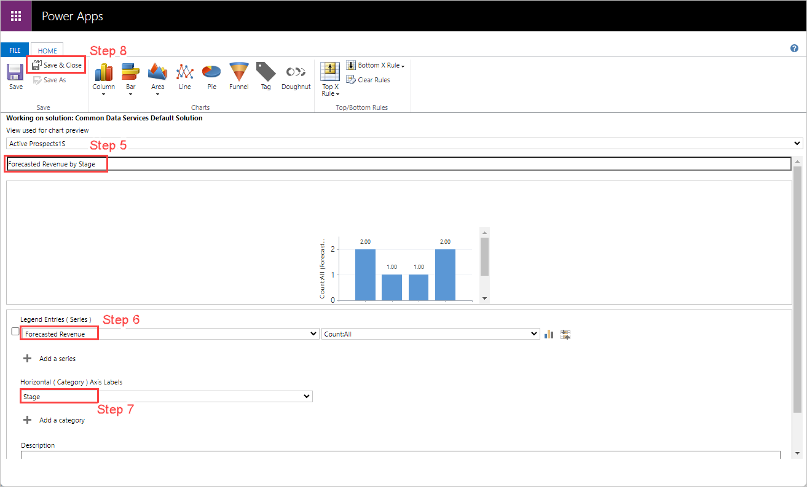

1. For the Chart Name, enter `Forecasted Revenue by Stage`.

1. For **Legend Entries (Series)**, check the box to the left of this item, and select the **Forecasted Revenue** column. In the dropdown just to the right, you can select several different aggregate items to display, including **Avg**, **Sum**, **Min**, **Max**, **Count:All** and **Count:Non-empty**. A sample graph appears once you select your **Horizontal** axis.

1. For **Horizontal (Category) Axis Labels**, select the **Stage** column. After a few moments, you'll see a sample graph appear below the chart name that you entered in step 5 above. At this point, you can adjust the aggregate to see what different aggregate selections look like. In our example we're showing the **Count:All** aggregate.

1. Select **Save and Close**. The **Chart:New** editor tab closes and returns you to your **Charts** table. After a few moments, your Charts table will reflect your new chart (you might need to refresh your browser).

1. Return to your App Designer, select the **Show Chart** button in the App screen header ribbon. It might appear as an icon the first time you look for it, but it is in the vicinity of the image below. The **Show Chart** button toggles to the **Hide Chart** button, so your user can toggle it on/off. If you have data in your table, you see the chart you just produced depicted like this:

   > [!div class="mx-imgBorder"]
   > 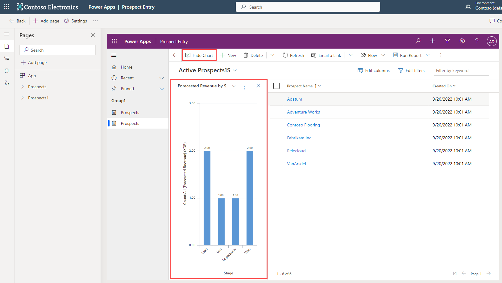

1. In your app editor, select **Save** from the top right of the ribbon.

1. Select **Publish**. Next let's add a form that enables data entry.

### Create the form

1. Return to your **Tables** main screen. If you still have the **Charts** list browser tab open, go to that tab and select your table name to the left of **> Charts** to return to the table editor; else you can follow the same first two steps we did in the **Create a chart** section above.

   > [!div class="mx-imgBorder"]
   > 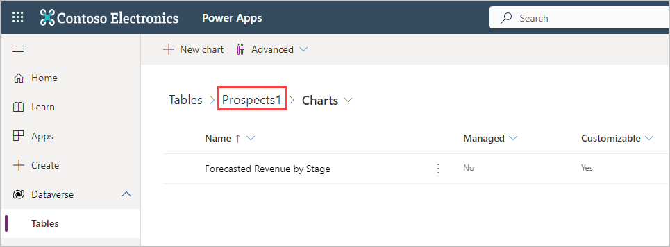

1. Select **Forms** under **Data experiences**.

   > [!div class="mx-imgBorder"]
   > 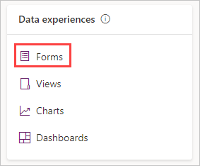

1. Select the drop-down arrow next to **+ New form** in the header, and then select **Main Form**.

1. Select or drag the **Stage** column from the left and place it below the **Owner** column in the center. Drag and drop functionality is available for any of your table columns to move them around in the form. But simply selecting the columns adds them below the item that is highlighted in your form display.

1. Select the **Contract Amount** column to add it below the **Stage** column.

1. Select the **Probability** column to add it below the **Contract Amount** column.

1. Select the **Forecasted Revenue** column to add it below the **Probability** column.

1. With **Forecasted Revenue** still selected look at your **Properties** tab on the right side of the screen. Select the checkbox for **Read-only column**. When complete, your form should look similar to this screenshot:

   > [!div class="mx-imgBorder"]
   > 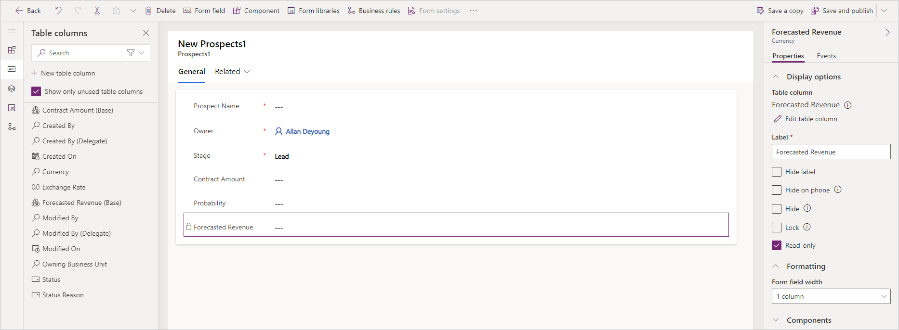

1. From the ribbon at the top, select **Save and Publish**.

1. Return to the **Tables>Forms** screen by selecting the button labeled **Back** from the top left of the ribbon. Now let's make the form you just created the default form for your app.

1. Select **Form settings** from the Forms ribbon, then **Form order** from the popup. Make sure that the form set you're choosing from is **Main Form** and find your new "Prospects" form. You can drag and drop to change the form order. Move your new form above the form named **Information** like the following image. Then select **Save and publish**.

   > [!div class="mx-imgBorder"]
   > 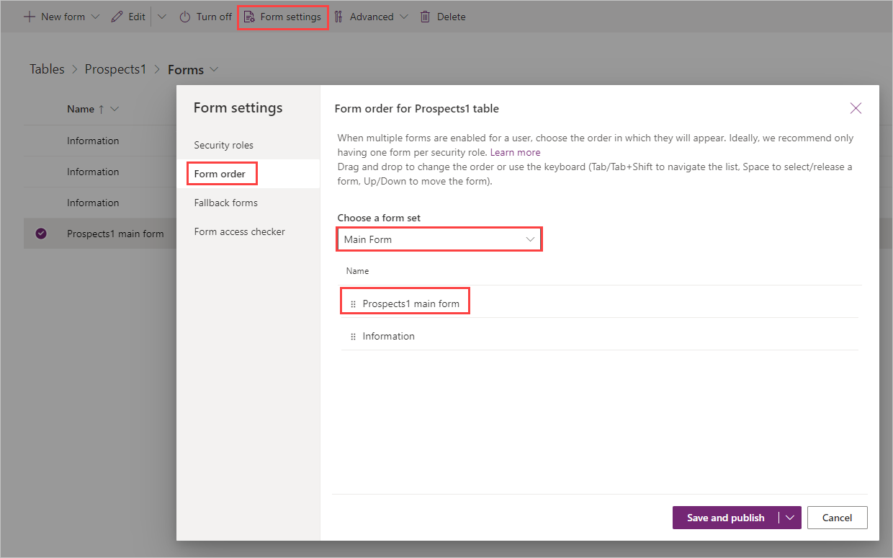

1. Now return to your app builder, go to your **Home** screen where you have your *Prospects* data, and select **+ New** to bring up your new Main form.

   > [!NOTE]
   > You might need to refresh the app to ensure that it's using your new form as the default.

   Select **New**:
   > [!div class="mx-imgBorder"]
   > 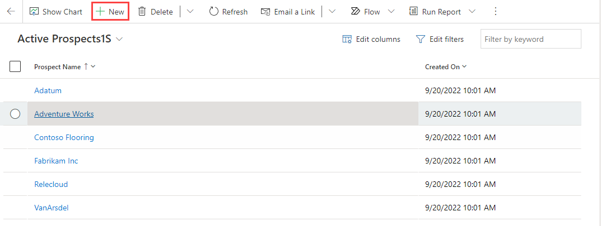

   Your new form ready for data:
   > [!div class="mx-imgBorder"]
   > 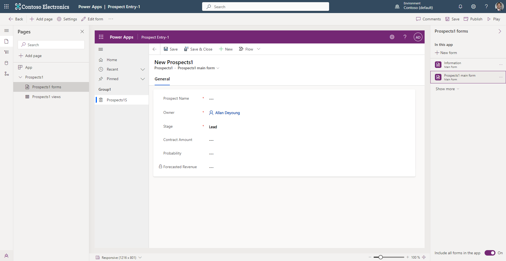

   Notice that your Prospect Name, Stage, Contract Amount and Probability fields are editable, and your Forecasted Revenue field is read-only.

1. Finally, **Publish** your app.

Congratulations! You successfully created a new model-driven app based on your data. Your new app includes a chart to view a depiction of your data and a form for data entry.
