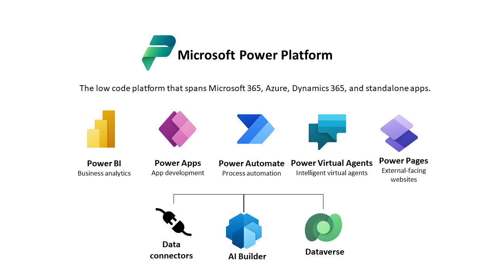

Data is at the center of everything a business does today and powers the insights that can drive what it should do tomorrow. To thrive and grow, businesses need to capture, analyze, predict, present, and report data and do it all with a high level of agility.

A business may have many data sources across various devices, applications, systems, and software as a service (SaaS) providers. There may be connectors for some or all of these data sources to allow you to build apps and flows by using the Microsoft Power Platform, but these data stores need to be managed and require different tools, skills, and security models.

## Microsoft Dataverse

Microsoft Dataverse is the cloud data platform for the Microsoft Power Platform that is easy to use, compliant, secure, scalable, and globally available. Using Microsoft Dataverse as the data store for your apps has many benefits:

- **Metadata**: Properties you define on your data model are used by Power Apps, speeding up the building of apps.

- **Data access**: You can control who can access which tables, rows, and columns.

- **Logic**: Calculations and rules can be added to table columns.

- **Import and export**: You can choose from multiple tools to manage your data, including Excel.

- **Audit**: You can track who accesses and changes data.

- **Processes**: Business processes can be added to ensure data quality and perform automation.

- **Managed data in the cloud**: You don't need to perform backups or configure the database because this is performed for you by Microsoft.

- **Storage**: You don't need to worry about how the data is stored because Microsoft takes care of this for you.

- **Skills**: You don't need to be a DBA to manage Dataverse.

- **Secure**: All data is encrypted at rest and in transit.

- **Integration**: Dataverse is deeply integrated with Microsoft cloud services such as Microsoft 365 and Microsoft Azure.

- **Proven**: Microsoft Dataverse is used by Dynamics 365 apps such as Dynamics 365 Sales and Dynamics 365 Customer Service.

- **Connectors**: Microsoft Dataverse has connectors for Power Apps, Power Automate, and Power BI.

For more information, see [Why choose Microsoft Dataverse?](/power-apps/maker/data-platform/why-dataverse-overview)

## Tables

Data within Dataverse is stored within a set of records called tables. A **table** is a logical structure of rows and columns that represent a set of data, similar to how a table stores data within a database.

Tables represent objects or things of the internet. These can be physical things such as pets, buildings, and products, or abstract concepts such as projects, skills, and benefits.

Microsoft Dataverse is designed to let you quickly and easily create a data model for your application, based on the tables and the table metadata that you include in your app.

Dataverse includes a base set of *standard* tables that support common business scenarios. You can also create *custom* tables specific to your organization and populate them with data that you import from lists in Microsoft SharePoint, from Microsoft Excel, or by using PowerQuery. App makers can then use Power Apps to build rich applications by using this data.

For most organizations, it's a good idea to use the standard tables and columns as they were intended. But to meet your business needs, you can extend the functionality of standard tables by creating one or more custom tables to store information that's unique to your organization.
