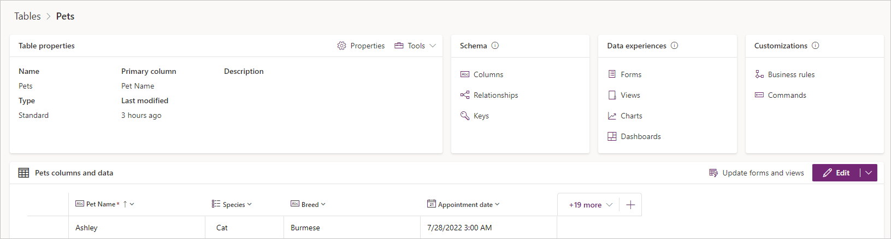

In Microsoft Dataverse, you create and edit tables by using the Power Apps maker portal. You don't need to use T-SQL, instead you maintain a table and its properties with the user interface in the maker portal.

Before you can start creating a table in Dataverse, you need to understand the capabilities and options of Dataverse tables.

## Table properties

Tables are the key building blocks of Microsoft Dataverse. In Dataverse, a table is more than just a database table with columns and relationships. A Dataverse table contains other components to support your apps and flows. Tables in Dataverse have the following properties:

- **Name**: The simple name defining your table such as *Pets*

- **Rows**: Specific records in your data (such as a cat named *Ashley*)

- **Columns**: Metadata for each record (such as pet *Species* and *Breed*)

- **Relationships**: Describe the links to other tables (such as a pet belonging to an owner)

- **Keys**: Column, or columns, to uniquely identify a row in the table (such as an ID number)

- **Forms**: Forms used by model-driven apps to view and edit a table row

- **Views**: Define the rows and columns for displaying table rows

- **Charts**: Visualizations of table rows

- **Dashboards**: Provide a customizable glance at your data through charts and filtered data

- **Business rules**: Logic that can be applied to columns in a table row

- **Metadata**: Properties of the table that affect the capabilities of the table and how apps and flows can use the table

- **Commands**: You can customize the buttons in your command bar for your model driven app

> [!div class="mx-imgBorder"]
> 

We explore these table properties in the remainder of this module.

## Row keys

Database tables have a **primary key**. A primary key uniquely identifies a single row in the table. In Dataverse, the primary key is a Globally Unique Identifier (GUID), a 32-character string such as *123e4567-e89b-12d3-a456-426655440000*. The GUID for the primary key is generated automatically when a row is created in a Dataverse table.

Because GUIDs aren't user friendly, in Dataverse there's also a column called the **primary column**. This is a text string that is used to represent the row in apps and flows. When you create a Dataverse table, this column is defaulted to *Name*.

> [!NOTE]
> When you integrate other systems with Dataverse, the GUID is not often known to the external system. This is where you can use an alternate key.

## Create a table in Dataverse

To create a Dataverse table, select on **Tables** in left-hand navigation of the [Power Apps maker portal](https://make.powerapps.com), and then select the **New table** dropdown. You have several different options to create a Dataverse table.

### Start from a blank table

- **Add columns and data**: Create a table by entering the data rows and columns you want.

- **Describe the new table**: Create a table with the help of AI Copilot.

- **Set advanced properties**: Start with a blank table and enter the table properties, such as name, and description. Expand Advanced options to set more properties, such as track changes and audit changes.

### Use existing data

- **Upload an Excel file**: Use an Excel file to populate a table with your data, which uses AI to assist with the table generation when copilot is enabled for the environment.

- **Create a virtual table**: A virtual table is a custom table in Microsoft Dataverse that has columns containing data from an external data source, such as Azure SQL Database or SharePoint.

Let's explore the **Set advanced properties** option in more depth. All of the settings and fields described below are available using the other *Create table* options as well.
> [!div class="mx-imgBorder"]
> 

There are two tabs in the new table pane. The first tab, *Properties*, contains the following table options:

- **Display name**: The name of the table, for example, *Pet*

- **Plural name**: The plural name for the table, for example, *Pets*. The plural name is auto-populated the instance you add a Display name, but you can modify both.

- **Description**: For internal use to describe the purpose of the table

- **Enable attachments**: Checkbox to enable files to be attached to table rows

The second tab, *Primary column*, contains the following options for the primary column of the table:

- **Display name**: Name of the column, for example, Pet name; by default, the Display name is set to *Name*. You can change the Display name.

- **Description**: This is for internal use to describe the purpose of the column.

- **Schema name**: This is the internal name of the column created in the database. By default, the schema name is automatically created for you based on the Display name. You can change the Schema name before creating the table. The schema name can't contain spaces and includes the customization prefix for the Dataverse solution publisher.

- **Column requirement**: By default, the primary column is *Business required*

- **Maximum character count**: The primary column is always of type *Single Line of Text* and defaults to 100 characters. You can change the length of the primary column.

> [!div class="mx-imgBorder"]
> 

### Advanced options

At the bottom of the *Properties* tab, you can expand **Advanced options**. This exposes further options for the table.

> [!div class="mx-imgBorder"]
> 

The most important of these options are:

- **Schema name**: This is the internal name of the table created in the database. By default, the schema name is automatically created for you based on the Display name. You can change the Schema name before creating the table. The schema name can't contain spaces and includes the customization prefix for the Dataverse solution publisher.

- **Type**: *Standard*, *Activity*, or *Virtual*. These options are discussed later. Almost all tables you create use the default option, *Standard*.

- **Record ownership**: *User or Team* or *Organizational*: These options are discussed later. Almost all tables you create use the default option, *User or Team*.

> [!IMPORTANT]
> You cannot change the following after the table is created:
>
> - Schema name
> - Table type
> - Table ownership

You can enable many other options for the table. These options either create table columns or relationships, or affect the user interface when the table is used within an app.

For more information, see [Create and edit tables using Power Apps](/power-apps/maker/data-platform/create-edit-entities-portal/?azure-portal=true).

> [!NOTE]
> Best practice is to create tables from within a Dataverse solution. The table will inherit the publisher prefix from the solution.

## Table types

Before creating tables in Dataverse, you should understand the different types of custom tables that you can create:

- **Standard**: A table where you can store data and add to the navigation in model-driven apps. Most tables you create are standard tables.

- **Activity**: Activity tables store interactions such as phone calls, tasks, and appointments. Dataverse has a set of activity tables. These tables share the same set of columns and share security privileges. Many of the table options, including the primary column, are fixed and can't be changed. Activity tables appear in the timeline on model-driven app forms.

- **Virtual**: Virtual tables connect to data from an external data source such as Microsoft Azure SQL Database or a SharePoint List.

- **Elastic**: Used when your table includes a large dataset, the elastic tables offer performance benefits over standard tables and are powered by Azure Cosmos DB. There are some [considerations when to use them](/power-apps/maker/data-platform/create-edit-elastic-tables?azure-portal=true#when-to-consider-dataverse-elastic-tables) over other table types.

> [!NOTE]
> After a table is created, the table type can't be changed.

## Table ownership

When you create a custom table, the options for ownership are *User or team owned*, or *Organization-owned*. After a table is created, you can’t change the ownership.

- **User or team owned**: Actions that can be performed on these rows can be controlled at the user level.

- **Organization-owned**: Access to the data is controlled at the organization level.

> [!NOTE]
> After a table is created, the table ownership can't be changed.

## When to use standard tables, and when to create new tables

Dataverse comes with many standard tables that support core business application capabilities. Each table also contains many metadata columns that represent common data that the system needs to store for that table. We recommend that you become familiar with the catalog of standard tables, and use them where possible. Because any applications written with standard tables work as you expect in your environment without extra effort.

For minor changes, you might not have to create a custom table:

- To change the display name of a column, you can edit the table. You don't have to create a new table.

- You can't delete standard tables, but you can hide them. To hide a standard table, change the security role privileges for your organization to remove the Read privilege for that table. This removes the table from most parts of the application.

If standard tables don't work for your business needs, and if they can't be edited to meet those needs, consider creating a new table, column, or table relationship.
