In this unit, you create a table and then customize key components. You learn how to:

- Create a custom table.

- Add custom columns to your table.

- Customize a view.

- Customize a form.

The tutorial follows the Contoso company, which is a pet grooming business that grooms dogs and cats. Contoso needs an app for client and pet tracking that employees can use on various devices.

## Create a custom table

Follow these steps to create a new custom table.

1. Sign in to the [Power Apps maker portal](https://make.powerapps.com/?azure-portal=true).

1. In the left navigation pane, select **Tables**, select the **New table** dropdown, and then select **Set advanced properties**.

    > [!div class="mx-imgBorder"]
    > 

1. In the *Properties* table of the New table pane, enter the following values:

    - **Display name**: *Pet*

    - **Description**: *Track pets for pet grooming*

    > [!div class="mx-imgBorder"]
    > [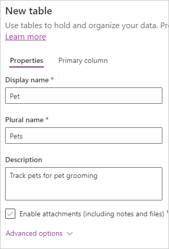](../media/new-table-pane-pets.png#lightbox)

1. Select the *Primary Column* tab and enter the following values:

    - **Display name**: *Pet Name*

    > [!div class="mx-imgBorder"]
    > [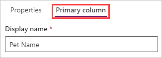](../media/new-table-primary-column-pets.png#lightbox)

1. At the bottom of the pane, select **Save**.

## Add and customize columns

1. When the table is finished creating, your display shows the table properties and your blank table in the section called **Pet columns and data**. Note here that **Pet Name** is the only column on display and next to that is **+18 more** and next to that is  **+** to add a new column. There's also an **Edit** button in the upper-right corner of this section that also allows you to edit, but in this case, we do the editing within this window.

    > [!div class="mx-imgBorder"]
    > [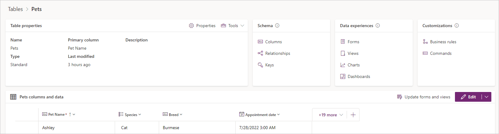](../media/table-properties.png#lightbox)

1. Within the **Pet columns and data**, select the **+ (New column)** button to create a new column and observe a pop-up **New column** pane on the right side of the screen.

1. In the **New column** pane, enter the following values:

    - **Display name**: *Species*
    - **Data type**: *Choice*

    > [!div class="mx-imgBorder"]
    > [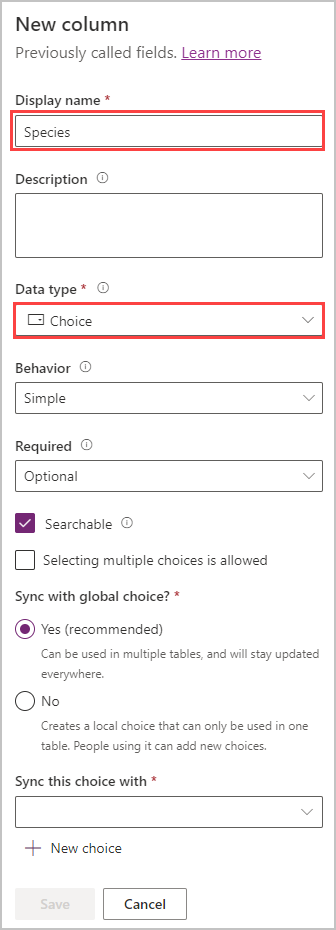](../media/add-new-column.png#lightbox)

1. Create the choice values:

    1. Select **New choice** and you see the **New choice** pane appears.

    1. In the **Display name** field, enter *Species*.

    1. Under **Choices** you see two entry fields titled **Label** and **Value**. Enter *Dog* under the label. Power Apps assigns a value automatically, but you can change it. In this case, we change this value to a *1*.

    1. Select **New choice** under the *Dog* entry and make *Cat* the new entry for Label and *2* for Value.

    1. Select **Save**.

    > [!div class="mx-imgBorder"]
    > 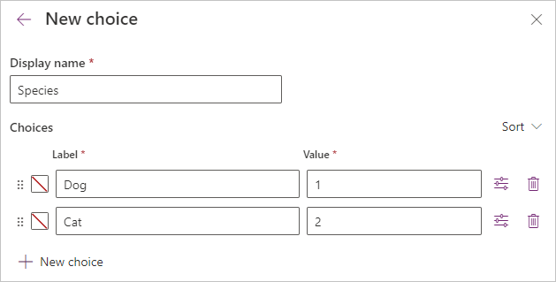

1. To make the *Species* choices that you just created the designated choices for this column, search for and select *Species* from the drop-down list under **Sync this choice with** and then select **Save**.

    > [!div class="mx-imgBorder"]
    > 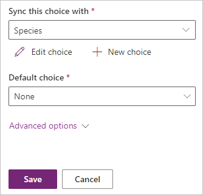

1. Let's add another column in the columns and data pane; again select the **+ (New column)** button to add a new column.

1. In the **New column** pane, enter the following values, and then select **Save**:

    - **Display name**: *Breed*

    - **Data type**: *Single line of text* (this value is the default)

1. Add one more column by selecting the **+** button again in the columns and data pane.

1. In the **New column** pane, enter the following values, and then select **Save**:

    - **Display name**: *Appointment date*

    - **Data type**: *Date and Time*

## Customize a view

1. Navigate to **Views** by selecting **Views** under **Data experiences**.

    > [!div class="mx-imgBorder"]
    > [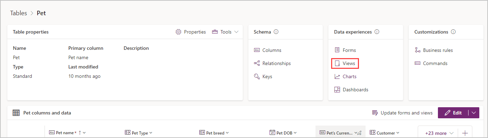](../media/table-views.png#lightbox)

    The list of views for the Pet table is displayed.

    > [!div class="mx-imgBorder"]
    > [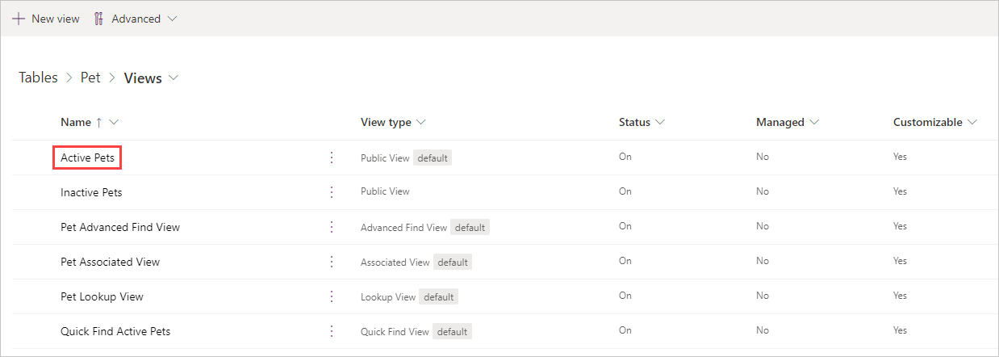](../media/pet-views.png#lightbox)

1. Select **Active Pets** to open the view designer.

1. In the view designer, you can select the columns you want to display in your view by clicking on the column name under the **Table columns** list. Simply selecting the column adds it to the right of the **Created On** column. Alternatively, you can select **View Column** to the right of the *Created On* column and select the columns you wish to display. Add the following columns to your table:

    - Appointment date

    - Breed

    - Species (you need to scroll down or search for this column)

    > [!div class="mx-imgBorder"]
    > 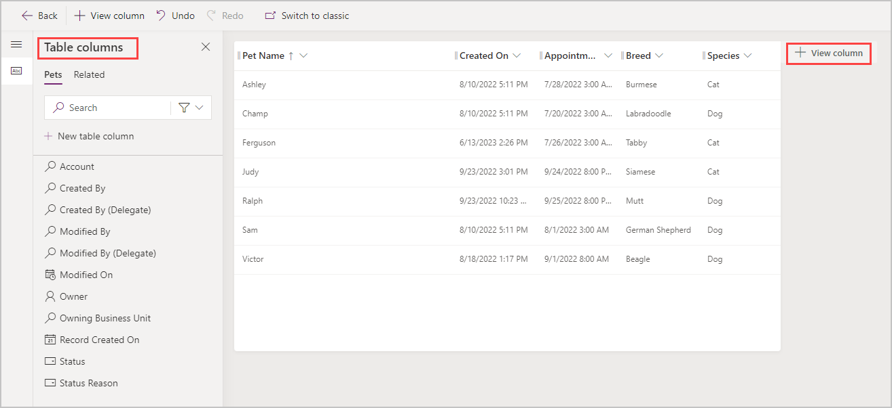

1. You can remove columns from your view by selecting the column name from the view table. Select the **Created On** column, select **Remove**.

1. To arrange the columns, drag them in the order you want them (or you can select the column to move, and then select **Move Left** or **Move Right**) until your view looks similar to this screenshot.

    > [!div class="mx-imgBorder"]
    > [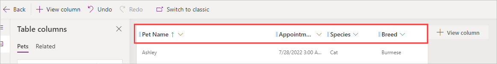](../media/updated-active-pets-view.png#lightbox)

1. On the view designer toolbar, select **Save and publish**.

1. Navigate back to the *Tables* screen by pressing the **Back** button at the top left of the screen to return to the *Views* list, then select *Pets* (from *Tables > Pets > Views*) to exit the *Views* table and return to the *Pets* table viewer.

## Customize the main form

1. Navigate to **Forms** by selecting **Forms** from the *Data Experiences* pane.

    The list of forms for the Pet table is displayed.

    > [!div class="mx-imgBorder"]
    > [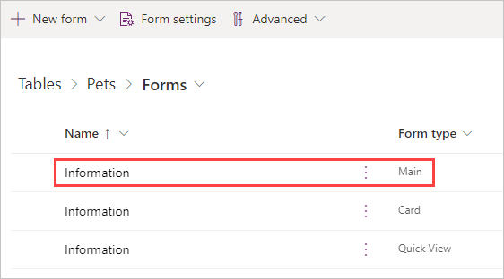](../media/pet-forms.png#lightbox)

1. Select **Information** next to the **Main** form type to open the form editor for the main form.

1. In the form editor, select **Table columns** from the menu on the far-left side of the window, and select or drag the **Species**, **Breed**, and **Appointment date** columns from under the **Table columns** pane to the **General** section of the form canvas. If you make a mistake, notice the **Delete** button on the command bar. Deleting that field merely removes it from the form and places that column back under the **Table Columns** list. When your form is complete, it should resemble this screenshot.

    > [!div class="mx-imgBorder"]
    > [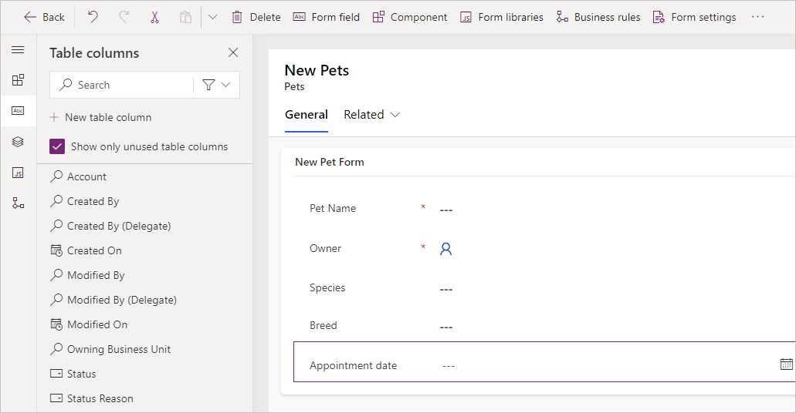](../media/updated-main-form-edit2.png#lightbox)

1. Select **Save and publish**.

1. Close the form designer and navigate back to the list of forms by selecting the **Back** button at the upper-left of the screen.

1. Navigate to the Pet table by selecting **Pet** in **Tables** > **Pet** > **Forms**.

1. At this point, it's possible to add data directly to your table. Under **Pet columns and data**, you can begin entering as many rows as you want. It's good practice to include some test data to be able to view how it appears in your views/forms.

It's also possible to import data into your table. We'll show you how to do that in the next exercise.
