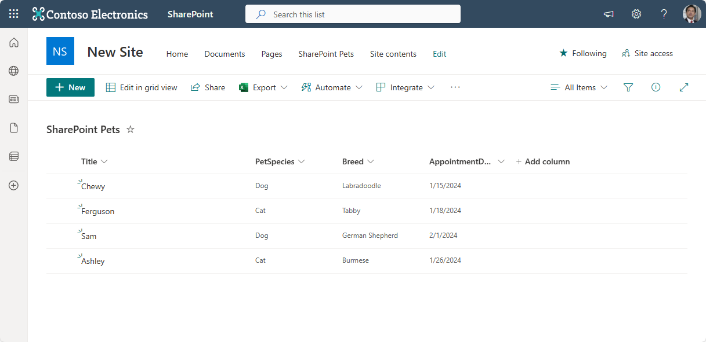
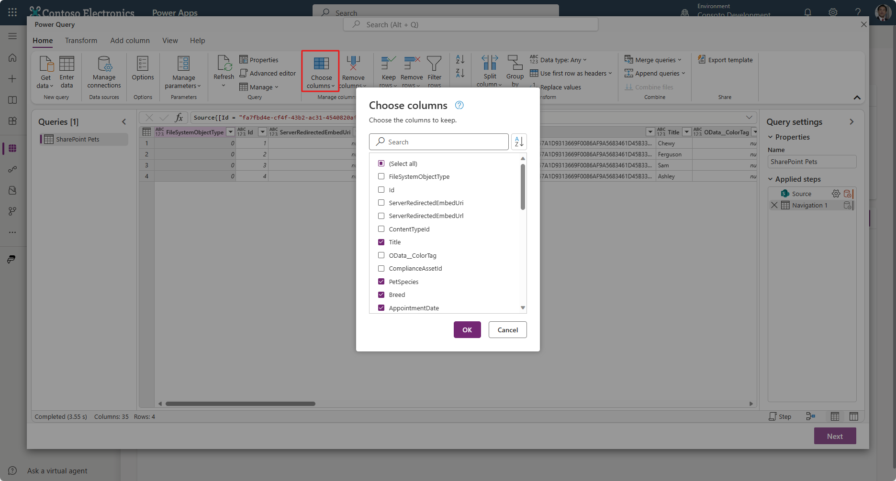
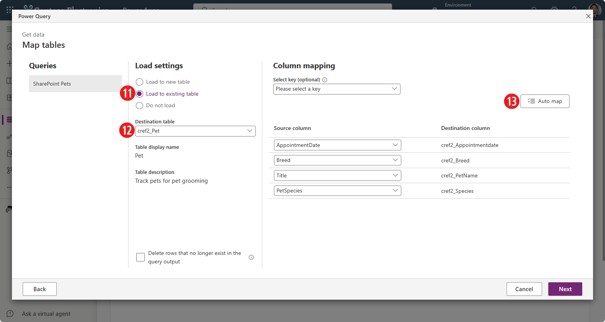

You can import data into your Microsoft Dataverse database in bulk from various sources including Excel, Access, SharePoint, SQL and many others.

> [!NOTE]
> The Dataverse Pet table referred to in this unit was created in the previous exercise. To have other data to import, the steps immediately below walk you through how to create a quick SharePoint list so that you can practice importing into your Pet table.

## Create sample import data

1. Before we walk through how to import data into your Dataverse table, let's create a SharePoint list to use as a table. If you need help finding SharePoint, in a separate browser tab, go to [office.com](https://www.office.com/?azure-portal=true) or Microsoft 365 and sign into your work or school account.

1. In the upper left corner of the window, select the app launcher waffle box then **SharePoint**. Then you can navigate to the SharePoint site that you want to create your list in.

1. Select **New** > **List** in the command bar of the SharePoint site.

1. Select **Blank list** from the **Create a list** popup.

1. Add a name for your list "SharePoint Pets" and select **Create**.

1. On your newly created list that appears, let's create columns that match your **Pets** data table created in the last exercise. Select **Add column** and add the following columns next to your **Title** field as the following data types:

   | Name | Data type |
   |------|-----------|
   | PetSpecies | Single line of text |
   | Breed | Single line of text |
   | AppointmentDate | Date and time |

1. Next, we want to add data so that we have some to import. Add data to your table so that it looks similar to this screenshot:

   > [!div class="mx-imgBorder"]
   > 

1. Now return to your SharePoint site home screen (you can select the site name at the top left of your list, in the image above it is "New Site") and copy the URL of your SharePoint site, up to your site name.

   > [!IMPORTANT]
   > Don't include any suffix for your lists, just include the URL of your home page. (Example: `https://yourOrganization.sharepoint.com/sites/yourSharePointsite`)

Now we're ready to import some data into our Dataverse table. Keep your SharePoint browser tab open for reference.

## Import data into your Dataverse table

1. In a separate browser tab, go to the [Power Apps home page](https://make.powerapps.com/?azure-portal=true), and from the left navigation panel, select **Tables**.

1. Select the **Pet** table, and then select **Import** and **Import data** from the command bar menu.

1. This action begins the **Power Query** data importer. In the **Choose data source** window that pops up, select **SharePoint Online list** as your source. If you need to, you can type "SharePoint" in the search field to narrow the results.

1. Once the Power Query window changes to **Connect to data source**, enter the SharePoint page URL copied previously in the **Site URL** entry field (you can go back to the tab opened to your SharePoint home page and copy it, if needed). After you paste the URL, it might be necessary to sign in with your connection credentials. Once your credentials are good to go, select **Next** at the bottom right to continue.

1. In the **Choose data** step now showing, we can select one or more lists or document libraries that we want to import. Selecting from the list of available tables on the left side panel causes a data preview to display on your screen. Look for the list you just created called **SharePoint Pets** and select it.

1. Once the data from "SharePoint Pets" appears, you can select the **Next** button at the bottom right.

1. You'll see the Power Query editor displaying **Queries** and then the content that showed in the previous preview. The Power Query editor allows you to shape the data before importing it into Dataverse. You can choose the columns you want to import by selecting **Choose columns**. Conversely, you can remove any of the columns that you don't wish to import, by using the **Remove columns** button at the top of the window. If you make a mistake, the **Applied steps** on the right side of the window keeps track of the changes, and you can cancel that step to undo the last action. Don't worry, you're not modifying your data source, you're just filtering what you're going to import.

   By default, Power Query chooses all columns, but we don't need to import all of the data here.

1. Select **Choose columns** from the "Manage columns" tab in the header.

1. Select only the columns, **Title**, **PetSpecies**, **Breed**, **AppointmentDate**, and select **OK** to continue.

   > [!div class="mx-imgBorder"]
   > 
   Notice that the **Applied steps** adds a step from "Choose columns".

	> [!TIP]
	> If you made an error, you can select the "X" just to the left of the step in **Applied steps**. Then you can correct the step.

1. Once your query table has the columns of *Title*, *PetSpecies*, *Breed* and *AppointmentDate* select the **Next** button to continue.

1. At the **Map tables** step of the Power Query, under **Load settings** select **Load to existing table**. You can refer to the image immediately below for the following steps (numbered according to the steps).

   > [!div class="mx-imgBorder"]
   > 

1. Select the **Destination table** from the drop-down. Keep in mind that the Dataverse *Pet* table we created has a prefix in front of it with an underscore. In this example, our table is called *cref2_Pet*, but your table will have a different prefix in front of "_Pet".

1. Notice how the **Column mapping** section has the destination columns from our *Pet* table. Select the **Auto map** button. The **Auto map** button lets Power Apps determine how to best match your Source and Destination columns. However, you can also use the dropdowns to match your SharePoint columns. That's why it's helpful to have similar names to make mapping easier. You might have to manually select the *Title* field for the *PetName* destination column and, likewise, *PetSpecies* for *Species*.

   Once all of your source columns are matched with the destination columns, select **Next** in the bottom right of the window.

1. The **Refresh settings** step provides you with the ability to set up a refresh schedule if you want your data from the same source regularly. In this case, we'll leave it set to **Refresh manually**, since we only want to import it once. Select **Publish** at the bottom right of the window.

    If you receive any warnings, pay attention to the messages, and go back to your query edit screen to shape your data.

1. If you published and received no warnings, and the table screen refreshes (it might take a few moments), you should be able to see that the data was imported into your list.

Though this example used SharePoint as a source for importing data, the steps are similar with any data source you want to import into your list.
