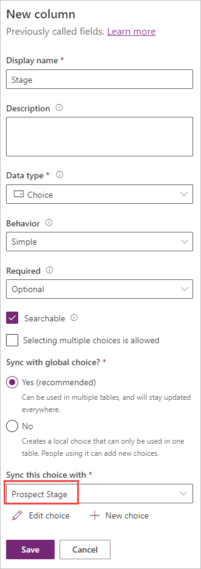

## Scenario

The current sales process for your company is manual and updates are only provided each Friday. You want to simplify this process, minimize the opportunity for mistakes, and improve visibility. So you decide you want to create a new app to track sales leads and automatically calculate the forecasted revenue. You want Dataverse to store the list of potential customers.

## Use Microsoft Dataverse to store data

In this exercise, you use a custom Dataverse table to store the list of potential customers for your app.

You learn how to:

- Create a custom table.

- Add custom columns to your table.

- Create a calculated column.

- Configure a business rule.

- Import data from a Microsoft Excel workbook.

### Create a custom table

1. Go to the [Power Apps maker portal](https://make.powerapps.com/?azure-portal=true) and sign in (if necessary).

1. On the menu, select **Tables**.

1. Select **New table** and select **Set advanced properties**.

   > [!div class="mx-imgBorder"]
   > [](../media/new-table-command.svg#lightbox)

1. Under **Properties**, enter the **Display name**: *Prospect*.

1. Select the **Primary column** tab and change the **Display name** to *Prospect Name*.

1. Select **Save**.

1. After a few moments, the *Tables > Prospect* screen appears.

    > [!div class="mx-imgBorder"]
    > [](../media/prospect-table-main-screen.png#lightbox)

1. Select **+** to add a new column in the *Prospect columns and data* section.

1. In the *New column* pane, enter the following information:

    - **Display name**: *Stage*

    - **Data type**: Select *Choice* (and select *Choice* from the pop-up)

    - **Required**: Select *Business required*

1. Under **Sync this choice with**, select **New choice**. The *New choice* pane appears. Enter the following information and select **Save**.

    - **Display name**: *Prospect Stage*

    - Add the following choices under **Label**, selecting **New choice** between entries until your table looks like the following screenshot. When completed, select **Save**:

        - **Lead** (under *Value* enter **1**)

        - **Opportunity** (under *Value* enter **2**)

        - **Won** (under *Value* enter **3**)

        - **Lost** (under *Value* enter **4**)

    > [!div class="mx-imgBorder"]
    > 

1. Once you've saved your *New choice*, select the drop-down list under **Sync this choice with** and find/select **Prospect Stage**.

    > [!div class="mx-imgBorder"]
    > 

1. Under **Default choice** select **Lead**.

1. Select **Save**.

1. Select **+** in the *Prospect columns and data* pane to add a new column.

1. Enter the following information in the *New column* pane and then select **Save**.

    - **Display name**: *Contract Amount*

    - **Data type**: *Currency*

1. Select **+** again to add a new column with the following information and then select **Save**.

    - **Display name**: *Probability*

    - **Data type**: *Whole Number* (Select *Number* and then *Whole number* from the popup.)

1. Next, we're going to add a column with a behavior. This one is a little more complex. Add a column with the following information.

    - **Display name**: *Forecasted Revenue*

    - **Data type**: *Currency*

    - **Behavior**: *Calculated*

    You may notice something different when you choose the behavior as *Calculated*. You need to save this column before you can edit the calculation. Notice the **Save and edit** link, just below the behavior box. Go ahead and select that link.

1. After a few moments, a calculated field pop-up window appears with the *Set Forecasted Revenue* where you can edit the behavior of the *Forecasted Revenue* column. Add an *Action* by selecting the **Add action** button.

1. Enter the following formula next to the equals sign, but don't copy and paste.

   > [!NOTE]
   > Your column names aren't exactly the same as the example, since the **crXXX_** is specific numbers and letters that define your environment. The formula entry auto-suggests options as you start to type the column names. Check the screenshot to see what your formula should look like in the Action pane.

    ```crXXX_contractamount * (crXXX_probability / 100)```

    > [!div class="mx-imgBorder"]
    > 

1. If it looks good, select the circled checkmark to save your changes. (You may need to scroll right to see the circled checkmark.)

1. Select **SAVE AND CLOSE** at the top of the window and the window disappears to reveal your Prospect Tables screen again.

### Add a business rule

1. In the table designer, find the *Customizations* pane on the far right and select **Business rules**.

1. Select **New business rule** at the top of the screen; a new browser tab opens.

    > [!div class="mx-imgBorder"]
    > [](../media/new-business-rule.png#lightbox)

1. Select the **Condition New Condition** inside of your design pane. The condition *Properties* pane shows on the right hand side of the screen.

1. In the *Properties* pane under *Rules*, look at your **Field**, ensure that **Contract Amount** is selected.

1. For the **Operator**, change the value from **Equals** to **Contains data**.

1. Select **Apply**.

1. Now select the **Components** tab.

1. Find the component **Set Business Required** and drag and drop it on the plus symbol to the right of the purple checkbox in the design pane (the plus symbol appears as you begin to move the component to the canvas).

    > [!div class="mx-imgBorder"]
    > [](../media/drag-set-business-required.png#lightbox)

1. With *Set Business Required New Action* selected/highlighted, look at the *Properties* pane and under **Business Required**, select **Probability** in the top dropdown and **Business Required** in the bottom dropdown.

1. Select **Apply**.

    > [!div class="mx-imgBorder"]
    > [](../media/set-business-required.png#lightbox)

1. In the top left of the screen, select the chevron drop-down just to the right of **Prospect New business rule** and in the **Business rule name**, type **Make Probability Required**.

1. Select **Save** in top-right corner of screen.

1. Select **Activate** to (also top-right of screen) activate the rule.

1. After a few moments, a popup window appears for *Process Activate Confirmation*. Select **Activate** in the popup to confirm activation.

1. Close the browser tab.

1. Select **Done**.

1. Notice your new business rule has been added to the Business rules screen. Now return to your table editing screen.

    > [!div class="mx-imgBorder"]
    > 

### Import data from an Excel file

You use the spreadsheet named "Prospects.csv" for this
exercise. Open this [link](https://github.com/MicrosoftDocs/mslearn-developer-tools-power-platform/raw/master/power-apps/Prospects.zip) and **Download** the file.

1. Extract the *Prospects.csv* from the zip file.

1. Open the *Prospects.csv* file in Excel. Notice the **Stage** column is empty. You need to enter these values manually. Enter the following values in the **Stage** column:

    - **Contoso Flooring**: Won

    - **Fabrikam Inc**: Won

    - **Adventure Works**: Lead

    - **VanArsdel**: Lost

    - **Adatum**: Lead

    - **Relecloud**: Opportunity

1. Save your file locally as an Excel Workbook (*Prospects.xlsx*). Then close the spreadsheet.

1. Return to your **Prospect** table in the Power Apps maker portal.

1. Select the **Import** button at the top of the screen and select **Import** > **Import data**.

   > [!NOTE]
   > Do not select Import data from Excel, which is a legacy function. Be sure to use the *Import data* which activates Power Query.

1. In the **Power Query** popup, there are many ways you can point towards your Excel sheet. You can drag and drop the file, browse for it, or connect to it directly from OneDrive.
    > [!div class="mx-imgBorder"]
    > 

    Once you find the *Prospects.xlsx* (you may need to enter your connection credentials), ensure that the connection is valid and then select **Next** to continue.

1. The Power Query now switches to **Choose data**. Find the **Prospects** table under the Excel workbook folder and select it. Doing so previews your data, giving you a chance to ensure that you're about to import the correct table. Then select **Next** to continue.

    > [!div class="mx-imgBorder"]
    > 

1. Power Query opens to a transform data screen where you can now shape your data before importing. Notice how Power Query automatically makes a guess at the type of data in each column. *ContractAmount* and *Probability* are defined as integer, and *Name* and *Stage* are defined as text. In this case, leave it as it is. Select **Next** to continue.

    > [!div class="mx-imgBorder"]
    > 

1. Power Query switches to the **Map tables** screen, where you can select where you want the data to load to (either a new table or an existing table) and which columns in your existing data source that you send your Excel table data to. In this case select **Load to existing table** under *Load settings*, then select your *Prospect* table from the dropdown under **Destination table**. Completing this brings up the **Column Mapping** section showing the *Destination column* name from your selected table and the *Source column* with some dropdowns.

    > [!div class="mx-imgBorder"]
    > 

1. Under **Column mapping**, select the **Auto map** button at the top right to let Power Query try determining how your columns match. Notice how the Power Query matches three of four of your columns automatically! Let's pick the last one manually matching **Name** to your **ProspectName** Dataverse column. Your mapping should now resemble this image:

    > [!div class="mx-imgBorder"]
    > 

    Select **Next** to continue.

1. The Power Query **Refresh settings** screen gives you the ability to determine how you want the data from this external source to refresh. In this case, leave it as **Refresh manually**. If you chose to do it automatically, you could set it up on a schedule. Leaving the default as manually, select the **Publish** button at the bottom right of the screen.

1. The imported data doesn't appear right away, so go ahead and refresh your browser screen to show the data

1. Ensure that the data has been successfully imported. Your columns and data should look similar to this screenshot:

    > [!div class="mx-imgBorder"]
    > [](../media/final-columns.png#lightbox)

Congratulations! You've created a custom table with a business rule and learned how to import external data into Dataverse.
