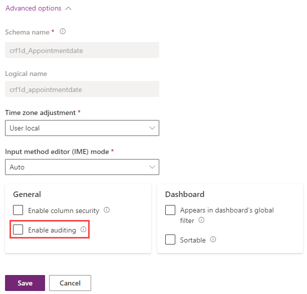

Microsoft Dataverse supports an auditing feature designed to meet the external and internal auditing, compliance, security, and governance policies that are common to many enterprises. Dataverse auditing logs changes that are made to customer records in an environment with a Dataverse database. Dataverse auditing also logs user access through an app or through the SDK in an environment.

Dataverse auditing is supported on all custom and most customizable tables and columns. Audit logs are stored in Dataverse and consume log storage capacity. You can view audit logs in the Audit History tab for a single record. You can view audit logs in the Audit Summary view for all audited operations in a single environment. Audit logs can also be retrieved using the Web API or the Organization Service.

## Key concepts

- There are three levels where auditing can be configured: an environment, table, and column. For table auditing to take place, auditing must be enabled at the environment level. For column auditing to take place, auditing must be enabled at the environment level and the table level.

- To enable user access auditing (Log access) or activity logging (Read logs), auditing must be enabled at the environment level. The option to enable activity logging is only visible when the minimum Office licensing requirements are met.

- You must have System Administrator or System Customizer role or equivalent permissions to enable or disable auditing.

- Auditing can be configured manually via the Power Platform admin center and the Power Apps portal. Auditing can also be configured programmatically. For more information, see [Auditing overview](/power-apps/developer/data-platform/auditing/overview/?azure-portal=true).

### Configure tables and columns for auditing in Power Apps

The following task requires the System Administrator or System Customizer role or equivalent permissions.

1. Sign in to Power Apps using the proper credentials.

1. Select the desired environment.

1. First we configure a table for auditing. Select **Dataverse** > **Tables**.

1. Select a table.

1. Select **Edit** from the command bar.

1. Once the table appears on the screen, select **Edit table properties**.

1. In the *Edit table* pane on the right side of the screen, expand **Advanced options**.

1. Scroll down to the options under *For this table* and check the box next to **Audit changes to its data**.

    > [!div class="mx-imgBorder"]
    > 

1. Select **Save**.

1. Select **Back** to return to the table viewer. Now we configure a column for auditing.

1. In the **Schema** pane, select **Columns**.

    > [!div class="mx-imgBorder"]
    > 

1. Select a column where you want to enable auditing, to open up the **Edit column** pane.

1. Expand the **Advanced options** and select the box next to **Enable auditing**.

    > [!div class="mx-imgBorder"]
    > 

1. Select **Save**.

With this simple setup, Dataverse can track changes to a table or a specified column. It's possible to refer to this data in a model driven app under **Audit history**. Remember that you can view auditing on an environmental level if you use the **Audit Summary View**, which is a comprehensive list of all audit logs in an environment.  The Audit Summary View is available in the Power Platform admin center.

For more information, see [Manage Dataverse auditing](/power-platform/admin/manage-dataverse-auditing/?azure-portal=true).
