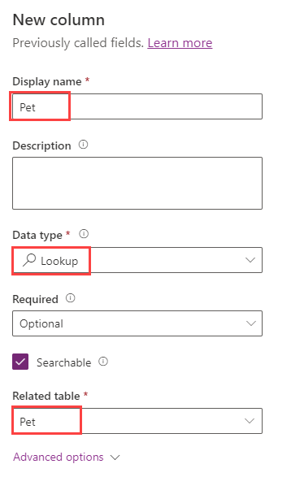
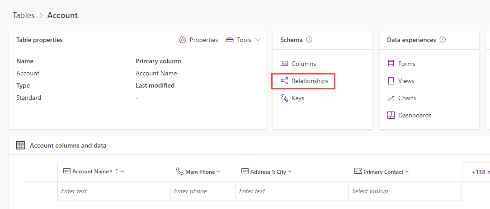
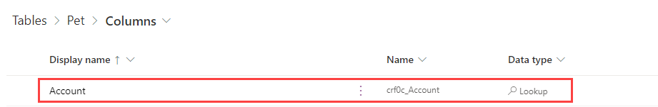
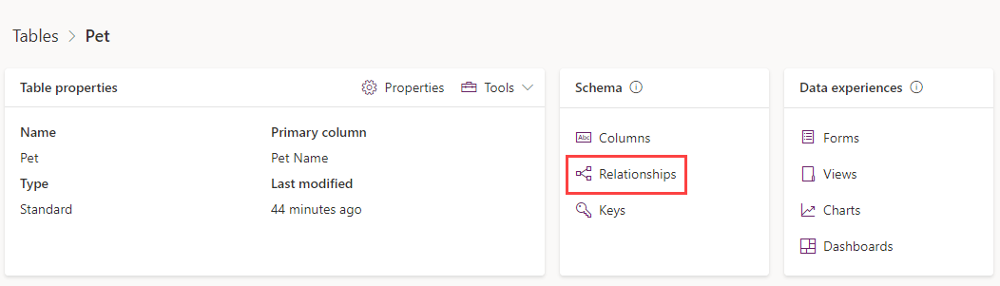
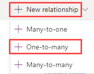
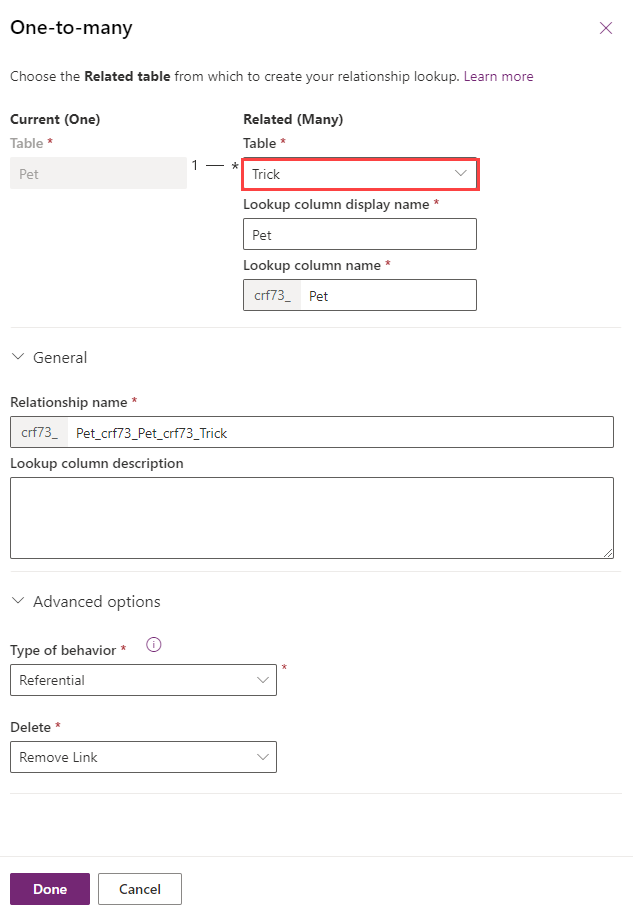

In this unit, you create a table and then add relationships between tables. You learn how to:

- Create a relationship by using a lookup column.
- Add a One-to-Many table relationship.
- Add a Many-to-Many table relationship.

> [!NOTE]
> The Dataverse Pet table referred to in this unit was created in the previous exercise. You need to create other tables to add relationships to.

## Create a custom table and add a column

1. Sign in to the [Power Apps maker portal](https://make.powerapps.com/?azure-portal=true).

1. In the left navigation pane, select **Tables**, select **New table**, and then select **Set advanced properties**.

1. In the *Properties* table of the New table pane, enter the following values:

    - **Display name**: *Trick*

    - **Description**: *Pet Tricks*

1. Select the *Primary Column* tab and enter the following value:

    - **Display name**: *Trick Name*

1. At the bottom of the pane, select **Save**.

1. On the **Trick** table, select **New** and select **Column**.

1. In the **New column** pane, enter the following values:

    - **Display name**: *Level*

    - **Data type**: *Choice*

1. Create the choice values:

    1. Select **New choice** to display the **New choice** pane.

    1. In the **Display name** field, enter *Level*.

    1. Under **Choices** are two entry fields titled **Label** and **Value**. Enter *Beginner* and *1* respectively.

    1. Select **New choice** under the *Beginner* entry and make *Proficient* the new entry for Label and *2* for Value.

    1. Select **New choice** under the *Proficient* entry and make *Expert* the new entry for Label and *3* for Value.

    1. Select **Save**.

1. Select the drop-down list under **Sync this choice with**,  select *Level*, and then select **Save**.

## Create a relationship by using a lookup column

1. On the **Trick** table, select **New** and select **Column**.

1. In the **New column** pane, enter the following values:

    - **Display name**: *Pet*

    - **Data type**: *Lookup*

    - **Related table**: *Pet*

   > [!div class="mx-imgBorder"]
   > 

1. Select **Save**.

## Add a one-to-many relationship

1. Select **Tables** in left-hand navigation of the [Power Apps maker portal](https://make.powerapps.com/?azure-portal=true), and then select the **Account** table.

1. On the **Schema** pane, select **Relationships** to display the existing relationships on the screen.

   > [!div class="mx-imgBorder"]
   > 

1. At the top left of the screen, select the **New relationship**, and then select **One-to-many** in the dropdown.

1. In the **One-to-many** pane on the right, in the **Related (Many)** list, select **Pet**.

1. Select **Done**.

   Notice that when you add a many-to-one relationship, an **Account** column of the **Lookup** data type is automatically added to the  list of columns on the Pet table.

   > [!div class="mx-imgBorder"]
   > 

### Create a one-to-many relationship

1. To create a new relationship, select **Tables** in left-hand navigation of the [Power Apps maker portal](https://make.powerapps.com/?azure-portal=true), and then select the table you want to use in the relationship.

1. Navigate to **Relationships** by selecting **Relationships** under **Schema**.

    > [!div class="mx-imgBorder"]
    > 

1. Select **New relationship** and then select **One-to-many**.

    > [!div class="mx-imgBorder"]
    > 

1. The new relationship pane is displayed.

    > [!div class="mx-imgBorder"]
    > 

The *Current* table is the table you selected. You select the *Related* table from the drop-down list. The other fields on the pane are automatically populated.

For more information, see [Create and edit One-to-many or Many-to-one table relationships using Power Apps portal](/power-apps/maker/data-platform/create-edit-1n-relationships-portal/?azure-portal=true).
