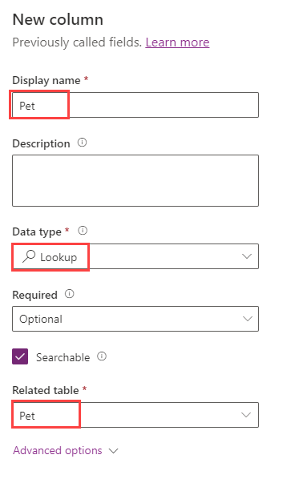

When working with Microsoft Dataverse, you need to try to keep information about different sets of data in separate tables. This is known as data normalization. Table relationships define the different ways table rows can be associated with rows from other tables.

We learned earlier in this module that a Database table has a **primary key** to uniquely reference rows in the table. In Dataverse, a relationship between two tables looks up, or references, the primary key.

## Relationship types

Table relationships define the ways that table rows can be associated with rows from other tables or the same table. There are just two types of table relationships:

- **One-to-many relationships**: In a one-to-many table relationship (1:N), many referencing (related) table rows can be associated with a single referenced (primary) table row. The referenced table row is sometimes referred to as the ”parent” and rows of the referencing table are referred to as ”children.” A many-to-one relationship is just the child perspective of a one-to-many relationship

- **Many-to-many relationships**: In a many-to-many (N:N) table relationship many table rows can be associated with many other table rows. Rows related using a many-to-many relationship can be considered peers and the relationship is reciprocal.

### Many-to-one vs. One-to-many

The many-to-one (N:1) relationship isn't fundamentally different than one-to-many, it's only a different point of view. The many-to-one relationship type exists in the user interface because the designer allows you to view and create relationships from *either* of the tables involved in a relationship. If you have a one-to-many relationship between Table A and Table B, you can see a *one-to-many* relationship under Table A in the Power Apps maker portal, and a *many-to-one* relationship under Table B. A many-to-one relationship is just a one-to-many relationship viewed from the related table. It isn't a different type of relationship, it's merely a different perspective.

### Lookup columns

An easy way to create a table relationship is by creating a column with data type **Lookup** to another table. Creating a lookup column creates a many-to-one relationship.

   > [!div class="mx-imgBorder"]
   > 

There's no functionality difference for a relationship whether it's created using one-to-many, many-to-one, or a lookup column.

### Create table relationships manually

When you create a new table, as we learned previously in this learning module, you have many options and a few mouse-clicks to make Dataverse work for you. On the **Tables** screen, there's a link to **Relationships** in the *Schema* pane.

   > [!div class="mx-imgBorder"]
   > 

Selecting this link takes you to a table displaying all of the relationships for your table. Some are system-designed and others you create. You can see which tables your current table is related to and what type of relationship they have to those other tables.

Also, note at the top in the command bar that you can create a **New relationship**. This allows you the flexibility to manually create a relationship between your tables.

   > [!div class="mx-imgBorder"]
   > 

You have the ability to decide what type of relationship you want to create. In the example below we're creating a one-to-many relationship to a table called Veterinarian. While each pet could see any doctor, we want each pet to see a regular doctor. Notice how creating a relationship this way creates a **Lookup** column in the related table.

   > [!div class="mx-imgBorder"]
   > 

Once you create this relationship, you can go to the associated table and discover the created lookup column.

### Many-to-many relationships

Before we move on, let's briefly discuss the concept of creating many-to-many relationships between tables in Dataverse.

Remember that One-to-many relationships have a hierarchy between the rows in the table relationship. Rows that are related through Many-to-many table relationships are considered peers.

> [!NOTE]
> Many-to-many relationships are not supported by relational databases and Dataverse creates a hidden *Intersect* table to link the table rows. This *intersect* table does not have a form and you cannot edit its properties or add columns to the table.

You can manually create a many-to-many relationship by choosing the related tables. For example, if you had a table of pet groomers and a table of pets, each pet could have multiple groomers and each groomer could have multiple pet clients. Unfortunately, there's no table in Dataverse that shows this, merely a relationship. In a form, you could insert a subgrid that has the items of the related table displayed on it, and, with filtering, show the items from the related table corresponding with your item. However, that is beyond the scope of this unit.

For more information, see [Create many-to-many table relationships overview](/power-apps/maker/data-platform/create-edit-nn-relationships/?azure-portal=true).
