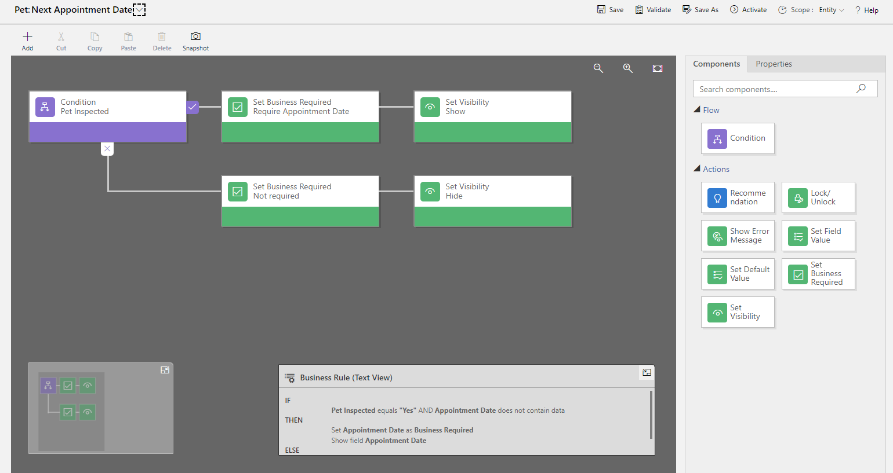
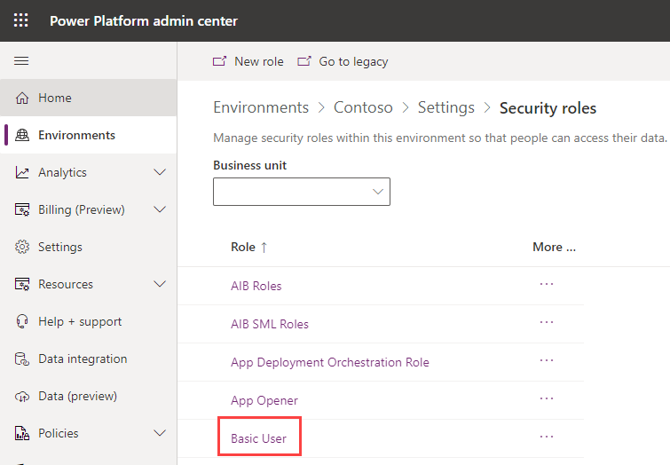
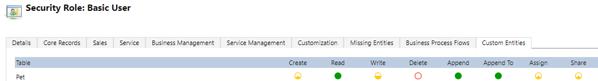

Microsoft Dataverse is more than a data store, it contains features to apply business logic to data and securing access to data.

Tables within Dataverse can use rich server-side logic and validation to ensure data quality. You can also reduce repetitive code in each app that creates and uses data within a table.

- **Business rules**: Business rules validate data across multiple columns in a table, and provide warning and error messages, regardless of the app that's used to create the data.

- **Business process flows**: Business process flows guide users to ensure they enter data consistently and follow the same steps every time. Business process flows are currently supported only for model-driven apps.

- **Real-time workflows**: Workflows automate business processes without requiring user interaction.

- **Business logic with code**: Business logic supports advanced developer scenarios that extend the application directly through code.

## Business Rules

Business rules can be used for many common scenarios when creating and updating table rows:

- Set the value for a table column.

- Perform calculations on table columns.

- Validate data.

- Enforce data requirements.

- Prompt users to enter data into a table column.

Business rules are used to replace the need for code such as JavaScript in model-driven app forms and are an important low-code feature of Dataverse.

Business rules provide a simple drag-and-drop declarative interface to implement and maintain rules. The business rule designer allows you to specify the conditions that define when the rule is applied, and actions performed by the rule.

The following screenshot shows a business rule on the Pet table to force the Appointment Date to be displayed and a date to be selected.

   > [!div class="mx-imgBorder"]
   > 

Business rules are created and managed in the Power Apps maker portal. Business rules are defined for a Dataverse table and are applied based on the setting of the *Scope* on the rule:

- **Individual form**: The rule applies only to the specified model-driven app form.

- **All forms**: The rule applies to all model-driven app forms.

- **Entity**: The rule applies to all model-driven app forms and when the row is created or updated on the Dataverse table. This is the default setting.

### Actions

By combining conditions and actions, you can do any of the following with business rules:

- Set column values.

- Clear column values.

- Set column requirement levels.

- Show or hide columns.

- Enable or disable columns.

- Validate data and show error messages.

- Create business recommendations based on business intelligence.

For more information, see [Create a business rule for a table](/power-apps/maker/data-platform/data-platform-create-business-rule/?azure-portal=true).

### Differences between canvas and model-driven apps

The business rules defined for a table apply to both canvas apps and model-driven apps if the table is used in the app.

Model-driven apps can use all actions available on business rules, however not all business rule actions are available for canvas apps. The following actions aren't available on canvas apps:

- Show or hide columns.

- Enable or disable columns.

- Create business recommendations based on business intelligence.

## Dataverse security

Dataverse has a comprehensive security model that controls access to environments, tables, table rows, and other Dataverse features such as importing and exporting of data.

Data in Dataverse is securely stored so that users can view it only if you grant them access. Access to data in Dataverse is controlled using role-based access control (RBAC). Dataverse security roles are collections of privileges and access levels. Instead of assigning each privilege to a user, you assign one or more Dataverse security roles to users. This simplifies management of user access.

> [!NOTE]
> A user must be assigned at least one security role to be able to access Dataverse and run their apps.

You can assign several built-in security roles:

- System Administrator: Has full permission to customize or administer the environment.

- Environment Maker: Can create new resources associated with an environment, including apps, flows, and connections.

- Basic user: Can run an app within the environment and perform common tasks for rows on the out-of-the-box tables such as Account and Contact.

You typically create custom security roles for your app to provide the minimum set of privileges required by the app.

Security roles are managed from the [Power Platform admin center](https://admin.powerplatform.microsoft.com/?azure-portal=true). Select your environment and select **Settings**, expand **Users + permissions** and select **Security roles**.

   > [!div class="mx-imgBorder"]
   > 

Within the security role, you can specify the access levels for each privilege for every table. In the following screenshot, the Create, Read, Write, Delete, Append, Append To, Assign, and Delete privileges for the Pet table have been selected.

   > [!div class="mx-imgBorder"]
   > 

To change a privilege, select the circle for the privilege.

For more information, see [Security concepts in Microsoft Dataverse](/power-platform/admin/wp-security-cds/?azure-portal=true).
