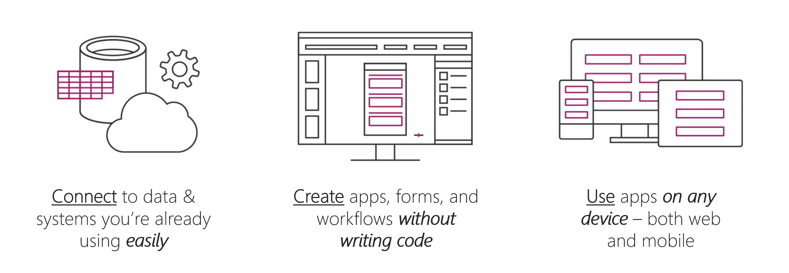
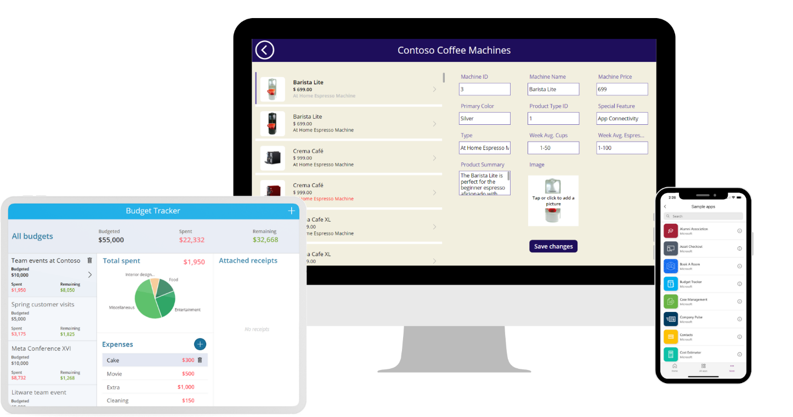

> [!VIDEO https://www.microsoft.com/en-us/videoplayer/embed/RW1gccr]

Welcome to your Power Apps learning journey! We're excited to partner with you in this learning path! Let's start with a brief introduction. What is Power Apps?

Power Apps is a suite of apps, services, and connectors that lets you create custom business apps without coding. It provides a rapid development environment where you can build apps according to your business needs. With Power Apps, you can build professional solutions using AI-powered development, prebuilt templates, and connectors to hundreds of data sources and systems. You can solve countless business problems with Power Apps, whether it's finance, sales and marketing, human resources, operations, or frontline workers.

Power Apps can connect to data you're already using. It can provide you with a vehicle to interact with your data on any device that can connect to Power Apps. It works in web browsers and on mobile devices.

The best thing about Power Apps is that you don't need coding experience to begin using it. The interface in the Power Platform studio enables you to produce solutions that can transform your manual business processes to digital ones.

With Power Apps, you can:

- Build an app quickly by connecting with existing data.

- Connect to the cloud services and data sources that you're already using.

- Share your apps instantly so that coworkers can use them on their phones and tablets.

When it comes to using Power Apps to get things done and keep people informed, your options are nearly limitless. The following examples can help you think about how to use an app, instead of traditional paper notes, to run your business:

- **Equipment in the field** - Often, company representatives who visit customers in the field carry clipboards to help guarantee a paper trail of parts with scheduled replacement dates. By running an app on a tablet, reps can look up the customer's equipment, see a picture of a part, test and analyze the part, and then order new parts. Reps can perform these tasks on-site instead of leaving the customer's warehouse.
- **Restaurant employee management** - Employees of a large restaurant might fill out work schedules and vacation requests on a piece of paper on a wall. With Power Apps running on everyone's smartphone, employees can open the app to record the same information, anywhere, anytime. The app can even send reminders for the start of the next day's shift.

If you're a beginner with Power Apps, this module gets you going quickly. If you're familiar with Power Apps, it ties concepts together and fills in the gaps.
