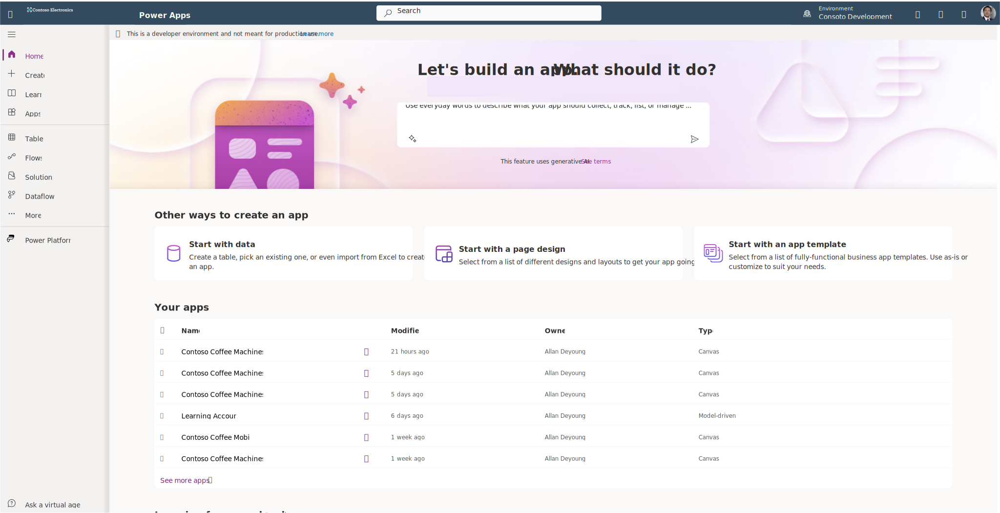
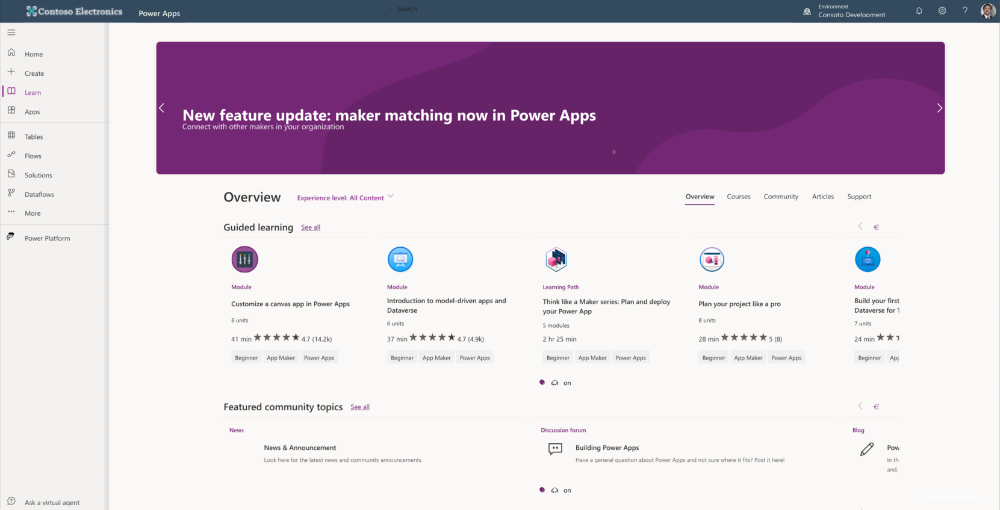

To get started using Power Apps, you need to sign in to your organizational Microsoft 365 Account. Then from your web browser, go to [make.powerapps.com](https://make.powerapps.com/?azure-portal=true). This web address takes you to the Power Apps Maker Portal where you can begin creating your app.

Notice a menu down the left-hand side of your screen, and a Copilot entry field in the top-center of the screen. Copilot provides a way to describe what you want your app to do in everyday language. However, using Copilot to develop your app produces an app built on Microsoft Dataverse, which is an add-on cost and isn't immediately included in most licensing. So, while Dataverse is a great feature, some of you want to use a data source that's available free of cost.

> [!div class="mx-imgBorder"]
> 

To get started with building an app on any data source, you select the **Create** button from the left-hand menu. Power Apps gives you shortcuts to start your app from some of the most common data sources including SharePoint and Excel, both of which are included in your organizational Microsoft 365 Account. Dataverse and SQL are superior data sources with the ability to handle large amounts of data quickly. However, connecting them to your app adds extra costs.

There are links to instructional videos for the most common ways to start, and if you continue to scroll down the **Create** page you see templates that are available to use. Templates are a great way to see how an app can behave with data, however, you don't want to use any of these templates with your own data. As you look through the templates, notice that some of them are Model-driven apps. Model-driven apps are form-based apps and aren't covered in this learning module. If you decide to try an app, make sure that it's a **Canvas app**.

In the **Learn** tab, you find links to available Microsoft training and News, Blogs, Discussion forum and a host of how-to articles and instructional videos.

> [!div class="mx-imgBorder"]
> 

The **Apps** tab provides a listing of all your apps and buttons to start a new app, like the ones in the **Create** tab.

That's all we need to know in this learning path. Starting in the next unit, we're going to be making our first app from an Excel spreadsheet saved to OneDrive. We're also going to create apps that you could use with a mobile device. So, let's introduce you quickly to OneDrive and Power Apps Mobile.

To get to your **OneDrive**, select the App launcher waffle box in the top left corner of the Power Apps Maker Portal. Then select the link for **OneDrive**. This action opens OneDrive in a separate browser tab. Then you can select the Add new button in the top left corner to add a file from anywhere on your computer. This is the landing space for the data file we're going to use in this learning module.

If you have a mobile device that you plan to use, go to your device's app store, and download the free **Power Apps Mobile** app. You might need to sign in with your Office 365 credentials, but Power Apps Mobile provides the vehicle to run any Canvas app on your mobile device.

I hope you're excited to get started with your first app! Let's continue to the next unit where we'll do just that!
