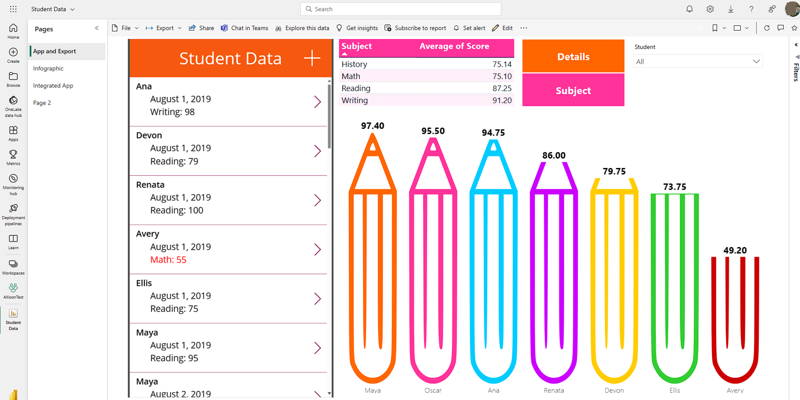

The Microsoft Power Platform includes two significant technologies that help you build powerful apps for your organization. Power Automate and Power BI work seamlessly with Power Apps to help you create automations and visualizations around your organization's data. Like Power Apps, these technologies can connect to hundreds of different data sources, and even to your desktop. The purpose of this unit is to help you gain some familiarity with what they're designed to do for you.

> [!div class="mx-imgBorder"]
> 

## Power Automate

Power Automate enables you to build automated workflows to receive notifications, run business processes, collect data, and more. If you have complex tasks you need to perform outside of your app, you can trigger a Power Automate flow with a button or process inside of your app, and even have the flow send data back to your app. A single flow can do multiple processes, such as:

- Updating a data source,

- Downloading,

- Writing files,

- Making PDFs,

- Sending out emails,

- Placing events on calendars,

- Sending messages in Teams,

- Starting approvals, etc.

Power Automate is an automated business assistant!

> [!div class="mx-imgBorder"]
> 

## Power Automate Desktop

Power Automate Desktop can interact with legacy systems from a desktop system. You can train Power Automate Desktop to replicate routine steps that a person at a desktop would do. With premium connections, Power Automate Desktop can be part of a regular Power Automate flow, and desktop flows can be initiated via Power Apps.

## When to use Power Automate

Now that you have a general understanding of Power Automate, how do you determine if the solution you're building requires a Flow? There are many simple functions Power Apps can already do, like sending an email when a button is pressed in your application. An email generated from Power Apps can also contain dynamic/specific information and be sent to any email address you would like. Often, users use Power Automate to create this same functionality even though Power Apps can do it out of the box. Power Automate should be used for more complex solutions, such as the approval workflows. With Power Automate you can run an approval when a button is pressed, on a schedule, when an item is created or modified, and so on.

In many Power Apps solutions, Power Automate handles complex business logic. Do you need a way to make sure someone acted on the incident report that your app generated? Or do you need a process to kick off every time new data is created in another system so Power Apps has the data it needs? Do you need to check each morning to see if an inspection is due that day and then send an email with a link to your Power Apps inspection form? These are great uses of Power Automate to transform your app from a point solution to a fully featured business solution.

## Power BI

Power BI is an analytics tool within Microsoft Power Platform suite. Power BI connects data from multiple sources and transforms the data into graphical visualizations to help organizations gain insights. It allows business users to use many different visualizations to build comprehensive reports and dashboards. When creating Power BI reports to view and analyze your app data, you can customize them for personal use and they're only accessible by you, providing you with a more unique and custom experience. If you need to share the report with others, you and each of the report consumers need a Power BI Pro license, which is available at extra cost. This license allows you to not only share the content, but also to control what others are able to do with the shared report or dashboard.

While Power Apps has capabilities to include simple graphs or tables, many solutions would be better served with rich visualizations provided by Power BI. Power Apps and Power BI have two options for seamless integration.

## Embed Power BI tiles in your canvas app

By embedding a Power BI tile in a Power Apps app, you're able to bring valuable visualizations into the app to allow the user to consume that data within the context of the app.

> [!div class="mx-imgBorder"]
> 

## Embed a canvas app in a Power BI dashboard

Another integration option is to embed a Power Apps app into your Power BI report. This allows a Power BI user to act on data while never leaving the dashboard resulting in a unique user experience. Consider an inventory management dashboard for a manufacturing facility. The user, without leaving the dashboard, can submit to purchasing an order for other materials. In this solution, the user simply experiences a complete end to end solution in one window on their desktop, even though both Power BI and Power Apps are part of it.

In this example, we're analyzing the performance of all the students in a class.

> [!div class="mx-imgBorder"]
> 

Notice once you embed your Power App in a Power BI Dashboard you can navigate between app screens, and even filter the data in your visualization.

> [!div class="mx-imgBorder"]
> 

## When to use Power BI

When deciding whether to use the basic charts, graphs, and visuals that come with Power Apps out of the box or to go with a more powerful software like Power BI, it really depends on your business solution and requirements. For example, if in your solution, you want to add some basic graphs and charts to improve the apps overall look and feel while adding some visual flair for your users, Power Apps has you covered.

On the other hand, if your solution requires in-depth analysis of your data and robust visuals, Power BI is the best product to use. Keep in mind, with Power BI, each app user needs another license on top of the Power Apps license. This might be a small price to pay if your solution relies on intuitive dashboards, charts, and graphs.

## Summary

The Microsoft Power Platform offers robust tools like Power Automate and Power BI, seamlessly integrating with Power Apps. Power Automate streamlines workflows, from notifications to complex tasks, even interacting with desktop systems via Power Automate Desktop. It's ideal for intricate processes like approval workflows. Power BI, an analytics powerhouse, transforms data into visualizations for insightful reports and dashboards. While Power Apps has basic visual capabilities, Power BI excels in complex data analysis, offering in-depth visuals. Integration options between Power Apps and Power BI provide unique user experiences. You can embed visualizations in apps or apps within reports for a cohesive, end-to-end solution tailored to diverse business needs.
