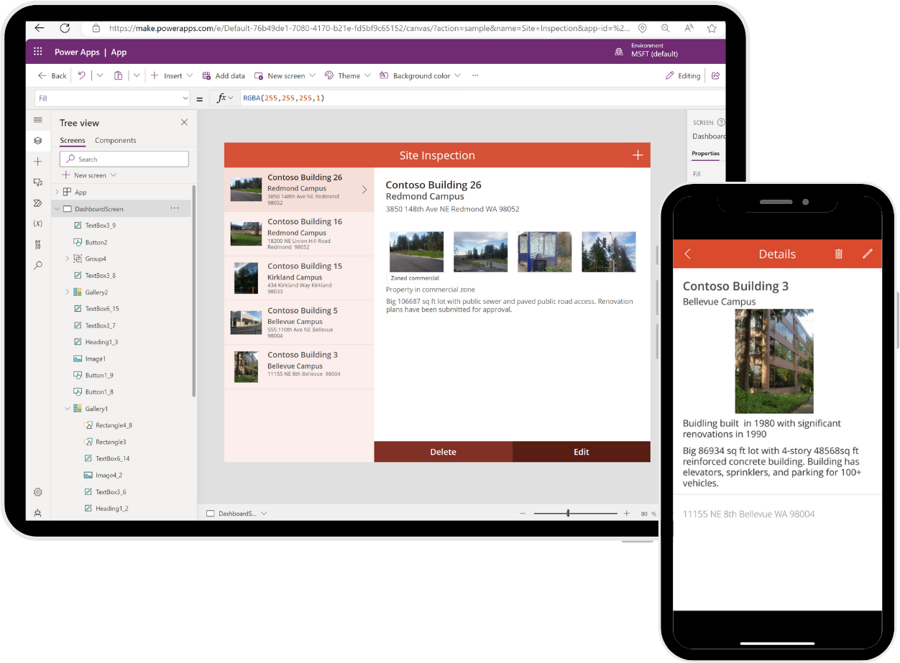

Before trying to create a Power Apps solution, you should consider what you're trying to accomplish with the app. You wouldn't build a road without having a purpose for the road. Similarly, you don't want to invest the effort into making an app, unless you have a clear objective for it. While there's no formal design process, the point of this unit is to help you make considerations that assist you in your app building, and save you pain of fixing an app that is already in production.

## Understanding user needs

Before even opening the Power Apps Maker Portal, you should have a good understanding of what your client or user needs. Properly defining the problem is a necessity of good problem solving. What do we want our app to do? Are we replacing or automating an analog process? Do we need to automate steps in our current process that cause backlogs? Do we need to create mobile capacity? Do we need to account for hundreds of lines of data, or tens of thousands of lines of data?

Avoid the temptation to replace the steps of a legacy process with an app when there's so much more you can accomplish with Power Apps. Where off-the-shelf software might help you streamline or solve business solutions, it rarely helps you solve all your business problems, and sometimes this causes you to update/alter your processes to match the software. For most organizations, this isn't ideal because of the cost or time it takes to update those business processes.

The great news is, by using Power Apps to build your solution, you don't have to worry about unsupported business solutions. Why? With Power Apps, you can build a custom solution tailored to the exact needs of your business requirements.

Often when building an app, you're tempted to recreate the piece of paper or legacy software-driven process exactly. If you challenge the existing process and ask what the business needs to do, rather than what the piece of paper or old software let you do, you open the way to better, more efficient processes. For example, maybe on the paper process, the user had to type notes about what they see. Would it be better instead to just take a picture? This type of thinking leads to better apps and better outcomes.

## Business requirements

Every app you develop has a different set of business requirements based on the solution. Taking the time to think about all the requirements is key to rolling out a successful production app.

Depending on the solution or company policies, you might have certain security, privacy, or compliance requirements you must follow. For example, let's say you're collecting secure personal information in the app. You want to ensure this information is securely stored and not visible to everyone.

During this process, you also want to identify any government regulations or authentication/authorization requirements (if applicable). You don't necessarily have to have all the answers to your questions here; you just want to know all the requirements.

## Data model

Earlier in this module, we learned about data sources for Power Apps, but with all these choices how do you decide which data source to use for your solution? Maybe you already have a data source implemented that users work with on a day-to-day basis, like SharePoint. Could you just use this as your data source to build your app? Do you need to connect to multiple data sources? How much data do you need to store? These are all common questions you should ask yourself and there are number of other factors to consider, such as:

- **Business Requirements** - Every data source and its supported functionality is slightly different. So, depending on your app requirements you need to select the data source that supports your needs, or modify your business requirements to comply with the supported functionality for the selected data source.

- **Licensing/Cost** - Remember that certain data sources like the Microsoft Dataverse or SQL are considered "premium" data sources. A premium data source requires each user who uses the app to have a Power Apps Per App Plan or a Power Apps Per User Plan. It might be that your needs don't require any premium data sources.

## User experience (UX)

By designing your Power Apps solution in a Canvas app, you have complete control of the end-user experience. This allows you to fully customize nearly every aspect of your app. However, just because you can doesn't necessarily mean you should. When you design your Power Apps solution, your goal should be to keep it simple. When your end users open the application and begin using it, they should have no confusion about what to select or where to go. If your app requires an extensive training program for users to understand how to use it, you might want to rethink your app.

Another important consideration for your user is app performance. You can add high resolution images and animations to your app to look pretty but consider the performance degradation for a user trying to pull up the app on a mobile device using legacy cellular data. Your user doesn't want to stare forever at a loading screen.

Here are some of the basic designs elements you want to consider:

- Custom Branding (your logo, colors, and fonts)

- Pop-ups (confirming user actions)

- Hide/show buttons based on users' access/permissions

- Confirmation prompts

> [!div class="mx-imgBorder"]
> 

Without confirmation, a user might not be sure if their submission was accepted. They might try to click the button again, causing incorrect or inconsistent data to get written to the data source.

Remember, these aren't the only customizations you can make to your app, these are just some of the common ones. Also, keep in mind that as you add different design features for the customization of the app, you're adding more code that your application needs to process. So, for example, if you add several different functions for hiding buttons, or showing popups on a given screen, this could cause your application performance to slow as each piece runs.

Finally, challenge yourself to do better with your user experience. Maybe today, the user records room temperatures by clicking in an input field, changing the device keyboard from letters to numbers, and then typing in "70." A better option might be to replace the input with a slider control that defaults to 70 and ranges from 65 to 71. Then, with a swipe of their finger, they can record the temperature. Small changes like this make for happier, more productive app users.

## User interface (UI)

User Interface in Power Apps is how humans interact with an app's data. Every app has design elements that attempt to make it easy to get and interact with the right data. For example, a mobile app might limit what fields appear in a gallery and make thumb-sized buttons near the bottom of the screen. The goal of a good UI is to make the user's interactions efficient and simple.

A good idea is to make a mockup of your app's screens to ensure that you capture everything your user needs for the app. You can use a diagram from Visio or Power Point, or you can even sketch it on a piece of paper.

After that, you can begin with a blank canvas app to give a mockup of your application. You can add most of the controls, graphics, forms, and other items to your app screens. Then you can play with the layout and size for each element as if you were building the app for real. When designing the UI, you don't need to add the logic behind the various elements you placed on the screen. The goal here is to focus on what the app could look like and how it could function. This is like what you can do with a Visio wireframe. But one of the biggest pros of going this route is that you gain more experience working with Power Apps and learn more about the various UI elements available in the process.

All the experience and knowledge you gain by creating your app mockup in Power Apps only pays off later when it's time to start on the production app. Another significant upside to using Power Apps for your mockup is that if you show it to your team and they like what you did, you can continue building from this app or create a new app and copy the elements you want to your other application. By not having to redo the UI or only having to redo parts of it, you could potentially save yourself hours of work.

Two other important UI concerns are Accessibility and Localization. It's important to ensure the app interface follows accessibility guidelines so all your users can interact with your application without any issues. If you did it correctly, your app allows users with vision, hearing, and other impairments to successfully use it. Power Apps has a built-in ability to assist you in this process.

Regarding Localization, if you're building a global app, remember that commas and decimals don't mean the same thing numerically in different areas of the world. Some regions use a comma for a decimal separator whereas others use a period for the same purpose. Therefore, numerical calculations in one place aren't the same in another if you don't carefully consider the impacts of your app's formulas.
