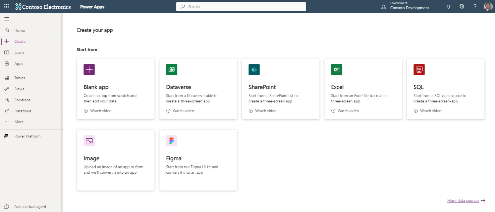
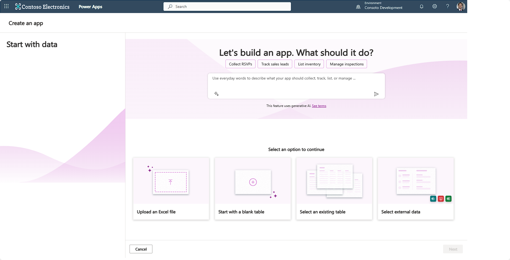

When you're learning to use Power Apps, there are several data sources options you can use that are available to you at no extra cost. You can connect to hundreds of different data sources, but some require extra licensing. In this unit, we discuss some of the more popular options.

> [!div class="mx-imgBorder"]
> 

## SharePoint

The first data source you should become familiar with is SharePoint. SharePoint provides you with the ability to build lists of data and document libraries. A SharePoint list replicates a table of data and can serve as a backend data source for an app. A document library can be a place to store documents or even read spreadsheet table data from, like what you already learned using OneDrive for Business.

SharePoint lists can be simple single-column lists that could provide data for a dropdown control in your app. They can also be multi-column lists with complex data. There's no limit to the number of SharePoint lists/document libraries that you can connect to your app.

Some key design points when you're using SharePoint as a data source are as follows:

- Keep your column types simple. Use Text, Number, Yes/No, or Date and time. Avoid using other types of columns unless necessary. You can create choices inside of your app that writes text to your SharePoint column. It's unnecessary to create a complex SharePoint column, when a sophisticated app can write data to a simple column.

- Refrain from creating mandatory/required input columns. You can make any input mandatory from inside your app.

- Keep your column names simple. The best practice is to refrain from using special characters and/or spaces in your column names. You can name them whatever you want inside of your app. Make your data columns easy to find/write by having simple names.

- SharePoint lists don't automatically relate to each other. It isn't technically a database. You have to provide your own "key" fields if you want to create tables that relate to one another.

- When querying SharePoint, you're limited in the types of queries you can do, and still retrieve all your data. This is because SharePoint doesn't always fetch your data beyond the delegation limit. You can experience a bit of this phenomenon when you go to a SharePoint list that has more than 100 items in it. You can scroll through the first 100 items, and then SharePoint "paginates" or refreshes to reveal 100 more items. When you connect to a SharePoint list, Power Apps lets you know if the query you're using is returning incomplete data. You see a yellow warning triangle appear on your control and Power Apps explains the issue to you.

Following these rules of thumb help you as you learn to interact with SharePoint data inside of your app.

## Excel

Excel is a secondary non-premium data source to consider. Excel tabular data can also be imported into a SharePoint list or a Dataverse table. Important considerations for using Excel as a direct data source for your app are as follows:

- Any data you use must be formatted as a table. You can only accomplish this inside of Excel. If you don't have your data set up as a table, your app can't see the data.

- When you build a gallery from an Excel table, the gallery only uses images that have "[image]" in the column header. It auto-populates your gallery fields in alpha-numeric order. So, you might need to update the field Item properties to get the desired column from your data.

- If someone has the Excel document open to modify data, it hinders read/write of that data from within the app. So, an Excel table, unless you're reading static data, isn't a preferred choice when you have multiple app users.

Overall, Excel is a good data source you can use for your app without paying extra license fees, but it should be considered behind SharePoint.

Now that we discussed the most common non-premium data sources, let's cover two more ways to get your data. These include Microsoft Dataverse and SQL. Maybe you noticed that these data sources were included in the "Start from" ways to create you can create an app from the Power Apps Maker Portal. These data sources can hold more data, are more performant, and include table relationships.

## Dataverse

The absolute best way to incorporate data into your app is via Microsoft Dataverse. When your Power Platform Administrator creates an Environment that includes Dataverse, they build Dataverse tables into the same Environment that your Power Apps app is built upon. Power Apps makes it easy to create any data table to meet your needs, and it's easy to import existing data into a Dataverse table. When you retrieve data, there are no API calls required, your app simply accesses the data within your Environment. Dataverse can hold huge amounts of data, and you can even expand the space, with more licensing, to suit your organizational needs. Dataverse queries are robust and performant. Dataverse can also create relationships automatically between tables, enabling you to pull data from multiple tables in a single gallery without costly lookups to other tables. It's fast, comprehensive and interfaces perfectly with Power Apps.

Another advantage of using Dataverse is the ability to use the Power Apps Copilot feature to describe what you want your app to do in everyday words. Any of the options available from the **Power Apps Maker Portal** where you **Start with data** are designed to work with Dataverse. The full functionality of Power Apps generative AI feature is available when you're using Dataverse!

> [!div class="mx-imgBorder"]
> 

## SQL

Though also considered a "premium" data source, SQL is another excellent choice for apps requiring large databases. Many organizations already keep data in SQL, and SQL tables can easily be connected to your app. If your SQL resides in the cloud, such as Microsoft SQL Server, then your data connection is straightforward. It's even possible to use locally stored SQL data by setting up an on-premises Data Gateway. Since Power Apps resides in the cloud, it needs a connection that is based in the cloud to be able to access your locally stored data. But it can be securely established to protect your data. For large databases, SQL is another excellent choice as a data source.

In summary, we covered four of the most popular choices for data in your app. There are hundreds of available data sources for your app, and it's even possible to create your own custom connectors if there's not already an existing connector to that data. Data sources available to you at no extra cost include SharePoint and Excel, and these data sources are great for learning and for limited amounts of data. Data sources available for extra fees include Dataverse and SQL. Dataverse is the most powerful data source that you can use with Power Apps, and it enables all the Copilot features. All these types of data can be connected into the same app!

In the next unit, you'll get the opportunity to see how easy it is to create an app from Excel using Copilot.
