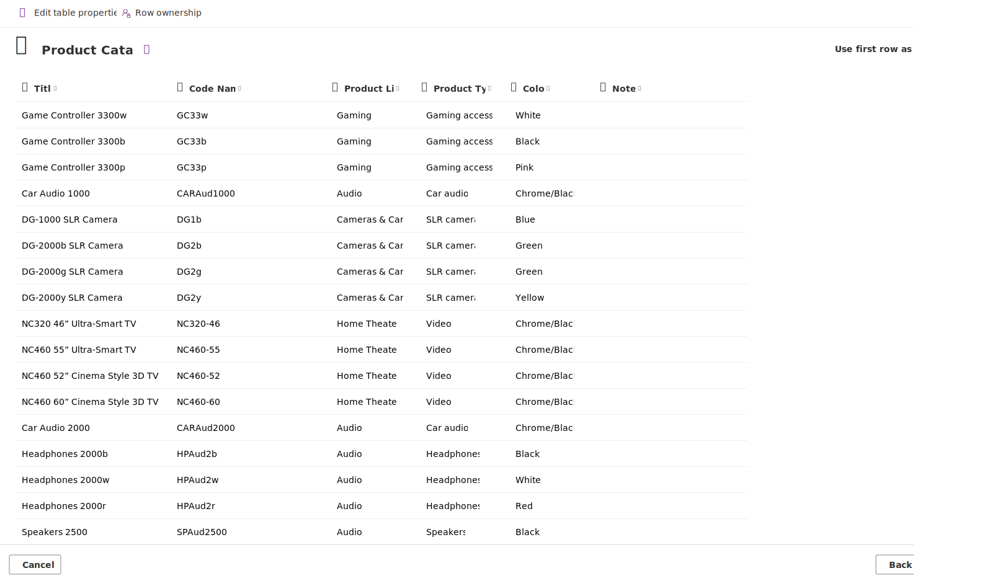

Now that you created an app with a formatted Excel table in a worksheet, we show you how Power Apps makes this even easier when incorporating Microsoft Copilot and Dataverse. In this case, you can provide a spreadsheet with no data tables and see how Copilot creates a data table, allows you to transform the table, then produces a one-screen app.

We start this exercise by downloading and extracting (or unzipping) a [sample worksheet](https://github.com/MicrosoftDocs/mslearn-developer-tools-power-platform/raw/master/power-apps/copilot/ProductList.zip) (or, if you prefer, you can use one of your own). Then we go to the Power Apps maker portal to create our app. With just a few clicks, you have a functional and responsive one-screen app that you can use on any device.

The goal for this lesson is to show you how easy it's to create a Power Apps app from any Excel spreadsheet.

> [!NOTE]
> To fully take advantage of this feature, you will need to use an Environment setup to include Dataverse tables, and you may need to sign up for a Power Apps license (or free trial) that includes Dataverse.

## Let's begin the exercise

1. Download the [**Product List**](https://github.com/MicrosoftDocs/mslearn-developer-tools-power-platform/raw/master/power-apps/copilot/ProductList.zip) worksheet.

1. Go to the [Power Apps maker portal](https://make.powerapps.com/?azure-portal=true).

1. From the Home screen, select the option to Start with data. After a moment, the **Create an app** screen will appear with the option to **Start with data**.

1. From the Start with data options, select **Upload an Excel file**.

1. Power Apps gives you the instruction to upload an Excel file from your computer or drag one into the page. You see a dotted line around the drop area where you can drag your file into, or you can choose **Select from device**. Find the **Product List** Excel file you downloaded and use either technique to add.

1. Your screen begins forming a preview table, and this takes a few moments. Power Apps is taking the first data range (or table) it encounters on your spreadsheet and creating a table for your app. So, if you added an Excel worksheet with multiple tabs and tables, you're only going to see the first one that Power Apps finds. Let's take a few moments to examine our new table.

   Notice how Power Apps added the title **Product Catalog** and created our column names, too! The column headers match our Excel spreadsheet. There's a toggle to **Use first row as column headers** at the top right that we need to toggle to **on**.

     > [!div class="mx-imgBorder"]
   > 

   There are six columns (if you used the downloadable Excel file). Power Apps guessed at the data type for each of these columns. The first two (**Title** and **Code name**) are *Single line of text*, the next three (**Product Line**, **Product Type** and **Color**) are type *Choice*, and the **Notes** column is also *Single line of text*.

1. Toggle on **Use first row as column headers**.

   Before moving on, know that you can change/modify any of these columns by selecting the column header, selecting **Edit column** and then adjusting the properties in a popup. You can also adjust the table properties by selecting the edit pencil icon to the right of the table name.

   In this case, Copilot has correctly brought in our data to make it usable, so we don't really need to make any modifications to it.

1. Now we're ready to create our app! Select the **Create app** button and Power Apps will let you know that it's creating an app for you.

1. After a few moments, Power Apps shows the new screen of your app in Edit mode. Notice how your app title shows at the top of the screen. Also notice that you have a gallery of products on the left side of the screen, and product details for the selected item in the gallery on the right side of the screen. A Copilot panel appears on the right side of the screen available to assist you with changes you want to make to the app.

   >[!NOTE]
   > Copilot is still in **Preview** mode as it gains knowledge. You can try it out by suggesting some changes such as "Please change the background color of the table name label to purple." You can provide "thumbs up/down" feedback and even detail the issue as feedback to Microsoft.

   When Copilot produces your app, it estimates what data your gallery displays. You can select the most appropriate columns for your gallery, and you can change them in the Power Apps editor.

1. All that's left is to save and publish. Select the **Save** icon in the upper right corner (it looks like a floppy disk). Then select the **Publish** icon on the far upper right corner (it looks like a file with a circled arrow on the lower right corner).

1. Put your app in **Preview mode** to test functionality. You can do that by selecting the **Play** icon to the left of the **Save** icon. The search functionality for a Dataverse app is robust. It can easily search through any text field. Enter “ultra” into the search input field. Notice how it filters based on the **Title** column for that specific pattern. Clear the input field and enter “aud”. Notice how it filters to car audio options choices and it ignores font case as it searches.

1. While your app is still in preview mode, let’s try the edit form functionality. Find/select the item “Headphones 2000w”, so that it appears in your form. Let’s edit this item to add notes to it. Select the pencil (Edit) icon at the top right of the form. Under Notes, enter “includes case” and select the check icon at the upper right of the form to save the change. Your item now includes the note!

1. We discussed that this app is fully responsive, meaning that it adjusts to the form factor that it's running from. With your app still in preview mode, look in the top right corner and notice what looks like three form factor options that you can preview. However, when you select one of them, there are further options where you can match specific tablet or mobile phone options. Choose one that resembles a mobile device that you use so you can see how the app screens behave.

## Summary

Feeding an Excel spreadsheet into Power Apps by using Copilot is another easy option for creating an app. This technique is a fast way to build a responsive one-screen app, with the same functionality as the three-screen app, on top of a Dataverse data table. Since Dataverse resides in the same cloud as the rest of the Power Platform, there are no time-consuming API calls, and the search functionality is robust. Just like any Power Apps app, you can add more data, screens, and functionality, but there's no faster way to get an app in the hands of your team.
