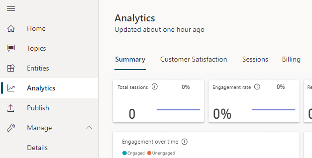
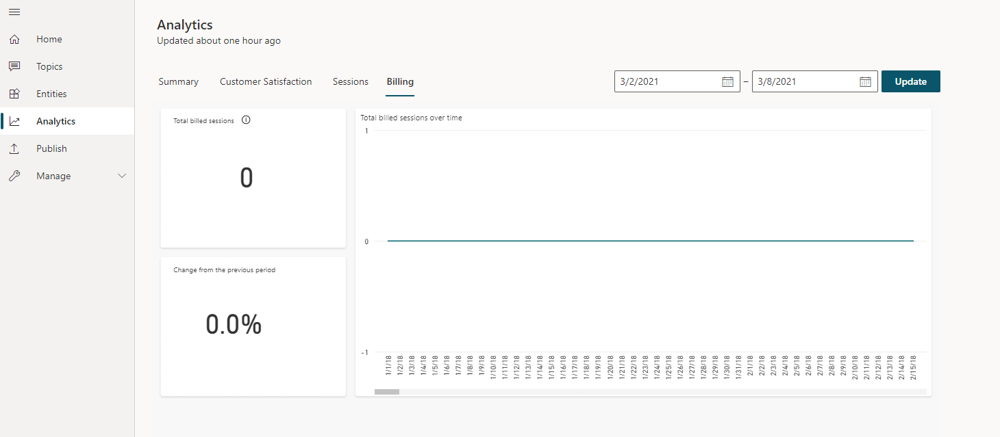

Power Virtual Agents has a comprehensive set of analytics that show you the key
performance indicators for your bot.

Multiple charts show you trends and usage for your chatbot's topics. These charts
use AI to highlight the topics that have the greatest impact on your chatbot's
performance.

## Analytics in Power Virtual Agents

The analytics section is divided into a number of pages to give you multiple
ways to understand bot performance.

>[!NOTE]
>Although transcripts are available immediately, the analytics dashboards are updated every hour, so there will be some delay before you see all data.

### View analytics

-   In Power Virtual Agents, select **Analytics** on the side navigation pane.

The Summary page gives you a broad overview of your bot's performance. It uses
artificial intelligence (AI) technology to show you which topics are having the
greatest impact on escalation rate, abandon rate, and resolution rate (see the
table under Summary charts for more information on these metrics).

The Summary page includes a variety of charts with graphical views of your bot's
key performance indicators. For information about each chart, see:

-   [Summary charts](/power-virtual-agents/analytics-summary#summary-charts)

-   [Engagement over time chart](/power-virtual-agents/analytics-summary#engagement-over-time-chart)

-   [Session outcomes over time chart](/power-virtual-agents/analytics-summary#session-outcomes-over-time-chart)

-   [Resolution rate drivers chart](/power-virtual-agents/analytics-summary#resolution-rate-drivers-chart)

-   [Escalation rate drivers chart](/power-virtual-agents/analytics-summary#escalation-rate-drivers-chart)

-   [Abandon rate drivers chart](/power-virtual-agents/analytics-summary#abandon-rate-drivers-chart)

The Engagement Rate Drivers, Abandon Rate Drivers, and Resolution Rate Drivers
charts use natural language understanding to group issues as topics. These
charts show you the topics that are having the most impact on the performance of
your bot.

By default, the page shows you key performance indicators for the last seven
days. To change the time period to the last 30 days, select **Last 30
days** from the drop-down list at the top of the page.

## View billed sessions for Power Virtual Agents

When you purchase a Power Virtual Agents license, you gain capacity for the specified number of billed sessions. Power Virtual Agents pools this capacity across the entire tenant.

The consumption of the capacity isn't reported at the tenant level, but can be seen for each individual bot.

### Definition of a billed session
A *billed session* is an interaction between a customer and a bot, and represents one unit of consumption.

The billed session begins when a user topic is triggered. More information: Use system and sample topics section

A session ends for one of the following reasons:

*   The user ends the chat session.
    When the bot doesn't receive a new message for more than 30 minutes, the session is considered closed.

*   The session is longer than 60 minutes.
    The first message that occurs after 60 minutes starts a new session.

*   The session has more than 100 turns. A turn is defined as one exchange between a user and the bot.
    The one-hundred-and-first turn starts a new session.

### Find the number of billed sessions for your bot

1. In Power Virtual Agents, select **Analytics** from the side navigation pane.

2. Go to the **Billing** tab.

You can change the date range to filter the **Total billed sessions over time** chart. You can also see the total billed sessions and trend percentage next to the chart.
