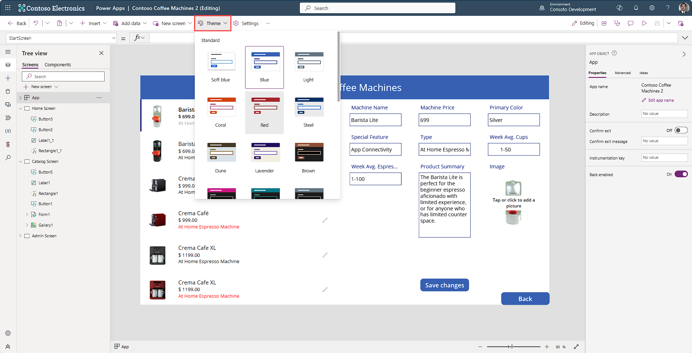

A quick and easy way to change the colors in your app is to apply a theme. Theming will change control properties like **Fill** and **Color** to make them the same throughout your app. In Power Apps, there are more than 20 out-of-the-box themes to choose from. **Theme** options are available when you select a Screen or the App from your **Tree view** panel on the left side of the screen. The following screenshot shows where to find the **Theme** option button in your command bar and some of the themes immediately available for your app.

> [!div class="mx-imgBorder"]
> 

These themes have a specific set of default colors and visual elements, which alter the look and feel of your entire app. Once you select a theme, the changes to your app take effect immediately.

To see what we mean, select the Lavender theme in our Contoso Coffee Machines app. You'll immediately notice that the background of our screen and buttons change. Given some of our text color (already in the app), we might not want to choose one of the darker themes that make the screen fill black, because then we wouldn't be able to see our text. In our case, Lavender works well.

If none of the included themes work for your app, you can create a custom theme. For example, if you decide to select the Steel theme but want the screen background to be a lighter color, this can be easily done. To change the background of your screen, select the screen in the **Tree view** panel, and you'll notice that the options **Background color** and **Background image** appear in the command bar next to the theme button. The command bar menu changes with any different control selected. Power Apps makes it easy to find properties that you might want to adjust.

Selecting the **Background color** presents a palette of **Theme** and **Standard** colors. If you pause your mouse over one of the color circles, notice a hover label next to the color displays an RGBA value which Power Apps interprets as **data type: color**. When you select one of these colors, Power Apps changes the **Fill** property of the selected control.

> [!div class="mx-imgBorder"]
> 

If you want to add a new blank screen it would still have the **Fill** property of **Color.white**. This is by-design, when working with a canvas app. However, the command bar buttons make it easy to tweak a standard theme, albeit one control at a time.

There's currently no option to create a "Custom" theme for a canvas app and store it to be used for other apps. The advantage of using a Power Apps theme is that it applies that theme to all controls that can be themed with a single button click. Another advantage of a Power Apps theme is that whenever you add a control to your app, selected theming is already applied to it.

> [!TIP]
> If you modify any control colors prior to applying a theme, Power Apps will not apply the theme color changes to that control. Power Apps wants you to have the power to modify theming however you see fit.

Many organizations select the theme that best suits their needs, and then alter the various control properties to align with their corporate branding. We'll learn how to do organizational branding in the next unit.