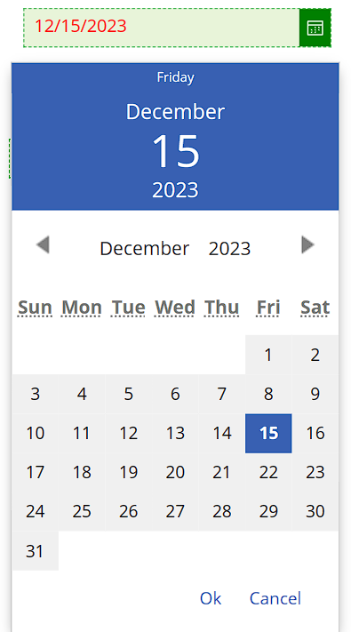
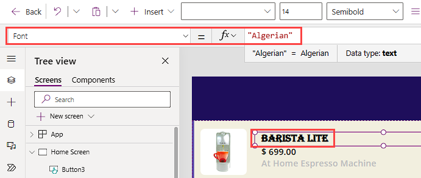

If an out-of-the-box Power Apps theme doesn't match the desired look and feel for your app, you can customize many of the control properties. By adjusting a few properties such as **Fill**, **HoverColor**, and **BorderColor** you can completely change how the control looks. Additionally, Power Apps enables you to customize fonts.

Power Apps allows you to input color in several ways, so if you have an RGBA value, or a Hex color value, or your color matches one of the standard HTML colors available with **Color.\[your selected color\]**, you can define that color. You can then use that color anywhere in your app as a custom color. Here are the common color properties for most controls.

## Typical properties

These properties are in effect when the user isn't interacting with the control.

-   Fill - the background color

-   Color - the text color

-   BorderColor - the color of the control's border

-   BorderStyle - the style of the control's border, either solid, dashed, dotted or none

## Hover properties

Users see hover properties when they hover over the control with a mouse. All of these apply when a mouse is over the control.

-   HoverFill - the background color of the control

-   HoverColor - the font color

## Disabled properties

These properties are in effect when a control is disabled. By default, you'll notice a light grey color scheme, to let the user know that a control exists but isn't accessible. This color scheme only shows when the control's **DisplayMode** property is set to **Disabled**.

-   DisabledFill - the background color

-   DisabledColor - the text color

## Color settings only controlled by the theme

There are some color settings that can't be altered and are specific to the theme that you select. For example, there's the **Date picker** control.

If you add a Date picker control to your app, you'll notice that you have the option to change the **Color** property of the font, the **Border** (color, but also style and thickness) and the **Background color**. All these options are available in the command bar interface.

Furthermore, you can adjust these and other properties via the formula (***fx***) input field. A couple that you'll find in the changeable properties include the **IconBackground** and **IconFill** (the color of the calendar icon). However, if you place the app in preview mode, you're unable to change the colors in the calendar away from the selected **Theme** color.

In the image of the **Date picker** control shown below, we've set the **Color** to display red text, adjusted the **Border color** to green (even made the **Border style** dashed), and we changed the **IconBackground** to green. When we placed the app in Preview mode, the calendar color shows the blue theme that is currently applied to our app.

> [!div class="mx-imgBorder"]
> 

## Font property

The Font property is available on any control that displays text. When you insert/select a control with the Font property, your command bar option will show a dropdown displaying 14 common fonts already programmed in Power Apps, however, it's possible to display many other types of fonts that are available in other Microsoft products. For example, if you want to display the font: Algerian, you can type "Algerian" in the Font property for that control.

> [!div class="mx-imgBorder"]
> 

## How to apply custom branding across your app

Remember that Power Apps recognizes color as a data type. If we define a variable as **type: Color**, then we can use that variable anywhere in our app where we want to represent that color. Likewise for Fonts, we can define a font type that Power Apps understands as a variable.

If we define desired color/font values as variables, then we can insert those values into our control properties having to do with colors. A great way to do this is to use named **Formulas**. Formulas is an app property, accessible when you select **App** from the **Tree view** panel. In the following example, we'll walk through how to define some branding colors while using our Contoso Coffee Machines app.

1.  From the Home Screen, select **App** from the **Tree view** panel. Notice that the property **StartScreen** appears in the formula drop-down.

1.  Select the properties drop-down and find/select **Formulas**.

1.  Contoso Electronics has three primary colors including a dark teal color and a light teal color along with white. Since Power Apps has already defined white, we only need to define the other two colors. These colors can be defined for Power Apps as:

	`nfBrandingLight = RGBA(3, 131, 135, 1);`
	
	`nfBrandingDark = ColorValue("#334A5F");`

	We used the prefix "nf" for named formula, then we used the equals (=) symbol and then added a color value that Power Apps understands, and then finally placed a semi-colon at the end. If you input your code in **App** > **Formulas** just like this, you can then use that formula value anywhere in your app where you need that color.

1.  In our app, go to the **Fill** property of your header rectangles and input "nfBrandingDark".

1.  Go to your button controls and update the **Fill** property as "nfBrandingLight".

A final thought on branding, once you have a control looking exactly how you want it, copy that control, and place it on a hidden screen as a template. Then you can copy the control and use it elsewhere in your app.