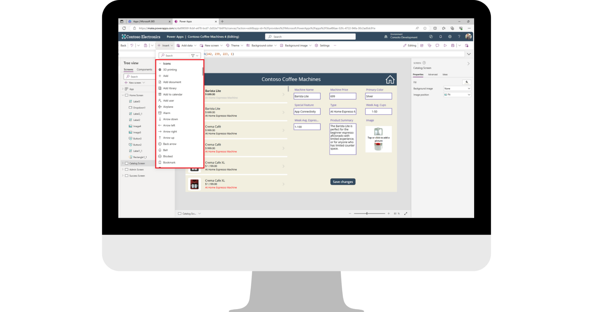

Most apps include icons that are easily understood, such as the floppy disk icon for "Save" or the back arrow for "Back". The advantages of using an icon versus a label or a button is that the icon requires no text and it can usually fit places that text simply won't.

Power Apps includes the **Icon** control and provides many out-of-the-box icons that you can use throughout your app. Since icons are controls, they all have customizable properties including **OnSelect** and **Color**. You can insert an icon into your app by selecting the **Insert** button from the command bar. If you expand the **Icons** field, you can scroll through the complete list of available icons.

> [!div class="mx-imgBorder"]
> 

## Adding an icon

If you've been building on our Contoso Coffee Machines app, then you've already dabbled a bit with the icon control (we changed a right arrow to an edit pencil). If you want to follow along with us, we'll use our Contoso Coffee Machines app to add a couple of icons. If you don't have this app, you can open any app and follow along.

1.  Open the Contoso Coffee Machines app and select the "Catalog Screen".

1.  Insert a "Back arrow" icon, by selecting **Insert** from the command bar. You can find it by expanding the **Icons** option, or simply by inputting "back" into the **Insert** search field.

	> [!NOTE]
	> When you insert the new icon, it picks up the selected **Theme** color scheme.

1.  Reposition your new **Back arrow** icon in the top left corner of your header rectangle.

1.  Change the color of the **Back arrow** to white by selecting the **Color** button from the command bar and selecting the white circle under **Standard colors** at the bottom left corner of the option box.

1.  Next, update the **OnSelect** property to: `Back()`

1.  Next, using your **Back arrow** icon as a template, copy it and then paste it onto your "Admin Screen". That way, you can avoid adjusting the **Color** and **OnSelect** properties.

## Changing an icon

You might remember that we can change the type of icon by changing the **Icon** property of the Icon control. We'll do that next, as we make a home screen icon.

1.  Copy/paste another **Back arrow** icon onto your "Admin Screen".

1.  Position it in the upper right corner of your header rectangle.

1.  Notice that you have an Icon property button in the command bar, select that button and find/select the **Home** icon (you can input "home" in the search field to help). Notice that the **Back arrow** immediately changes to the **Home** icon. You can do this with any Power Apps icon!

1.  Finally, let's modify the **OnSelect** property to return to our "Home Screen" by inputting:

	`Navigate('Home Screen')`

Even though our app only has three screens, you can see the utility of a **Home** icon as a selectable control in an app with multiple screens, where a selectable **Back arrow** wouldn't necessarily return us to the app's home screen.

**Icons** are an easy control you can use to enhance user interface with your app! Let's learn more about the **Image** control in the next unit.
