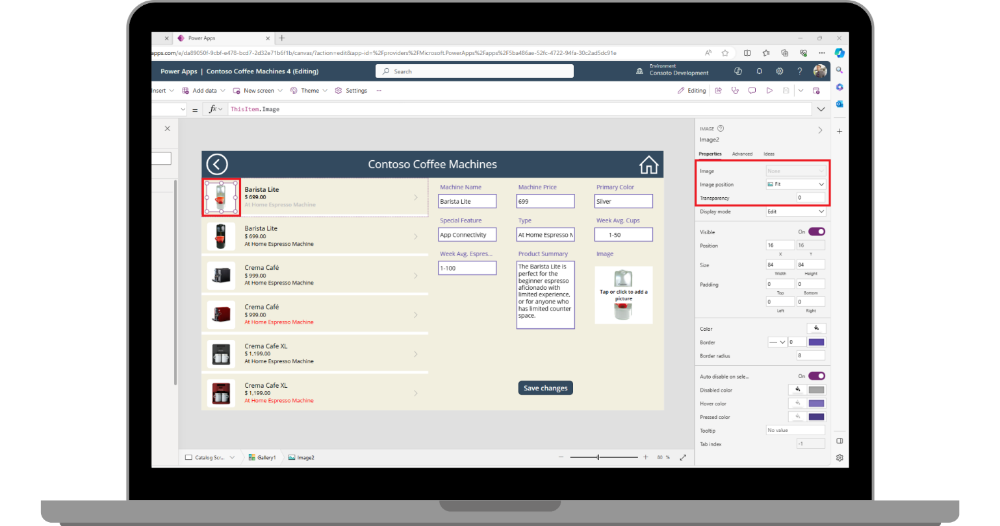

The **Image** control in Power Apps is a **Media** control that shows images, which can come from local files or from data sources. Adding an image, such as a company logo or a user photo is an easy way to enhance the overall look of your app. If your data source has images in it, you can include the image in a gallery control. You can even include an image as a background for a screen!

You can add as many images as you like to your app, but be mindful that the number of images you use, and image sizes might affect app performance as Power Apps works to pull the data into the app. So, you should always consider the ***data size*** of your image, and tailor it for your app, accordingly.

Just like every other control, your **Image** control has customizable properties. Some of the important **Image** control properties include:

**Image** - The name of image file (or file link) goes here.

**Image position** - The position (Fill, Fit, Stretch, Tile, or Center) of the image in a screen or a control, if it isn't the same size as the image.

**Transparency** - The degree to which controls behind an image remain visible.

> [!div class="mx-imgBorder"]
> 

## Insert an image into your app

In the following example, we're continuing with our Contoso Coffee Machines app, but you can use any app. Follow the steps below:

1.  The first step in adding an image to your app from local data is to upload an image file. Power Apps can use most image types. With your app in **Edit mode**, select the **Media** button from the Power Apps left-side rail (to the left of the **Tree view** panel). The **Tree view** panel will change to the **Media** panel.

1.  Select the **Upload** button in the **Media** panel.

1.  In the popup **Open** menu, find/select the image file you want to use in your app, and then select the **Open** button. After a moment, your image file will appear below the **Images** list and will display a small thumbnail. The image is now available to use in your app. In our app, we're inserting a Contoso Electronics logo to include in our header rectangle on the "Home Screen".

1.  To insert the image, you can either select it from the **Media** panel, or you can insert an Image control first and then update the image property as the image you just inserted.

	> [!NOTE]
	> Once you insert an image control, the Properties panel on the right side of your screen includes a dropdown for the Image property, enabling you to quickly change the image depicted. Additionally, you can add a formula to depict different images based on a condition. As long as the input result is equal to **Data type: image**, you can use a formula to generate an image.

1.  Resize your Image control and reposition it at the top left of your header rectangle. Try adjusting the **Image position** property to the various options (such as **Center**, **Fill**, and **Tile**) to see how the image reacts, but in our example, **Fit** is the best option.

Now that we've introduced you to the **Image** control, let's look at personalizing your app. Please continue to the next unit to learn how to do that.