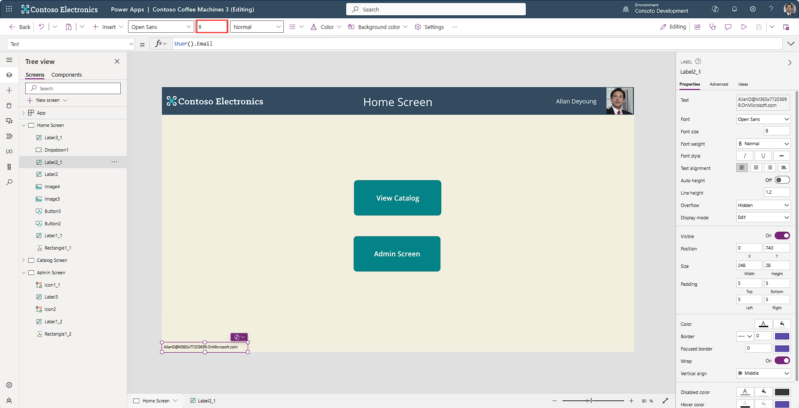

Did you know that Power Apps can be personalized? Each user in your organization has identity information including an email address, a display name, and sometimes even a photo. Power Apps can pull the user's Microsoft account data into your app via the **User** function.

The User function returns a record of information about the current user:

| Property        | Description                                              |
|-----------------|----------------------------------------------------------|
| User().Email    | Email address of the current user                        |
| User().FullName | Full name of current user, including first and last name |
| User().Image    | Image of current user                                    |

In the example below, we're continuing to use the Contoso Coffee Machines app, but you can use any editable app to follow along.

## Adding personalization with User function

1.  On the "Home Screen" insert an **Image** control.

1.  Position the image in the upper right corner of the header rectangle and flush with the right side of the screen. Resize the blank image to fit within the header rectangle.

1.  In the **Image** property input the following in the formula (***fx***) input field:

	`User().Image`

	> [!NOTE]
	> If your organization has an image for you, you'll see your image appear, else you'll see a silhouette placeholder.

1.  Insert a **Text label** control and in the Text property, enter:

	`User().FullName`

1.  Position the **Text label** control to the left of the new **Image** control.

1.  Insert another **Text label** control and position it at the bottom left corner of the "Home Screen".

1.  In the **Text** property, input:

	`User().Email`

1.  Using the command bar size input field for the **Label** control, input the size as 8.

When complete, your app "Home Screen" will resemble this image:

> [!div class="mx-imgBorder"]
> 

We've displayed personalized information for the logged in user in our app. You can use this information throughout the app, for example, if you want Power Apps to send the user an email, it has enough information to do that with the information it gains as soon as your user logs in.

In the next unit, we'll explore the different form factors you can begin to build your app on, and how you can see what your app will look like on a specific mobile platform. Let's continue to the next unit!
