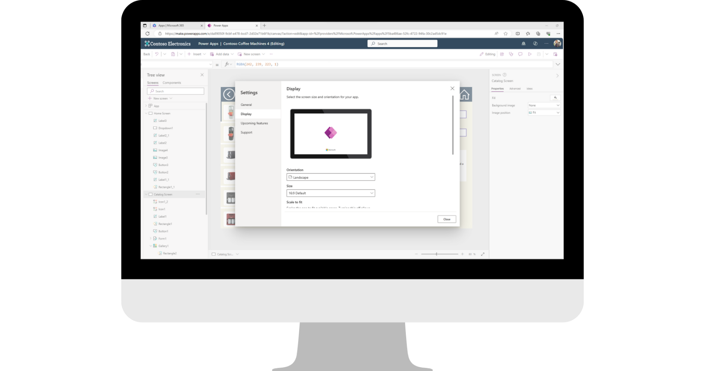
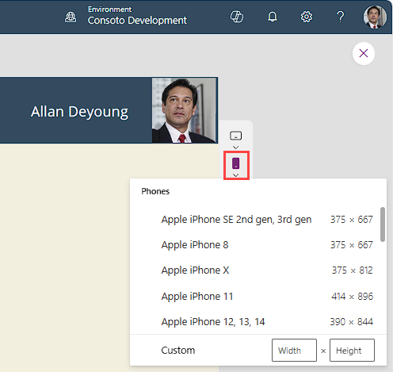
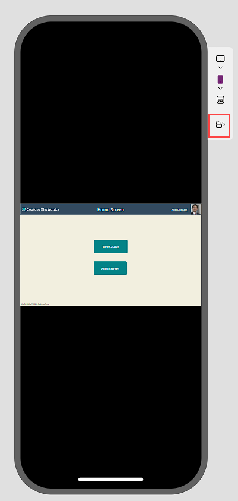
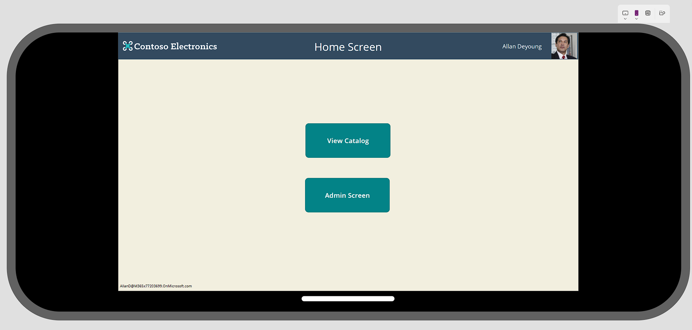

When considering how to build your Power Apps canvas app, there are two main form factors you can choose: Phone or Tablet. You'll use the Tablet form factor if most of your users are using the app via a computer, since that form factor fits a normal computer screen display. However, if most of your users use a smartphone, you might want to begin building on a Phone form factor.

The advantage of using the Phone form factor to build an app that you intend to use on a smartphone is that you can tailor every control for use on a smartphone. If you build on a Tablet form factor, then either your user won't be able to see the entire canvas of the app, or (assuming they turn their smartphone sideways) the fonts will be too small to see.

It's possible to design an app that will work on both form factors, but that is beyond the scope of this lesson.

You've already had an opportunity to build an app on the Tablet form factor. Take a moment to create a new app using a Phone form factor. You'll immediately notice the difference in the canvas screen real estate.

## Adjust your settings

A quick way you can adjust your canvas size to meet a particular platform is via the app **Settings**. The easiest way to check your app **Settings** while editing an app is to select the **Settings** button in the command bar. The **Settings** popup panel starts on the **General** tab, which allows you to change the App name, icon, and even provide a description for the app.

To adjust the **Display** form, select the **Display** tab in the **Settings** panel. Notice how you can adjust the Orientation of your form factor to Landscape (default) or Portrait.

The **Size** by default is set to 16:9, but you can adjust that to several other options, including a **Custom** setting. Changing the Display setting will prompt you Apply the change.

> [!div class="mx-imgBorder"]
> 

> [!WARNING]
> If you resize your app after you've built it, you will have to rearrange the controls to fit the new form factor.

Notice that you also have the option to lock the aspect ratio (toggled on by default) and lock orientation, Power Apps provides descriptions of what those functions do.

## How will my app look on a...

Power Apps has made it easy to see what your app will look like on any mobile platform. You can put your app into preview mode and see this. With your app in preview mode, look for a tab showing stacked icons of a tablet, phone and browser screen.

Select any of them and you'll see common platforms available. In the image below, we've selected the **Phone** options and just below, you can see a scrollable list, including some of the most common smartphones. There's even a **Custom** option if you don't see the device you would like.

> [!div class="mx-imgBorder"]
> 

If your app is built on a **Tablet** form, there's an option to change the device **Orientation**:

> [!div class="mx-imgBorder"]
> 

> [!div class="mx-imgBorder"]
> 

In this example, you can see that if your users were using this type of device exclusively, you might want to consider building it on a **Phone** form factor with a horizontal orientation!