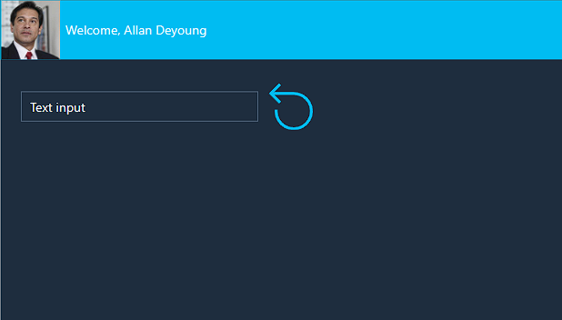

Hopefully, you've been practicing as we've gone along with our Contoso Coffee Machines app. If not, don't worry! In this exercise, we'll make an app to try out all of the new skills we've learned in this learning module.

Go to the Power Apps home page and create a new blank tablet from Canvas app, then follow the steps below:

1.  Insert a **Rectangle** and resize it to cover the top of your screen with a **Height** of 80.

1.  Insert an **Image** and resize it to fit in your rectangle at the top left of your screen.

1.  Change the Image property to:

	`User().Image`

1.  Insert a **Text label** and position it to the right of the image in the header.

1.  Change the **Text** property to:

	`"Welcome, " & User().FullName`

1.  Resize the **Text label** to fit the text without multiple lines.

1.  Insert a **Text input** control into your app. Position it somewhere below the header rectangle.

1.  Insert a **Reset Icon** into your app. Position it to the right of **Text input** control.

1.  Change the Reset Icon **OnSelect** property to:

	`Reset(TextInput1)`

	> [!NOTE]
	> The Reset function changes the Text input to whatever is entered in as the Default value, in this case "Text input".

1. Apply a theme to your app, by selecting **App** or **Screen1** from the **Tree view**, and then selecting an option from the **Theme** dropdown menu in the command bar. Your app should now resemble the app below (we chose **Dark Blue** as the theme).

	> [!div class="mx-imgBorder"]
	> 

1. Now, place your app in preview mode. Type some text into the **Text input** control, then select the Reset icon. Your text should have returned to "Text input".

1. Next, try viewing your app as someone would on a Samsung Galaxy Tab A7.

1. Next, try viewing the app as an iPhone 14, and try switching the orientation.

Congratulations on your new skills!