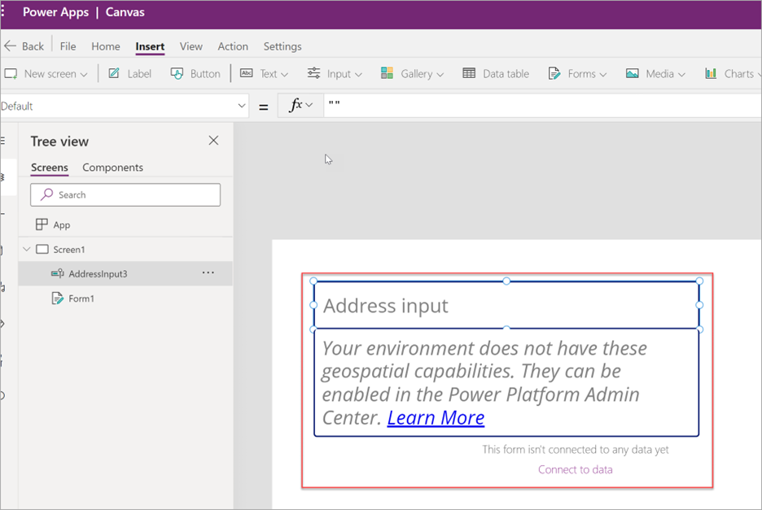
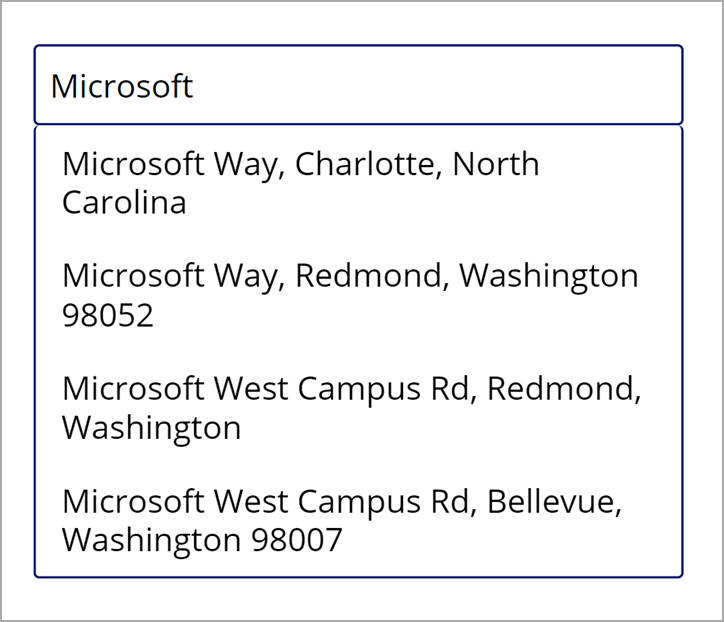
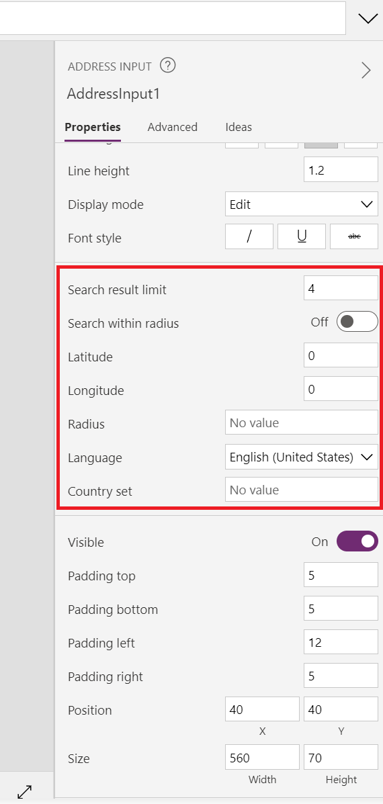

Adding maps and address input controls is a powerful way to add integrated visuals for routes, locations, and directions. In this unit, you'll learn about the components that are required for you to include these controls in your app.

## Prerequisite: Enable geospatial services

Before you can use a map in your app, you need to enable geospatial services in Power Apps. You can determine if geospatial services are already enabled for your environment when you add a control that requires geospatial configuration. When you attempt to add this type of control, Power Apps displays a message similar to the one shown in the following image.

> [!div class="mx-imgBorder"]
> 

You only need to enable geospatial capabilities once, but you need administrative privileges in the Power Apps environment to enable them.

For more information, see [Add geospatial controls to your canvas apps](/power-apps/maker/canvas-apps/geospatial-overview/?azure-portal=true).

## Address input

When you search for an address on a map by entering information into a regular text field in a canvas app, make sure that you enter a complete address with few mistakes so that the system can find the proper address. Address input relies heavily on you having all required information. Incorrect or impartial information can leave you with no results.

To address this issue, you can use the address input control within an app in Power Apps. This control helps you search for addresses by suggesting possible results based on locations that are found within certain search radiuses.

> [!div class="mx-imgBorder"]
> 

When you search for the fields, the search results can be restricted to certain areas. You can specify the latitude and longitude of a specific point as a property. For example, a current location, specify a specific radius in meters around that point to search for a location, and limit the number of suggested results that are returned. You can limit the number of search results through the **Search result limit** field.

> [!div class="mx-imgBorder"]
> 

When you select an address, the **Address** field provides access to some output properties that can interact with other controls in the app, such as the interactive map control. This control provides the output properties that are shown in the following screenshot.

> [!div class="mx-imgBorder"]
> 

The following screenshot shows an example of the raw output values from the address input control by using a text field. You can use these fields elsewhere in your application. For example, finding distances, validating existing data, and finding a point on a map, to name a few.

> [!div class="mx-imgBorder"]
> 

For more information, see [Use the address input control to easily enter addresses](/power-apps/maker/canvas-apps/geospatial-component-input-address/?azure-portal=true).
