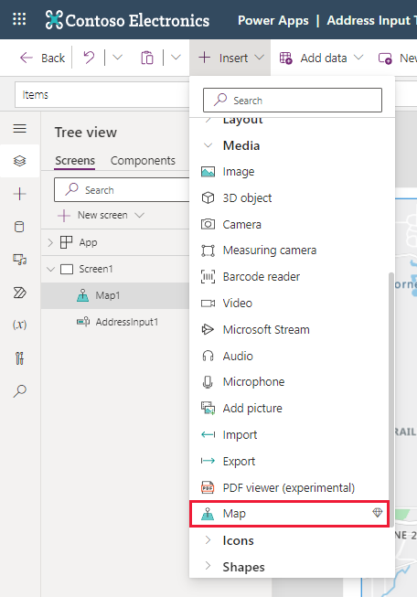
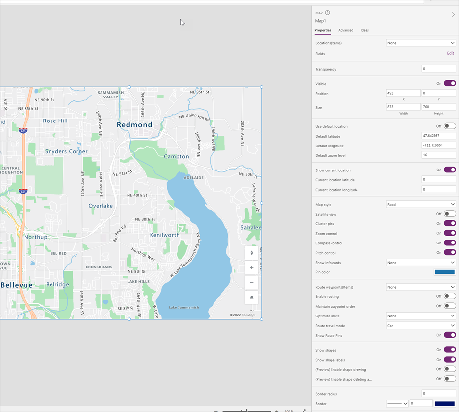
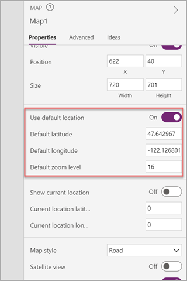
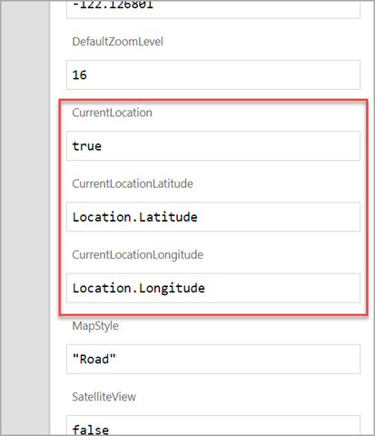
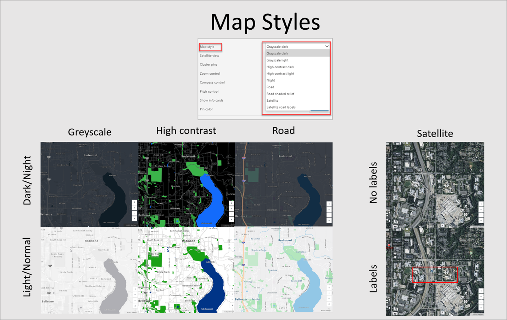
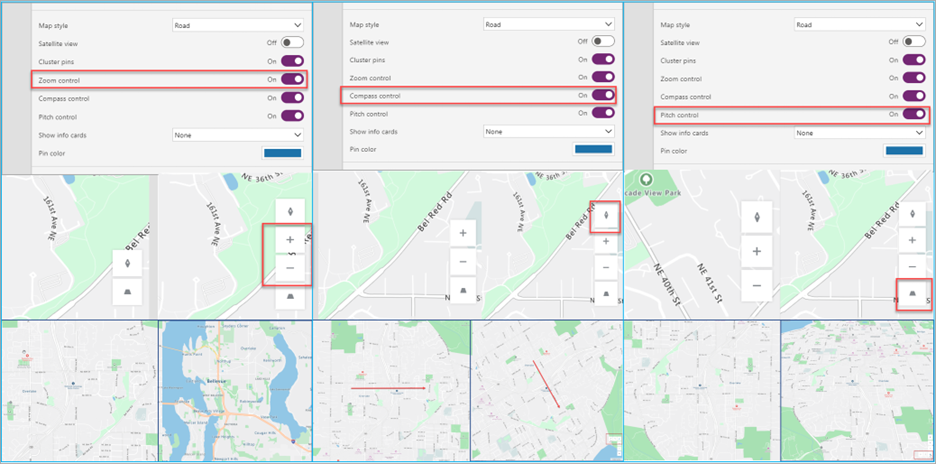
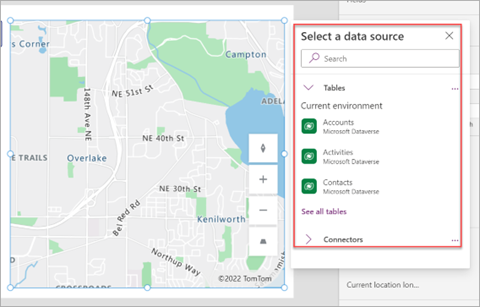
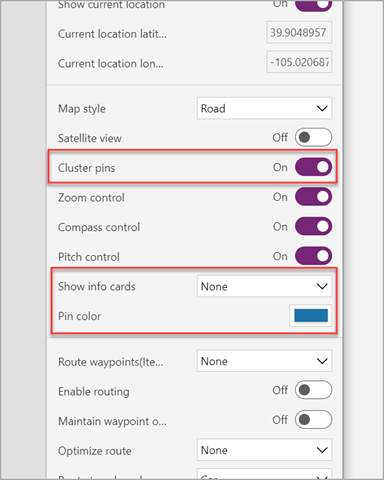
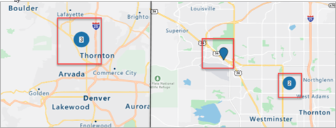

The map control is a premium control that takes full advantage of the native geospatial capabilities within Power Apps. It contains many properties that allow you to zoom, tilt, navigate, rotate, and interact with a map in an all-in-one experience. You can input data to your map, show pins, routes and waypoints from various data sources. It's able to display various map styles, such as road, satellite, and high contrast options.

> [!div class="mx-imgBorder"]
> 

This control can receive input from other controls in your app, such as the **Address input** control, but it renders a location according to any latitude and longitude data. It can also receive input data via an API, though we don't cover the API technique in this unit (look for a link in the Summary).

After adding the map control to the canvas app, you'll have access to many properties that you can interact with through the **Properties** menu or through **Power *fx*** formulas. In this lesson, you'll learn about several of these properties and their setup.

The following screenshot is an example map control that has been added to a canvas app showing the **Properties** panel on the right with some of the available configuration options.

> [!div class="mx-imgBorder"]
> 

When you enable the **Use default location** feature, the map automatically starts at a certain location when it first loads, providing a consistent user experience. When enabled, the map always renders at the location that's specified in the default latitude and longitude fields with the default zoom level.

> [!div class="mx-imgBorder"]
> 

The map can automatically show the user's current location on the interactive map when you set the **CurrentLocation** field to **true** and use the **Location.Latitude** and **Location.Longitude** settings in the respective **CurrentLocationLatitude** and **CurrentLocationLongitude** properties.

To enable this feature, you must turn on the **Show current location** and disable the **Use default location**

> [!div class="mx-imgBorder"]
> 

Depending on the application's requirements, or where you use it, the map control can display the picture in different views. For instance, you can use a satellite view to see the actual buildings and roads as they appear either with or without street and building information applied. Alternatively, the map can show a digitally rendered version in dark or light modes with three different types of roads. Some views might be better for navigation while others might be more optimal for accessibility or research purposes.

> [!div class="mx-imgBorder"]
> 

The map control also has embedded controls, such as **Zoom**, **Compass**, and **Pitch**, that you can enable so that users of the canvas app can view the location from different perspectives.

> [!div class="mx-imgBorder"]
> 

You can assign data sources to the maps via the **Items** property. A data source containing coordinates allows you to insert pins on the map. You can use this feature for business-use cases such as delivery locations, customer locations, and more.

When you select icons for the different pins in a data source, you can select from any Microsoft Azure pins.

> [!div class="mx-imgBorder"]
> 

For pins that are placed on a map, you can view associated information for that pin to provide canvas-specific information. To do so, point to the pins or select them, depending on the configuration in the **Show info cards** and the fields that are selected to display. You can set the color of the pins for the entire control in the properties or from the data source for each individual pin.

> [!div class="mx-imgBorder"]
> 

If multiple pins are located closely together, you can use the **Cluster pins** configuration to group all pins together until users adjust their zoom to have a better view of those pins.

> [!div class="mx-imgBorder"]
> 

In the next unit, we'll show you a demonstration of how this control can interact with other controls.
