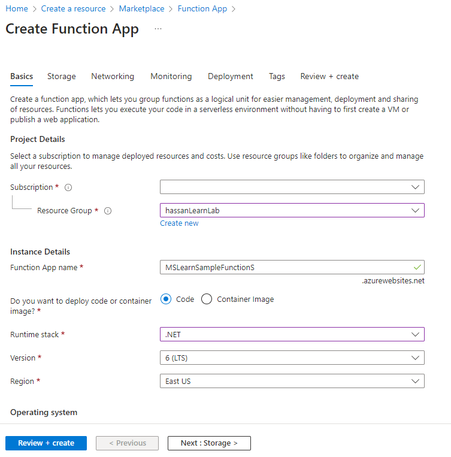

The previous exercise reviewed registering webhooks that publish Microsoft Dataverse data to an external Web API. In this exercise, you build an example Web API using Azure Functions to illustrate how to consume a published webhook event.

## Azure Functions vs. plug-ins

Microsoft Azure Functions provides a great mechanism for doing small units of work, similar to what you would use plug-ins for in Dataverse. In many scenarios, it might make sense to offload this logic into a separate component, such to an Azure Function, to reduce load on the Dataverse's application host. You have the availability to run functions in a synchronous capacity because Dataverse webhooks provide the Remote Execution Context of the given request.

However, Azure Functions doesn't explicitly run within the Dataverse's event pipeline. So if you need to update data in the most high-performing manner, such as autoformatting a string value before it posts to Dataverse, we still recommend that you use a plug-in to perform this type of operation. Any data operations you perform from the Azure Function will also not roll back if, after it completes, the plug-in has an exception and rolls back.

## Write an Azure Function that processes Dataverse events

To start writing an Azure Function that processes Dataverse events, you use Visual Studio 2022's Azure development template to create and publish your Function. Visual Studio provides several tools to help make Azure development simple. Therefore, you're required to have Azure Development Tools installed in your Visual Studio 2022 instance. If you don't have the feature installed, add it through the Visual Studio Installer.

### Create your Azure Function project

1. Create a new Azure Function project by using the Azure Functions template. You can find this template by creating a new project and then entering "function" in the search bar.

   > [!div class="mx-imgBorder"]
   > [](../media/function.png#lightbox)

1. Give your Function project a descriptive name and then select **Create**.

   > [!div class="mx-imgBorder"]
   > [](../media/configure.png#lightbox)

1. Select the latest **.NET Core LTS**, select **Http trigger**, uncheck the **Use Azurite** checkbox, select **Function** for Authorization level, and select **Create**.

   > [!div class="mx-imgBorder"]
   > [](../media/functions.png#lightbox)

   Your sample project should be created now, with the following template code found in the Function's .cs file:

```csharp
 public static class Function1
 {
     [FunctionName("Function1")]
     public static async Task<IActionResult> Run(
         [HttpTrigger(AuthorizationLevel.Function, "get", "post", Route = null)] HttpRequest req,
         ILogger log)
     {
         log.LogInformation("C# HTTP trigger function processed a request.");

         string name = req.Query["name"];

         string requestBody = await new StreamReader(req.Body).ReadToEndAsync();
         dynamic data = JsonConvert.DeserializeObject(requestBody);
         name = name ?? data?.name;

         string responseMessage = string.IsNullOrEmpty(name)
             ? "This HTTP triggered function executed successfully. Pass a name in the query string or in the request body for a personalized response."
             : $"Hello, {name}. This HTTP triggered function executed successfully.";

         return new OkObjectResult(responseMessage);
     }
 }
```

You replace this code later, but first, publish your Function to ensure that everything works correctly.

### Publish your Azure Function to Azure

1. Right-click your project and select **Publish...** from the context
    menu to test the publishing of your Function to Azure App Service.

   > [!div class="mx-imgBorder"]
   > 

1. Select **Azure** and select **Next**.

1. Select **Azure Function App (Windows)** and select **Next**.

1. Select your subscription and then select **Create new**.

   > [!div class="mx-imgBorder"]
   > [](../media/subscription.png#lightbox)

1. Name your new App Service, select your resource group or create new on, provide the rest of the required information and then select **Create**.

   > [!div class="mx-imgBorder"]
   > [](../media/function-app.png#lightbox)

1. After your Publish profile is created, select **Finish**.

1. Select **Publish** to deploy your Function to Azure. The Function is published by default in release mode. If you'd like to debug this function (more on this later), you want to publish the Function in Debug mode.

   > [!div class="mx-imgBorder"]
   > [](../media/publish-button.png#lightbox)

### Another method to create Azure Functions

If you want to manually create your Azure Function without the help of Visual Studio 2019, you can do so from the Azure portal:

1. Sign in to your Azure environment and  select **+ Create a new resource**

1. Search for function app and select **Function app**.

   > [!div class="mx-imgBorder"]
   > [](../media/marketplace.png#lightbox)

1. Select **Create**.

1. To create an Azure Function App, specify its name and runtime stack, and then verify that the **Subscription**, **Resource group**, **Region** fields are correct, and then select **Next**.

   > [!div class="mx-imgBorder"]
   > [](../media/create-function.png#lightbox)

1. Select **Review + create**.

1. Select **Create**.

> [!NOTE]
> This lesson doesn't cover the details of building a new Azure Function assembly.

## Update your function's logic to interact with Dataverse data

1. If needed, change your Function's **FunctionName** and corresponding class name to something more meaningful (that is, **MSLearnFunction**).

1. Add the following *using* statements to your function:

    ```csharp
    using Newtonsoft.Json.Linq;
    ```

1. Replace the code inside the **Run** function with this code:

   ```csharp
   log.LogInformation("C# HTTP trigger function processed a request.");

    string queryParams = "";
    foreach (var q in req.Query)
    {
        queryParams += $"Key: {q.Key} Value: {q.Value}\n";
    }

    string requestBody = await new StreamReader(req.Body).ReadToEndAsync();
    dynamic data = JsonConvert.DeserializeObject(requestBody);
    string requestHeader = "";
    foreach (var h in req.Headers)
    {
      requestHeader += $"Key: {h.Key} Value: {h.Value}\n";
    }
    log.LogInformation("Query Parameters:\n" + queryParams);
    log.LogInformation("Request Header: \n" + requestHeader);
    log.LogInformation("Request Body:\n" + requestBody);
    string requestBodyFormatted = JValue.Parse(requestBody).ToString(Formatting.Indented);
    log.LogInformation("Request Body Formatted:\n" + requestBodyFormatted);

    try
    {
      dynamic target = data.InputParameters["Target"];

      foreach (dynamic field in target.Attributes)
      {
        log.LogInformation($"Name: {field.Key} Value: { field.Value}");
      }
    }
    catch (Exception ex)
    {
      log.LogInformation(ex.ToString());
    }

    return (ActionResult)new OkObjectResult(data.InitiatingUserId);
    ```

1. Build your function and publish it to Azure by right-clicking the project and then selecting **Publish...**

1. Verify that your function has been published by going to the Azure portal. You can manually select it from within the resource group that you specified when you created the function. Or you can search for it by name in the Azure portal, as shown in the following image.

   > [!div class="mx-imgBorder"]
   > [](../media/search.png#lightbox)

## Register a Dataverse webhook that calls your Azure Function

In this exercise, you use the Plug-in Registration Tool to register a webhook that calls your new Azure Function.

1. Open the Plug-in Registration Tool and sign in to your Dataverse environment.

1. Register a new webhook by selecting **Register New Web Hook** under the **Register** menu option.

   > [!div class="mx-imgBorder"]
   > 

1. Get your Function's URL from the Azure portal by selecting **Get function URL**.

   > [!div class="mx-imgBorder"]
   > [](../media/get-function.png#lightbox)

1. Copy the **URL**.

1. Paste the copied value into a text editor, which should look like the following string.

    ```http
    https://[AppServiceUrl].azurewebsites.net/api/MsLearnFunction?code=[WebhookKey]
    ```

1. Cut and paste the code query string value from the copied URL and place into the **Value** section of the WebHook Registration string (make sure to remove the **code=** portion). Select **Save**.

   > [!div class="mx-imgBorder"]
   > [](../media/webhook-registration.png#lightbox)

1. Register a new step that posts a message on creation of a new account. Register a new step by right-clicking your new webhook assembly and then selecting **Register New Step**.

   > [!div class="mx-imgBorder"]
   > 

1. Select **Create** for Message, select **account** for Primary Entity, select **Synchronous** for Execution Mode, and then select the **Register New Step** button. Because you're building this webhook to run synchronously, ensure that the flag is set when you're registering the new step.

   > [!div class="mx-imgBorder"]
   > [](../media/synchronous.png#lightbox)

## Test your webhook integration

1. To test your webhook integration, go to your Dataverse environment and create an account row.

1. Go to your Function in the Azure portal and view the logs.

   > [!div class="mx-imgBorder"]
   > [](../media/logs.png#lightbox)
