Microsoft Dataverse provides various pre-built mechanisms for externalizing its data for integration purposes. This lesson covers publishing Dataverse data to Azure Service Bus using Dataverse's Service Endpoint Registration feature, which you can configure in the Plug-in Registration tool.

## Set up your Azure Service Bus environment

Create your Azure Service Bus namespace and message queue with the following steps.

1. Sign in to the [Azure portal](https://portal.azure.com/?azure-portal=true).

1. Select **+ Create a resource**.

1. Search for service bus and select **Service Bus**.

   > [!div class="mx-imgBorder"]
   > [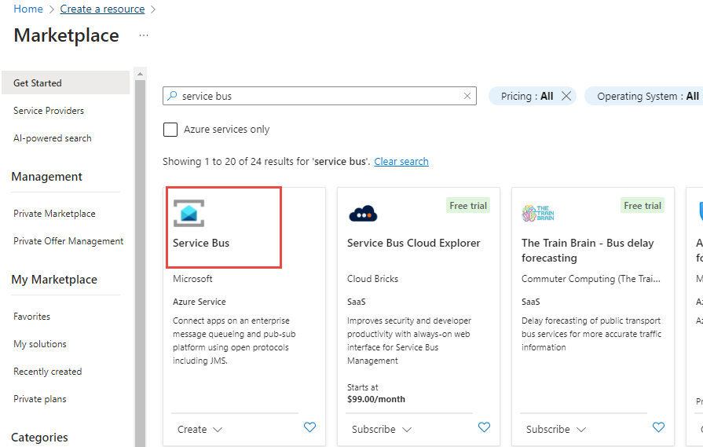](../media/service-bus.png#lightbox)

1. Select **Create**.

1. Enter the appropriate details for your namespace and then select **Next**.

   > [!div class="mx-imgBorder"]
   > [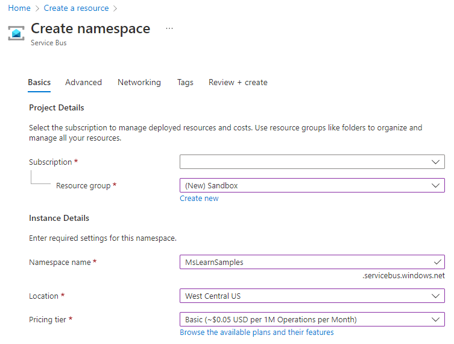](../media/create-namespace.png#lightbox)

1. Select **Review + create** again.

1. Select **Create**.

    It might take a few minutes for your resource to provision. When it's finished, you should see something similar to the following image in the **Notifications** area of your Azure portal:

   > [!div class="mx-imgBorder"]
   > 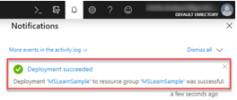

1. After your resource has been created, go to your newly created
    namespace to create a new queue.

   > [!div class="mx-imgBorder"]
   > [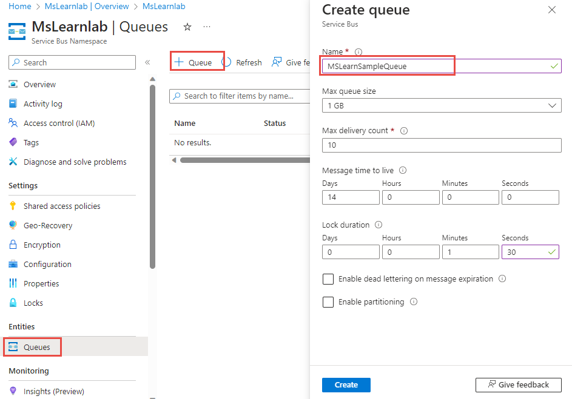](../media/create-queue.png#lightbox)

1. Note a few items that are found in your namespace so that Dataverse has the correct credentials to connect to your new queue. For this procedure, use the existing Shared access policy that was auto created as part of your namespace. If you want further access limitations, you can create a Shared access policy for your individual queue as well.

   > [!div class="mx-imgBorder"]
   > [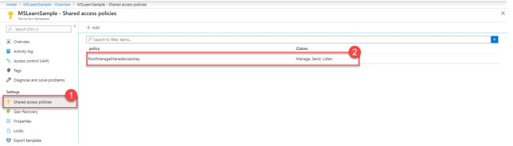](../media/policies.png#lightbox)

1. From within your Shared access policy, copy your **Primary Connection String** and store it for future use because you need this string as part of your Service Bus Endpoint configuration in Dataverse:

   > [!div class="mx-imgBorder"]
   > 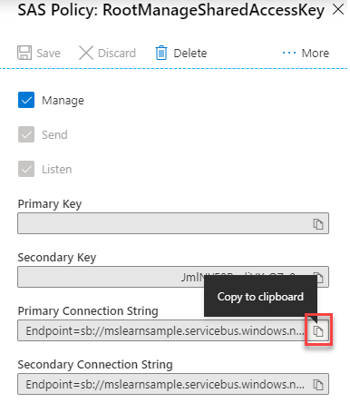

## Register Service Bus endpoint in Dataverse

Now that you have set up a message queue in Azure, you can provide Dataverse with the required configuration information to access it.

> [!NOTE]
> You use Dataverse's Plug-in Registration Tool to configure the publishing of your Dataverse data to your Service Bus. This tool is provided as part of Microsoft's Dataverse developer tooling, which is found at NuGet. For more information on how to install the Plug-in Registration Tool through NuGet, see [Download tools from NuGet](/power-apps/developer/common-data-service/download-tools-nuget/?azure-portal=true). You can also install and launch the plug-in registration tool using the Power Platform CLI tool command (**pac tool prt**).

1. Open the Plug-in Registration Tool and connect to your Dataverse environment.

1. When connected to the environment, register your Service Bus Endpoint by selecting **Register** and then selecting **Register New Service Endpoint**.

   > [!div class="mx-imgBorder"]
   > [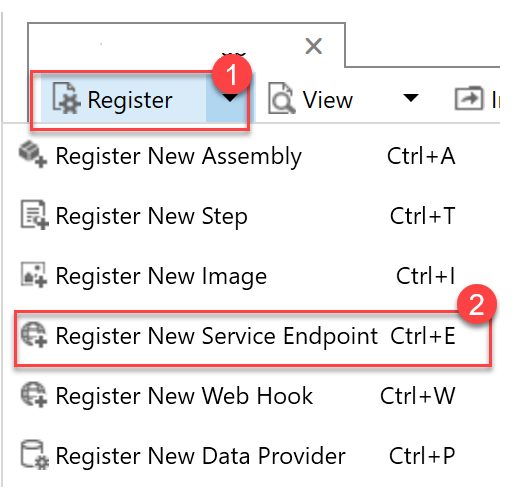](../media/register.png#lightbox)

1. Copy and paste the **Primary Connection String** value that you referenced earlier when setting up your Service Bus instance, and then select **Next**.

   > [!div class="mx-imgBorder"]
   > [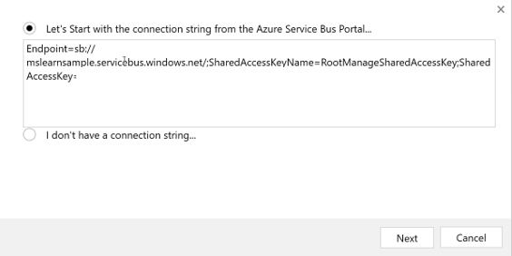](../media/connection.png#lightbox)

1. All the fields from your connection string should prepopulate on the form. For this example, you write a one-way queue publisher, so you can leave the **Designation Type** as **Queue**. Dataverse supports many other designation types to support various messaging protocols.

   Enter your queue name into the **Queue Name** field and specify **Message Format** as **JSON**. Dataverse supports the .NETBinary, JSON, and XML message formats. You're using JSON for this message because it's become an industry standard messaging format because of its portability and lightweight nature. Lastly, to have your user information sent to your queue, you can select **UserId** in the **User Information Sent** drop-down list.

   > [!div class="mx-imgBorder"]
   > 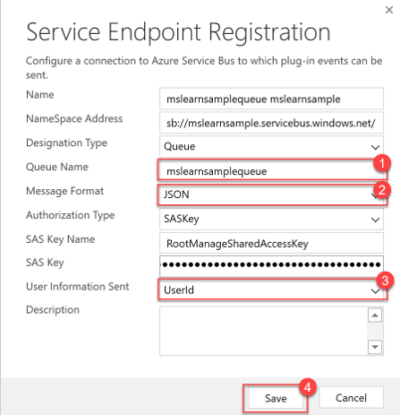

## Register a Service Bus integration step

In this scenario, you register an integration step that publishes a message to a Service Bus queue every time an account row is created. By registering a step, you can define the table and message combination. You can also define what conditions cause the message that is being processed by Dataverse to be sent on the Service Bus to the Azure queue.

1. Register a new step for your Service Endpoint by right-clicking and selecting **Register New Step**.

1. Enter the following details to register a new integration step that is started on creation of an account row. Make sure that you clear the **Delete AsyncOperation if StatusCode = Successful** flag. Clearing this flag is only for testing purposes so you can verify that the created System Job rows show that the Service Bus integration step has successfully started on creation of an account row. In a real-world production scenario, we recommend that you leave this value selected.

   > [!div class="mx-imgBorder"]
   > [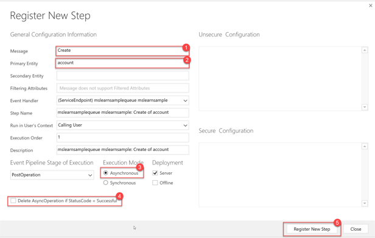](../media/new-step.png#lightbox)

## Test your Service Bus integration

Test your Service Bus integration with the following steps:

1. To test your Service Bus integration, go to your Dataverse environment and create an account.

1. To see if the integration ran, go to **Admin center**.

   > [!div class="mx-imgBorder"]
   > [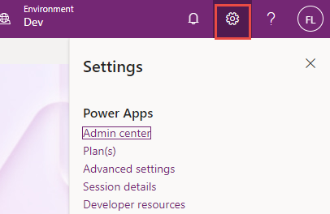](../media/admin-center.png#lightbox)

1. Expand the **Audit and logs** section and **System jobs**.

   > [!div class="mx-imgBorder"]
   > [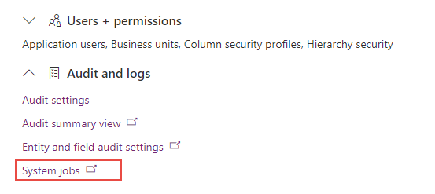](../media/system-jobs.png#lightbox)

1. Verify that your integration step ran successfully by viewing it in the **System Jobs** view. If it ran successfully, the **Status Reason** should be **Succeeded**. You also use this view to troubleshoot integration runs if an error occurs. If there's a failure, open the System Job record to view the error information.

   > [!div class="mx-imgBorder"]
   > [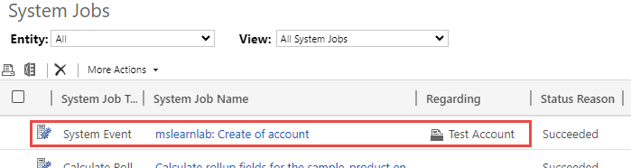](../media/status.png#lightbox)

1. Because the integration step ran successfully, you can now verify that the account creation message has arrived in your Service Bus queue by going to the queue in the Azure portal.

   > [!div class="mx-imgBorder"]
   > [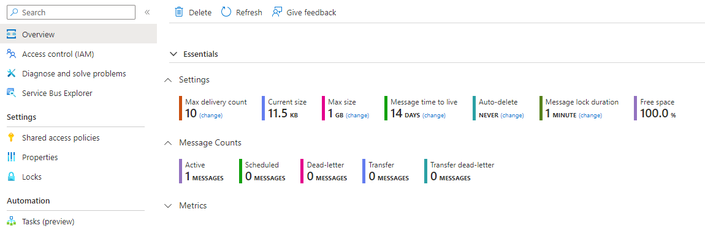](../media/queue.png#lightbox)
