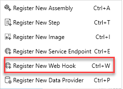
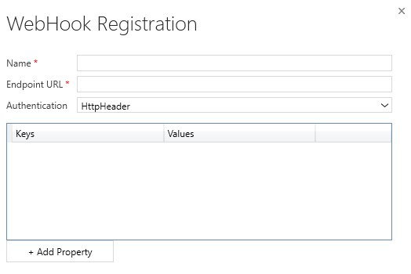
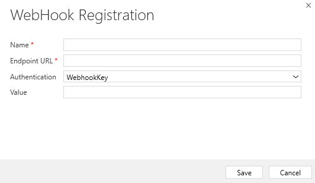
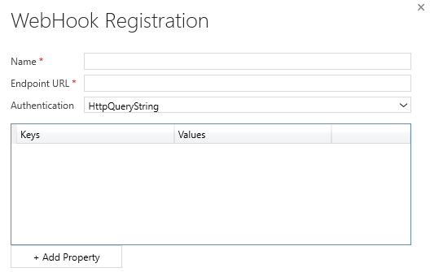

Another method for publishing events from Microsoft Dataverse to an external service is registering webhooks. A webhook is an HTTP-based mechanism for publishing events to any Web API-based service you choose. This method allows you to write custom code hosted on external services as a point-to-point integration.

## Webhooks vs. Azure Service Bus

When considering integration mechanisms, you have a few available options. It's important that you consider various elements when choosing a given method.

Consider using **Azure Service Bus** when:

- High-scale asynchronous processing/queueing is a requirement.

- Multiple subscribers might need to consume a given Dataverse event.

- You want to govern your integration architecture in a centralized location.

Consider using **webhooks** when:

- Synchronous processing against an external system is required as part of your process (Dataverse only supports asynchronous processing against Service Bus Endpoints).

- The external operation that you're performing needs to occur immediately.

- You want the entire transaction to fail unless the external service successfully processes the webhook payload.

- A third-party Web API endpoint already exists that you want to use for integration purposes.

- Shared Access Signature (SAS) authentication isn't preferred or feasible (webhooks support authentication through authentication headers and query string parameter keys).

## Webhook authentication options

The following table describes the three authentication options that you can use to consume a webhook message from a given endpoint.

| Type | Description |
|------|-------------|
| HttpHeader | Includes one or more key value pairs in the header of the HTTP request. Example: `Key1: Value1, Key2: Value2` |
| WebhookKey | Includes a query string by using code as the key and a value that is required by the endpoint. When registering the webhook by using the Plug-in Registration Tool, only enter the value. Example: `?code=00000000-0000-0000-0000-000000000001` |
| HttpQueryString | Includes one or more key value pairs as query string parameters. Example: `?Key1=Value1&Key2=Value2` |

## Webhook HTTP headers

The following table shows the HTTP headers that are passed to your service as part of a
webhook call. You can use these headers as part of your processing
method if you're writing a new webhook processor.

| Key | Value Description |
|-----|-------------------|
| x-request-id | A unique identifier for the request |
| x-ms-dynamics-organization | The name of the tenant who sent the request |
| x-ms-dynamics-entity-name | The logical name of the entity that passed in the execution context data |
| x-ms-dynamics-request-name | The name of the event that the webhook step was registered for |
| x-ms-correlation-request-id | Unique identifier for tracking any type of extension. This property is used by the platform for infinite loop prevention. In most cases, this property can be ignored. This value can be used when you're working with technical support because it can be used to query telemetry to understand what occurred during the entire operation. |
| x-ms-dynamics-msg-size-exceeded | Sent only when the HTTP payload size exceeds the 256 KB |

## Register a webhook endpoint

Webhook endpoint registration is performed similarly to Service Endpoint registration, by using the Plug-in Registration Tool.

Within the Plug-in Registration Tool, you can register a new webhook by selecting **Register New Web Hook** under the **Register** menu option.

> [!div class="mx-imgBorder"]
> 

The following **WebHook Registration** dialog box appears, where you can configure the URL of your endpoint, along with any authentication options.

### Register with HTTPHeader authentication

If **HttpHeader** authentication is selected, the screen prompts you to add **Keys** and **Values** that are passed as part of your HTTP request. Commonly, the keys and values might include an OAuth bearer token or other various authentication formats.

> [!div class="mx-imgBorder"]
> [](../media/add-property.png#lightbox)

### Register with WebhookKey authentication

If **WebhookKey** is specified as the **Authentication** method, a query string is passed to the URL with the given key in the format ```?code=[web hook key]```.  This method is useful when you're calling Azure Functions because it uses this code parameter by default to perform its authentication.

> [!div class="mx-imgBorder"]
> [](../media/webhook-key.png#lightbox)

### Register with HTTPQueryString authentication

You can pass Query String parameters by specifying **HttpQueryString** as the **Authentication** option. As with the **HTTPHeader** option, it presents the option to pass a set of key/value pairs to your Web API. You could also pass other parameters, and even manually pass the "code" parameter that is expected through Azure Functions in this manner.

> [!div class="mx-imgBorder"]
> [](../media/query.png#lightbox)
