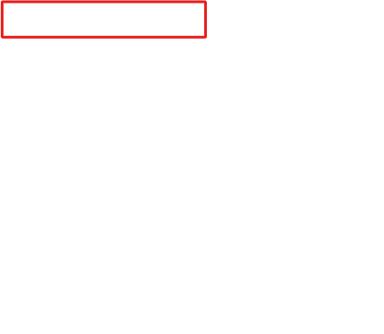

The flow triggers when you add a new item to the **Machine Order** table in Microsoft Dataverse.

- It uses the Approvals Service to send an approval request.

- The approver receives an email with options to approve or reject and to add comments.

- After the approver responds, the record in the Machine Order table will be updated with the appropriate approval status.

- An email is sent to the requester informing them whether the machine was approved or rejected.

> [!NOTE]
> Two ways to create a flow are from blank or from a template. In this lab, you'll create the approval flow starting with a blank flow.

> [!NOTE]
> This module is designed for use with the App in a Day instructor-led course. For more information on attending this free, instructor-led course, see [Microsoft Power Platform instructor-led training](https://powerplatform.microsoft.com/instructor-led-training/). On that page, you can [Register for an event](https://events.microsoft.com/allevents/?search=App%20in%20a%20Day&view=list&language=English&clientTimeZone=1&startTime=06:00&endTime=11:00).

> [!NOTE]
> To complete the exercises, you'll need to use a few
> files. Download the [App in a Day files](https://github.com/MicrosoftDocs/mslearn-developer-tools-power-platform/raw/master/in-a-day/AIAD/AppinADayStudentFiles.zip)
> for use in this module. The file folders that are in
> this download include:
>
> - **Completed modules with instructions** - Package files to import the completed exercise steps.
> - **Machine-Order-Data.xlsx** - File used in the exercises.

## Task - Sign in to the Power Apps website

Your first task is to sign in to the Microsoft Power Apps website.

1. Go to [Make Power Apps](https://make.powerapps.com/?azure-portal=true) and make sure that you're in the correct environment.

   > [!div class="mx-imgBorder"]
   > 

1. Select **Solutions** and then select to open the **Contoso Coffee** solution.

## Task - Sign in to the Power Automate website

1. Go to [Power Automate](https://flow.microsoft.com/?azure-portal=true) and make sure that you're in the **correct environment** where you have been building your apps for these labs.

1. Select **Solutions** and then select to open the **Contoso Coffee** solution.

1. Select **New** and then select **Automation > Cloud flow > Automated**.

   > [!div class="mx-imgBorder"]
   > 

## Task - Set up the trigger

Next, you need to set up the trigger, that is, when the flow should run. You can trigger a flow in the following ways:

- Manually, from a Power Apps application

- Manually, from a flow button

- On a fixed schedule

- When an event occurs, such as a new item being added to a table, a new email arriving in a user's inbox, or a new tweet being posted on Twitter that meets certain conditions

In this scenario, you set the flow to trigger when a new item is added to the **Machine Order** table in Microsoft Dataverse.

1. In the **Flow name** box, enter a name for your flow, such as `New machine approval request`.

1. In the **Choose your flow's trigger** box, search for `when a row is added` and then select **When a row is added, modified, or deleted**.

1. Then, select **Create**.

   > [!div class="mx-imgBorder"]
   > 

1. In the trigger, select **Added** from the **Change type** dropdown menu.

1. From the **Table Name** dropdown menu, select **Machine Orders**. You can type `machine orders` to search for it.

1. From the **Scope** dropdown menu, select **Organization**. Scope allows you to limit when your flow runs. For example, if you choose **User**, the flow would only run for orders that you create. In this case, you're choosing **Organization** because you want this flow to run for records that are created by anyone in your entire organization.

   > [!div class="mx-imgBorder"]
   > 

## Task - Add an action to send an approval request

In this next task, you'll add an action to send an approval request.

1. Select **New step**.

   > [!div class="mx-imgBorder"]
   > 

1. Search for `Approvals` and then select **Start and wait for an approval**.

   > [!div class="mx-imgBorder"]
   > 

   The system uses the approval service. For more information, see [Get started with approvals](/power-automate/get-started-approvals/?azure-portal=true).

1. In the **Approval type** dropdown menu, select **Approve/Reject - First to respond**.

   > [!div class="mx-imgBorder"]
   > 

1. In the **Title** field, add some text and one piece of dynamic content. This dynamic content contains the Machine Name of the machine order request. Enter `New machine request for` in the **Title** text box.

1. Select **Machine Name** from the **Dynamic content** pane. (Ensure that you include a space between the word "for" and the Machine name)

   > [!div class="mx-imgBorder"]
   > 

   > [!NOTE]
   > If the **Dynamic content** box is not visible, select the **Add dynamic content** button.
   > [!div class="mx-imgBorder"]
   > 

1. Select the **Assigned to** field and then select **Approver** from the Dynamic content pane. Select the **Add dynamic content** button to show/hide the **Dynamic content** pane.

   > [!div class="mx-imgBorder"]
   > 

   > [!NOTE]
   > Recall from the previous lab that this address is the approver's email address.

1. **Save** your flow.

   > [!NOTE]
   > A warning might display in the Flow checker that Power Automate Approvals has not been installed for your environment. When you run the flow later in the lab it will initiate the provisioning of Power Automate Approvals.

1. Select the **back arrow** next to your flow name in the upper left hand corner.
   > [!div class="mx-imgBorder"]
   > 

1. Now, you're back in your solution. Select your flow and select **edit** in the upper ribbon.

   > [!div class="mx-imgBorder"]
   > 

   > [!NOTE]
   > You are now in the modern flow designer. The new designer provides a more modern experience, is faster, and easier to use, with several features customers have been asking for.
   >
   >The rest of the labs will continue with the modern flow designer look.

1. Select the **Start and wait for an approval** action. In the left hand panel, select **Show all** next to advanced parameters.

   > [!div class="mx-imgBorder"]
   > 

1. Select the **Requestor** field, and then select the lightning bolt icon to access the dynamic content.

   > [!div class="mx-imgBorder"]
   > 

1. Select **Requested By** from the Dynamic content window.

   > [!div class="mx-imgBorder"]
   > 

1. In the **Details** field, enter `A new machine has been requested` and then press the **Enter** key.

1. Select **Machine Name** from the **Dynamic content** pane. Remember, to see they dynamic content select the lighting bolt icon.

   > [!div class="mx-imgBorder"]
   > 

1. Type `, $` and then select **Price.** Rather than scrolling to find your dynamic content, use the search bar for ease to find the **Price** dynamic content.

   > [!div class="mx-imgBorder"]
   > 

1. Press the **Enter** key and then type `Department Contribution: $`.

1. Then, select **Department Contribution** from the Dynamic content pane.

   > [!div class="mx-imgBorder"]
   > 

1. Press the **Enter** key, and then type `Comments:` and select **Comments**.

   > [!div class="mx-imgBorder"]
   > 

1. **Save** your flow.

   > [!NOTE]
   >When saving the flow, you may receive a warning stating your flow was saved, but approvals may not yet be configured.  This is a warning which will resolve itself the first time you run the flow later in the labs.
   >
   >When creating your own approval flows, you might also include a clickable link that will be displayed in the approval email. In this scenario, you could include a link to view machine details in an online catalogue. You would include the **Item link** and **Item link description**.
   >
   > You could also set the **Item link** to deep link into a Power Apps application to view more details about the request. In this scenario, you might pass an OrderID or a MachineID as a URL parameter. Power Apps accepts URL parameters.
