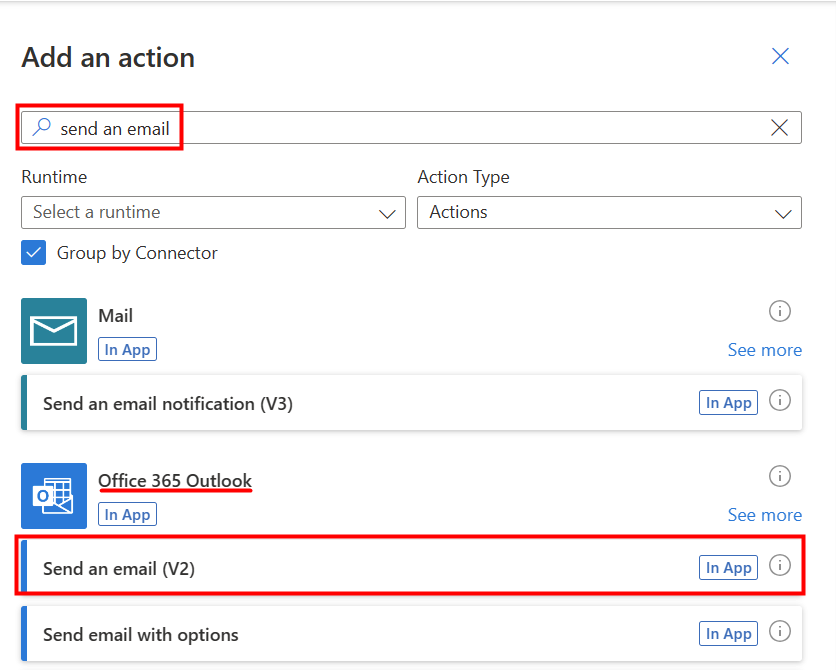
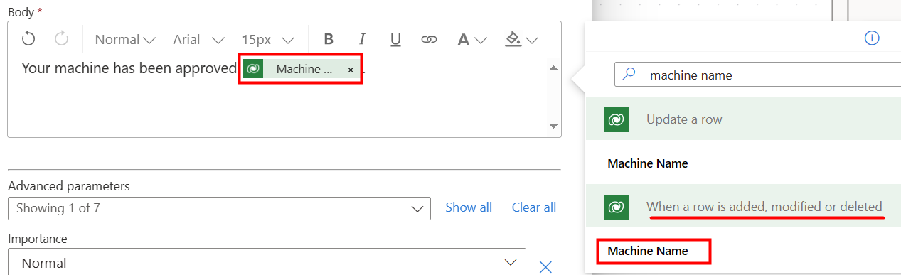

In Power Automate, you can add conditions to take different actions depending on a certain result, in this case, to indicate whether the request was approved or rejected.

> [!NOTE]
> To complete the exercises, you'll need to use a few
> files. Download the [App in a Day files](https://github.com/MicrosoftDocs/mslearn-developer-tools-power-platform/raw/master/in-a-day/AIAD/AppinADayStudentFiles.zip)
> for use in this module. The file folders that are in
> this download include:
>
> - **Completed modules with instructions** - Package files to import the completed exercise steps.
> - **Machine-Order-Data.xlsx** - File used in the exercises.

## Task - Add conditional logic to the flow

In this task, you add conditional logic to the flow by following these steps. If you closed your flow from earlier, you can find your flow in your solution and choose to edit.

1. Select **+** under the Start and wait for an approval action. Then select **Add an action**.

   > [!div class="mx-imgBorder"]
   > 

1. Search for and then select **Condition**.

   > [!div class="mx-imgBorder"]
   > 

1. Select the **Choose a value** box and select **Outcome** from the **Dynamic content** pane. Remember to select the lighting bolt icon to access the dynamic content.

   > [!div class="mx-imgBorder"]
   > 

1. Select **is equal to** for the condition and then type `Approve` for **Value**.

   > [!div class="mx-imgBorder"]
   > 

1. **Save** the flow.

## Task - Set up actions to perform

Now, you set up what actions to perform if the response is approved or not: True branch vs. False branch.

You add two actions:

- Update the record in the **Machine Order** table.

- Send an email to the employee who requested the machine.

Follow the steps to add the actions.

1. In the left **True** box, select the **+** icon and select **Add an action**.

   > [!div class="mx-imgBorder"]
   > 

1. Search for `Update a Row` and select **Update a Row Microsoft Dataverse**.

   > [!div class="mx-imgBorder"]
   > 

1. Select **Machine Orders** from the **Table name** dropdown menu.

1. Select the **Row ID** and then select **Machine Order** from the **Dynamic content** pane.

   > [!div class="mx-imgBorder"]
   > 

   Every time you create a table in Dataverse, a column is automatically created with the same name of the Display Name of the table. This column serves as the unique lookup ID for the record (or row) that was created.

1. Select **Show all** next to Advanced parameters.

1. Select **Approve** from the **Approval Status** dropdown menu.

   > [!div class="mx-imgBorder"]
   > 

1. Select the **Approved Date** field and then select the **fx** icon to write an expression.

   > [!div class="mx-imgBorder"]
   > 

1. Type `utcNow()` in the window above the Function tab and then select **Add**.

   > [!div class="mx-imgBorder"]
   > 

   > [!div class="mx-imgBorder"]
   > 

1. **Save** the flow.

## Task - Add another action

Your next task is to add the send email action to the **True** branch.

1. From within the **True** branch, select the **+** icon and then select **Add an action**.

   > [!div class="mx-imgBorder"]
   > 

1. Search for `send an email` and select **Send an email (V2) - Office 365 Outlook**.

   > [!div class="mx-imgBorder"]
   > 

1. Select **Sign in** if prompted.

   > [!div class="mx-imgBorder"]
   > 

1. Select the **To** field and then select **Enter custom value**.

   > [!div class="mx-imgBorder"]
   > 

1. Select **Requested By** from the Dynamic content window from under the **When a row is added, modified, or deleted** action for the **To** field.

   > [!div class="mx-imgBorder"]
   > 

1. In the **Subject** field, enter `Your machine order has been approved!`

1. In the **Body** field, enter `Your machine has been approved` and select **Machine Name** from the Dynamic content pane from under **When a row is added, modified or deleted**.

   > [!div class="mx-imgBorder"]
   > 

1. In the **Body** field, hit return to move to the next line. Enter `Estimated ship date:` and select **Estimated Ship Date** under **Update row** from the Dynamic content pane.

   > [!NOTE]
   > If estimated ship date is selected from **When a row is added, modified, or deleted** NO ship date returns in the email as this value isn't populated until the approval status column contains data. This was the business rule set up earlier in a previous exercise.

   > [!div class="mx-imgBorder"]
   > 

1. In the **Body** field, hit return to move to the next line. Select **Response summary** from the Dynamic content pane from under **Start and wait for an approval**.

   > [!div class="mx-imgBorder"]
   > 

   > [!NOTE]
   > If you don't have a Microsoft Office 365 mailbox set up, you can use another connector to send the email, such as Outlook.com, Gmail, or SendGrid.

1. Select **Save**. You can now close out of this flow designer browser tab.
