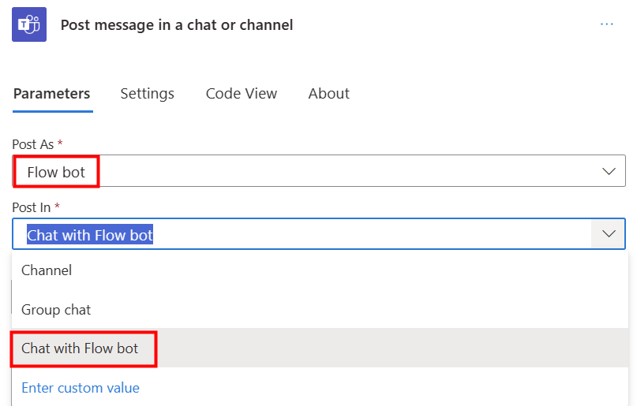

In this optional exercise, you modify the existing flow to include a Microsoft Teams notification for your approval flow.

> [!NOTE]
> To complete the exercises, you'll need to use a few
> files. Download the [App in a Day files](https://github.com/MicrosoftDocs/mslearn-developer-tools-power-platform/raw/master/in-a-day/AIAD/AppinADayStudentFiles.zip)
> for use in this module. The file folders that are in
> this download include:
>
> - **Completed modules with instructions** - Package files to import the completed exercise steps.
> - **Machine-Order-Data.xlsx** - File used in the exercises.

## Task - Modify the flow

Before you begin, ensure that you're currently viewing the **New machine approval request** cloud flow, within the **Contoso Coffee** solution, in **Edit** mode.

To modify the flow, follow these steps:

1. In the **True** branch of the condition, select the **+** icon and select **Add an action** after the **Send an email action**.

   > [!div class="mx-imgBorder"]
   > 

1. Search for `post a message` and select **Post a message in a chat or channel**. You might be prompted to sign in.

   > [!div class="mx-imgBorder"]
   > 

1. Select **Flow bot** from the **Post as** dropdown menu, and then select **Chat with Flow bot** from the **Post in** dropdown menu.

   > [!div class="mx-imgBorder"]
   > 

1. Select **Requested By** in the **Recipient** field.

   > [!div class="mx-imgBorder"]
   > 

1. In the **Message** box, type `Your machine has been approved` and then select **Machine Name** from under the dynamic content **When a row is added...** header.

   > [!div class="mx-imgBorder"]
   > 

1. Move to the next line of the message, then type `Estimated Ship Date:` and then select **Estimated Ship Date** from under the dynamic content **Update a row** header. Important to make sure you select the **Estimated Ship Date** from the **Update a row** action.

   > [!div class="mx-imgBorder"]
   > 

1. In the **False** branch of the condition, select the **+** icon and select **Add an action** after the **Send an email action**.

   > [!div class="mx-imgBorder"]
   > 

1. Search for `post a message` and select **Post a message in a chat or channel**.

   > [!div class="mx-imgBorder"]
   > 

1. Select **Flow bot** from the **Post as** dropdown menu, and then select **Chat with Flow bot** from the **Post in** dropdown menu.

   > [!div class="mx-imgBorder"]
   > 

1. Select **Requested By** in the **Recipient** field.

   > [!div class="mx-imgBorder"]
   > 

1. In the **Message** box, type `Your machine request for ` and then select **Machine Name** from under the dynamic content **When a row is added...** header, then type `was not approved`.

   > [!div class="mx-imgBorder"]
   > 

1. Select **Save** to save your changes.

## Task - Test your modified flow

Now that the flow is modified, you're ready to test it.

1. In another tab, go to [Microsoft Teams](https://teams.microsoft.com/?azure-portal=true).

1. Open a third tab and run the Machine Ordering app. Select a machine and submit an approval request.

1. You should receive an email with options to approve or reject the request. Select **Approve**.

1. After you select **Submit**, a message and a notification should display in the **Chat** tab on your app bar from the flow bot. Select to open the chat. Wait a moment if it doesn't appear immediately.

  The approval of the request should be visible.

   > [!div class="mx-imgBorder"]
   > 
