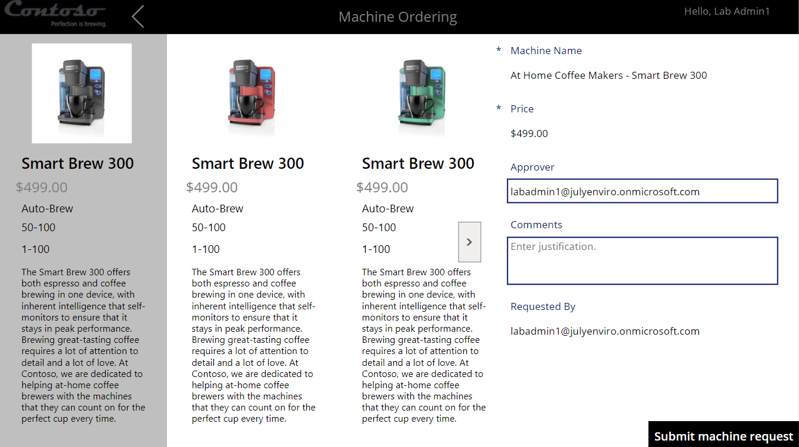
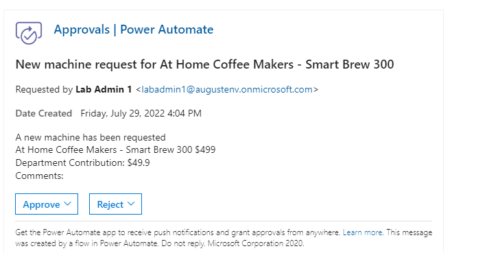
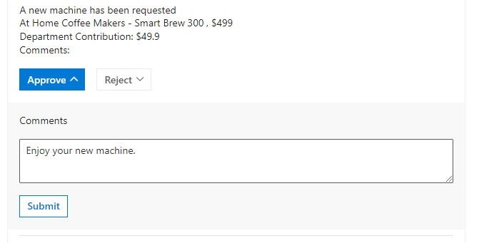
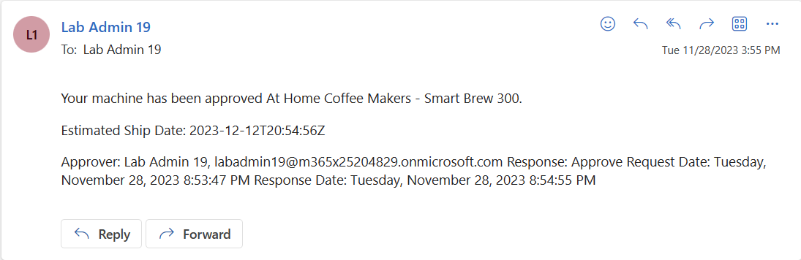
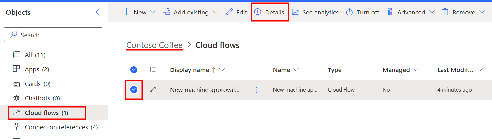
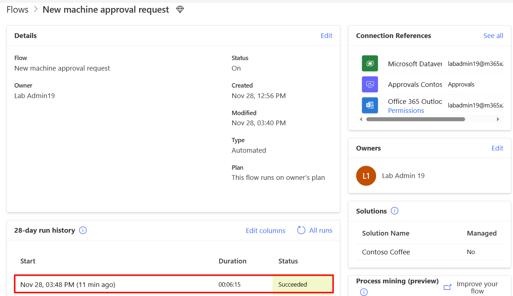

> [!NOTE]
> To complete the exercises, you'll need to use a few
> files. Download the [App in a Day files](https://github.com/MicrosoftDocs/mslearn-developer-tools-power-platform/raw/master/in-a-day/AIAD/AppinADayStudentFiles.zip)
> for use in this module. The file folders that are in
> this download include:
>
> - **Completed modules with instructions** - Package files to import the completed exercise steps.
> - **Machine-Order-Data.xlsx** - File used in the exercises.

To test the flow, you complete the following tasks:

1. Run the Machine Ordering app and submit an approval request.

1. Verify that the request was sent to the approver.

1. Approve the request.

1. Verify that the Microsoft Dataverse record was updated and that an email was sent back to the requestor.

## Task - Test the cloud flow

> [!NOTE]
> When a new machine record is added to the Machine Order table in Microsoft Dataverse, it might take up to 10 minutes for the flow to trigger.
>
> A warning might display in the Flow checker that Power Automate Approvals has not been installed for your environment. Run the flow to initiate the provisioning of Power Automate Approvals.

To test the cloud flow, follow these steps.

1. To submit a machine request, go to [Make Power Apps](https://make.powerapps.com/?azure-portal=true).

1. Select **Apps** and then start the **Machine Ordering** canvas app.

1. Select a few machines and then select **Compare**.

   > [!div class="mx-imgBorder"]
   > 

1. Select one of the machines and then provide an email address in the **Approver** field. If the prior lab modules were done, the approver field should populate with your current email address. If it doesn't, enter your email address for the account you use.

   > [!div class="mx-imgBorder"]
   > 

1. Provide a comment and then select **Submit machine request**.

1. Select **OK**.

1. The flow runs and sends an email to the manager email that you provided. The request for approval email resembles the following image. It includes **Machine information**, **Price**, **Department Contribution (the calculated field)**, and the **Requester Comment**.

   > [!IMPORTANT]
   > If the flow doesn't run immediately, make sure that you wait for it. It might take up to 10 minutes for the flow to be triggered, this is especially true if approvals were not installed in your environment prior to execution. Future executions of this flow will be quicker.

   > [!div class="mx-imgBorder"]
   > 

1. Select **Approve**.

1. Add a comment and then select **Submit**.

   > [!div class="mx-imgBorder"]
   > 

   The flow continues to run; it updates the row and sends an email to the requestor. The email sent to the requester resembles the following image.

   > [!div class="mx-imgBorder"]
   > 

1. To see your flow runs, go to [Power Automate](https://flow.microsoft.com/?azure-portal=true) and make sure that you're in the correct environment. Select the **Contoso Coffee** solution from the solutions section, select your flow, and select **Details** in the upper ribbon. Notice that the flow is now marked as **Succeeded** in the run history.

   > [!div class="mx-imgBorder"]
   > 

    > [!div class="mx-imgBorder"]
   > 
