In this exercise, you add two actions to the **False** branch.

> [!NOTE]
> To complete the exercises, you'll need to use a few
> files. Download the [App in a Day files](https://github.com/MicrosoftDocs/mslearn-developer-tools-power-platform/raw/master/in-a-day/AIAD/AppinADayStudentFiles.zip)
> for use in this module. The file folders that are in
> this download include:
>
> - **Completed modules with instructions** - Package files to import the completed exercise steps.
> - **Machine-Order-Data.xlsx** - File used in the exercises.

## Task - Add actions

To add actions, follow these steps:

1. If you don't already have the flow open, from Power Automate, select your **Contoso Coffee** solution, select your flow, and select **Edit** from the upper ribbon to open it in **Edit** mode.

   > [!div class="mx-imgBorder"]
   > [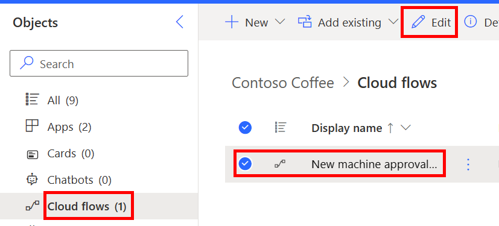](../media/flow-edit.png#lightbox)

1. In the **False** branch of your Condition, select the **+** icon and select **Add an action**.

   > [!div class="mx-imgBorder"]
   > [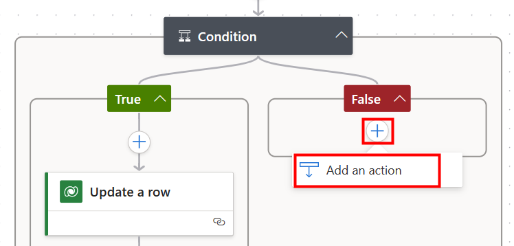](../media/action-button.png#lightbox)

1. Search for `Update a Row` and select **Update a Row (Dataverse)**.

   > [!div class="mx-imgBorder"]
   > [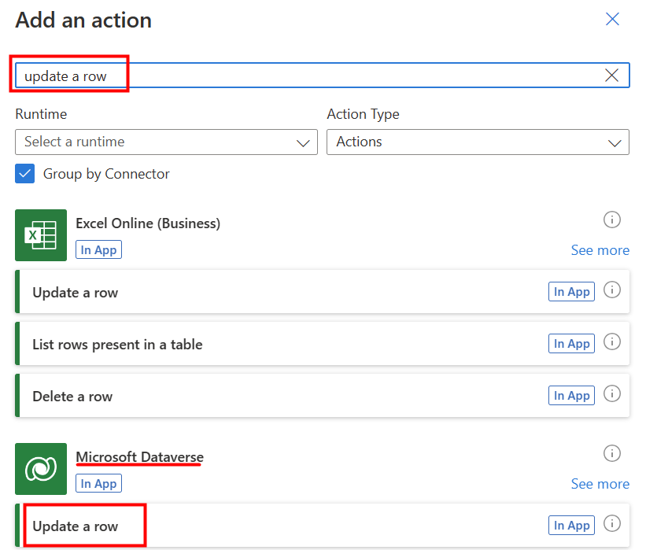](../media/update.png#lightbox)

1. Select **Machine Orders** from the **Table name** dropdown menu, and select **Machine Order** for **Row ID**.

   > [!div class="mx-imgBorder"]
   > [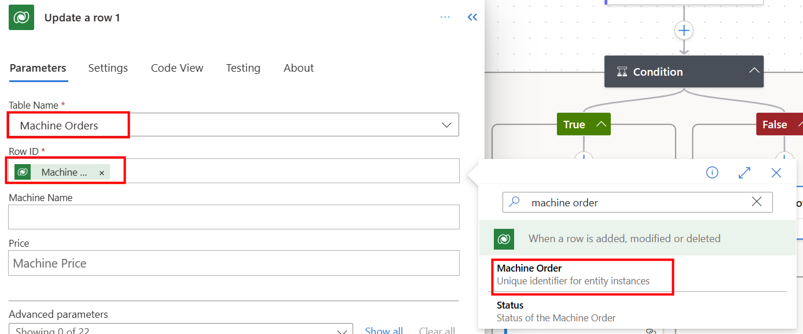](../media/row-id.png#lightbox)

1. Select **Show all** next to **Advanced Parameters**.

1. Select **Reject** for the **Approval Status**.

   > [!div class="mx-imgBorder"]
   > [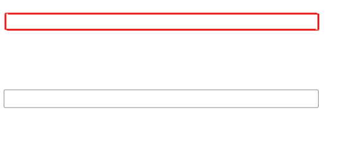](../media/reject.svg#lightbox)

1. In the **False** branch of your Condition, select the **+** icon and select the **Add an action**.

1. Search for `send email` and then select **Send an email (V2) - Office 365 Outlook**.

   > [!div class="mx-imgBorder"]
   > [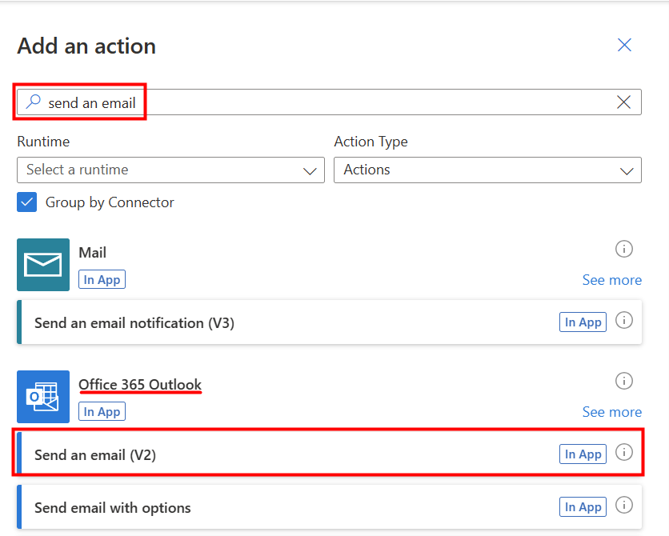](../media/email.png#lightbox)

1. Select the **To** field and then select **Requested By** from the **Dynamic content** pane, under the **When a row is added, modified or deleted** section.

1. Enter `Your machine was not approved` in the **Subject** field.

1. Type `Sorry, your request for` in the body, and then select **Machine Name** from the **Dynamic content** pane, below the **When row is added, modified or deleted** section.

1. Type `was NOT APPROVED.` after the machine name.

1. Hit Return to move to the next line of the body. Select **Response summary** from the **Dynamic content** pane, under the **Start and wait for an approval** section.

   The email should now resemble the following image.

   > [!div class="mx-imgBorder"]
   > [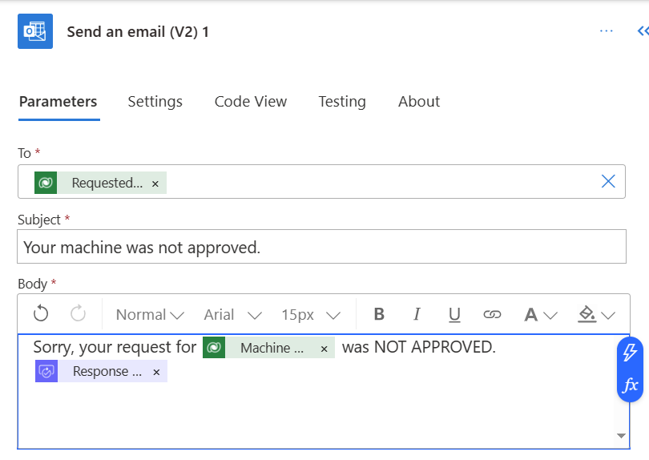](../media/subject.png#lightbox)

1. **Save** the flow.

## Task - Test the updated flow

To test the updated flow, follow these steps:

1. Run the Machine Ordering app and submit an approval request.

1. Run the Machine Ordering app. Select a machine and then submit an approval request.

1. You should receive an email with options to **Approve** or **Reject** the request. Select **Reject** this time and then enter some comments, such as "`Machine no longer available.`" When you're finished, select **Submit**.

   > [!div class="mx-imgBorder"]
   > [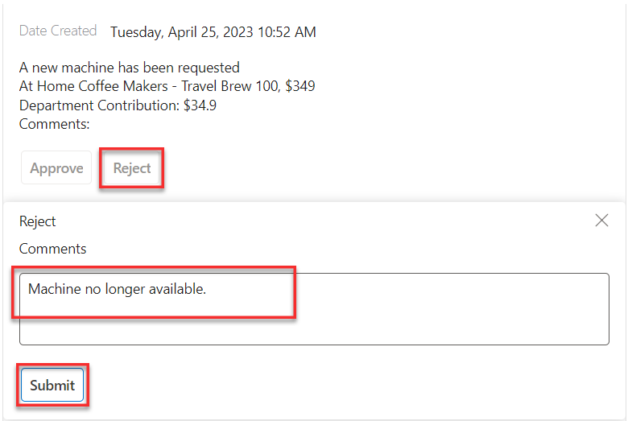](../media/submit.png#lightbox)

1. Confirm that the requestor receives an email informing them that their machine approval request was rejected.

   > [!div class="mx-imgBorder"]
   > [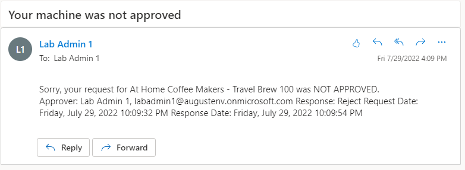](../media/rejection.png#lightbox)

1. Go to [Make Power Apps](https://make.powerapps.com/?azure-portal=true), select **Apps**, and choose the **Machine Procurement** application, and select **Play** from the tool bar.

   > [!div class="mx-imgBorder"]
   > [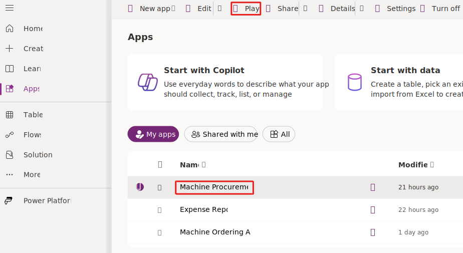](../media/procurement.svg#lightbox)

1. Machine Orders now show the **Approval Status** column.

   > [!div class="mx-imgBorder"]
   > [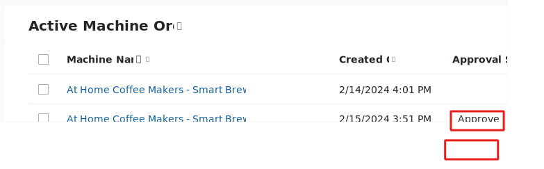](../media/status.svg#lightbox)

## Task - Go to the approval center

To access the approval center, follow these steps:

1. Use the Machine Ordering app to submit a few more approval requests.

1. Go to [Power Automate](https://flow.microsoft.com/?azure-portal=true), make sure that you're in the correct environment, and then sign in with your lab credentials if prompted.

1. In the left-hand pane, select **Approvals**.

   > [!div class="mx-imgBorder"]
   > [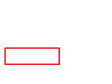](../media/approvals-button.svg#lightbox)

   All pending approval requests should be visible in the **Received** section.

1. Approve or reject a request from this screen. The details are displayed in the right pane, where you can **Add a comment** and **Confirm**.

   > [!div class="mx-imgBorder"]
   > [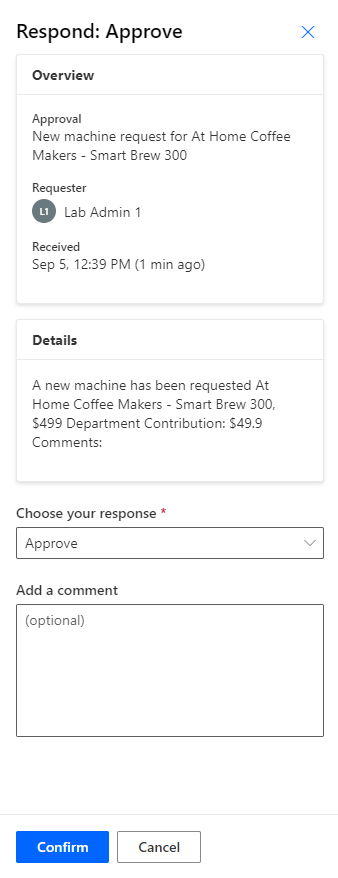](../media/respond.png#lightbox)

   The request is no longer visible because it already processed.

   > [!NOTE]
   > All approval requests that are sent to the current signed-in user will be visible in the approval center, including approvals that are sent from any app or flow.

1. You can also use the approval center to view all requests that you sent and are awaiting response from the approver. Select the **Sent** tab in the upper part of the screen to view all requests that you sent.

1. Open the Power Automate mobile app on your mobile device.

1. Sign in and switch to the environment where the flow is deployed.

   > [!div class="mx-imgBorder"]
   > [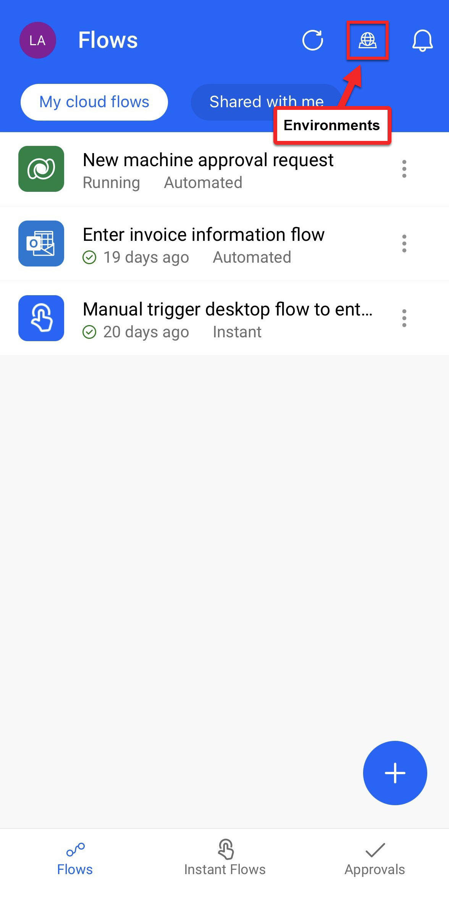](../media/confirm.png#lightbox)

1. Select **Approvals** in the bottom right and view all pending approvals.

   > [!div class="mx-imgBorder"]
   > [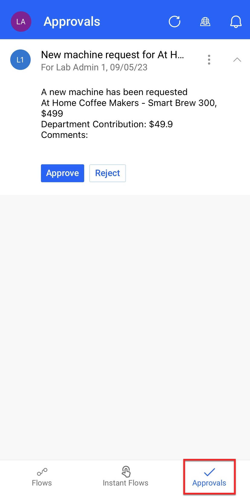](../media/pending.png#lightbox)

1. You can quickly approve or reject these pending requests from this screen.

1. If you have push notifications turned on and you're signed in to the flow mobile app, when you receive a new approval request, it triggers a push notification on your phone. Try out this functionality.

Congratulations, you successfully completed this lab. You created your Power Apps application and flow, and you connected them to a Microsoft Dataverse table. Now, you're ready to build your own apps and workflows.
