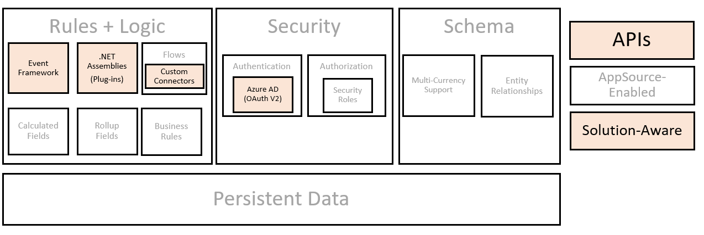

To better understand how to extend Microsoft Dataverse, learning about its underlying architecture is valuable. Since Dataverse is a software-as-a-service platform, most of these details, such as underlying data storage, are successfully abstracted from us as developers, and we can focus on more interesting items, such as building custom business logic and integrating with other applications. The below graphic illustrates these underlying components, highlighted sections are areas where a developer building Power Apps model-driven applications can extend leveraging code.

> [!NOTE]
> This unit is only intended to be a high-level view of the Dataverse architecture. For more in-depth analysis of the Dataverse, refer to the [Dataverse Developer Guide](/power-apps/developer/data-platform/overview?azure-portal=true).

> [!div class="mx-imgBorder"]
> 

## Metadata and solution-awareness

Microsoft Dataverse provides a metadata-driven architecture that gives the flexibility to create custom tables and extend existing tables. Using this approach, we can easily transport our customizations across environments using Dataverse solutions.

When you create a custom table, metadata about that table, its columns and relationships to other tables, and user interface components (such as forms and views) are stored as metadata in the Dataverse environment in a solution.

Dataverse also exposes an OData V4 RESTful endpoint, known as the Dataverse Web API that can be leveraged to view and manipulate metadata within a Dataverse environment. One common mechanism for browsing your solution's metadata is to leverage the Metadata Browser. Microsoft provides this as a solution that you can install into your app. The current links can be found at [Browse table definitions in your environment](/power-apps/developer/common-data-service/browse-your-metadata?azure-portal=true). This tool can be installed into any model-driven Power App. In addition, [XrmToolbox](https://www.xrmtoolbox.com/plugins/MsCrmTools.MetadataBrowser/?azure-portal=true) has a community metadata browser tool available.

## .NET assemblies (plug-ins)

Dataverse plug-ins are managed code classes registered to run when specific Dataverse events occur. When the event occurs, they pass through a plug-in execution pipeline that consists of three stages: Pre-Validation, Pre-Operation, and PostOperation. When registering a plug-in, choose in which stage your code should run. The stage you should choose depends on the purpose of the extension. You don't need to apply all your business logic within a single step. 

You can configure plug-ins to run either synchronously or asynchronously. Synchronous plug-ins execute immediately according to the stage and execution order; the entire operation will wait until they're complete. Asynchronous plug-ins are executed via a system job after the operation completes and can only be registered for the PostOperation stage.

Plug-ins can also be developed and registered to implement the logic for Dataverse Custom API messages. 

## APIs

The Dataverse APIs provide a programmatic interface for applications and services to access business data, organization information, and metadata stored in Dataverse.  Developers can use a RESTful OData Web API or typed .NET classes via the SDK for .NET assemblies, depending on how they need to consume the API. The Web API is the most broadly applicable because it only requires the ability to make HTTP requests and consume HTTP responses. You must use the SDK for .NET for Dataverse plug-in development. For most other uses, you can choose the API style that best fits what you are building.

