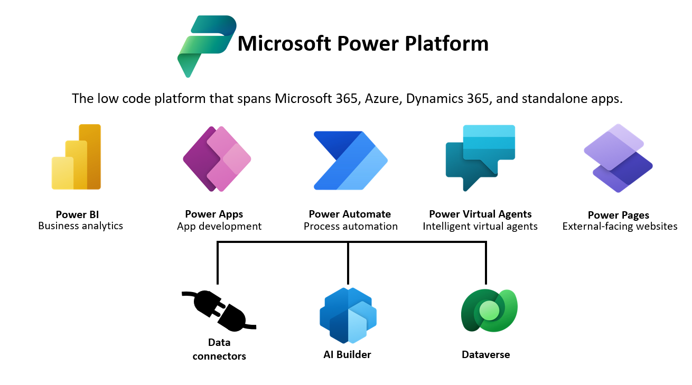

> [!div class="mx-imgBorder"]
> 

Extending the Dataverse platform with code is required whenever some level of automation needs to occur that existing features don't support, and you can't easily build the automation with low-code techniques like Power Automate. These types of extensibility points frequently execute as server-side code via an asset called a plug-in. Flow and other options enable asynchronous automation and logic, but they couldn't do all that plug-ins do today for synchronous rules. Plug-ins are still required when you need to implement synchronous operations within a model-driven application.

Dataverse plug-in development is an essential skill contained in a Power Platform developer's arsenal and is one of the most common tasks required of us.

## Building model-driven apps

The Dataverse metadata and tables store all data and table-level business logic that defines a model-driven app. Also, the method in which we package and distribute customizations to a model-driven app (via solutions) is also contained within Dataverse.

## Building client apps 

Dataverse provides a set of APIs that you can use to build any application, whether a custom web application
written in ASP.NET, a Node.js application, a Windows application, or another type of application. There are many benefits to using Dataverse to build your application, a few of which we summarize in the next section.

## Benefits

Each Dataverse environment has a unified set of features that enable you to create business-focused definitions of your organization's data and business processes within various applications. Since data and metadata reside in the cloud, applications are easy to manage and administer. A built-in security model allows you to control access to tables and functionality for different sets of users within your organization.

Microsoft has built many first-party applications on Dataverse, including Dynamics 365 Sales, Dynamics 365 Customer Service, and Dynamics 365 Field Service. By building your apps on the same Dataverse platform, you can easily interact with data constructed by other applications within the Dataverse.
