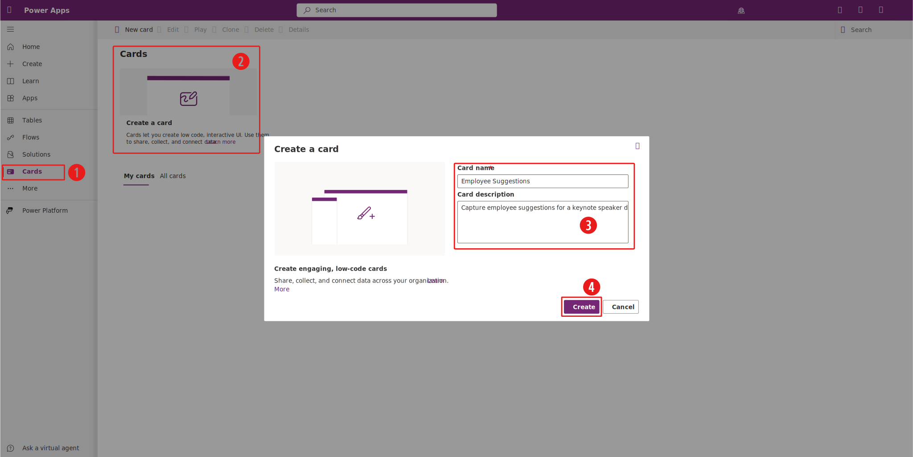
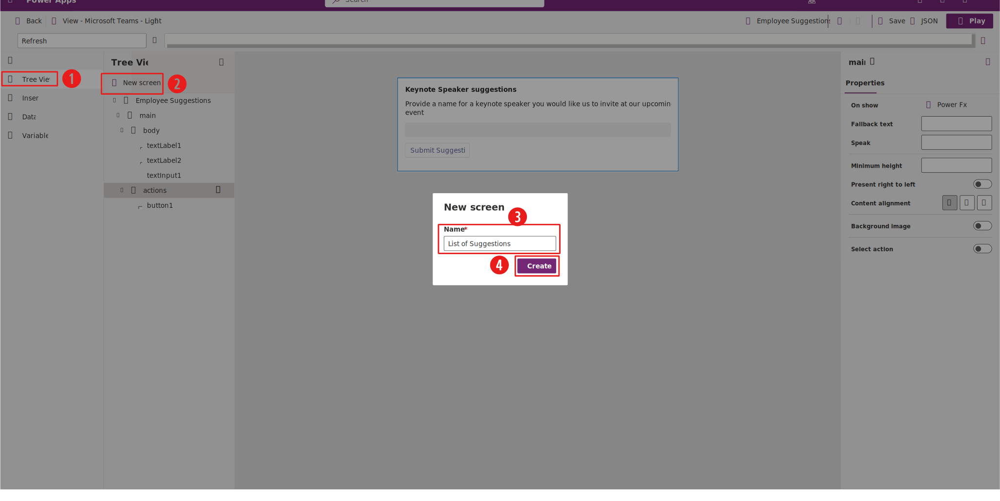

In this exercise, you use the card designer studio to create a card that captures employee suggestions.

## Scenario

You're responsible for an upcoming event and are required to gather employee suggestions for a keynote speaker. You want to minimize the risk of repeated names, so all employees must be able to view the complete list of suggestions.

## Exercise steps (video)

The following video demonstrates the steps for this exercise. The following sections provide detailed instructions.

> [!VIDEO https://www.microsoft.com/videoplayer/embed/RW1g8a3]

## Exercise

To create a card, sign in to [Power Apps Studio](https://make.powerapps.com/?azure-portal=true) and then select an environment where you have **Create** permissions, such as a developer environment.

To access the card designer studio, follow these steps:

1. Select **Cards** in the left navigation pane.

1. Select the **Create a card** tile.

1. Provide a card name and card description.

1. Select **Create**.

   > [!div class="mx-imgBorder"]
   > 

To capture the keynote speaker suggestions from employees, create a collection variable by following these steps:

1. Select **Variables** in the main navigation pane.

1. Select **+ New variable** in the tool pane.

1. Provide a name, such as **KeynoteSpeaker**.

1. Select **Collection** for the variable type.

1. Provide a name, such as **SpeakerName** and then select **Text** as the type for the first column of the **Collection structure**.

1. Select **Permanent** for the **Persistence** variable.

1. Select **Save** to create the variable.

   > [!div class="mx-imgBorder"]
   > 

To display the list of suggestions, create a new screen by following these steps:

1. Select **Tree View** in the main navigation pane.

1. Select **+ New screen** in the tool pane.

1. Provide a name, such as **List of Suggestions**.

1. Select **Create** to complete the process.

   > [!div class="mx-imgBorder"]
   > 

After you create the screen, follow these steps:

1. Confirm that you've selected **Tree View** from the main navigation pane.

1. Select **textlabel1** from the newly created screen in the tool pane.

1. In the **Properties** pane, modify the **text** value with a property, such as **List of Suggestions**.

1. Select **textLabel2** from the newly created screen in the tool pane.

1. In the **Properties** pane, provide the collection variable name (**KeynoteSpeaker** in this exercise) for the **Repeat for every** property.

1. In the Power Fx formula bar, define the **Text** property with the **ThisItem.SpeakerName** Power Fx formula.

To return to the main screen from the list of suggestions, follow these steps:

1. Select **+ Insert** in the main navigation pane.

1. Select **Button** in the **Input** section of the tool pane.

1. In the **Properties** pane, provide a title for the button, such as **Back**.

1. Select **Run PowerFx** for the **Type** property.

1. In the Power Fx formula bar, define the **Verb** property with the Power Fx formula **Back()**.

To capture the keynote speaker suggestions in the main screen, follow these steps:

1. Select **Tree View** in the main navigation pane.

1. Modify the text label descriptions of the main screen with meaningful information for the card users.

1. Select **+ Insert** in the main navigation pane.

1. To provide a field where the card users enter their suggestions, select **Text input** in the **Input** section of the tool pane.

1. To allow users to confirm their submission, select **Button** in the tool pane.

1. In the **Properties** pane, provide a title for the button, such as **Submit Suggestion**. Select **Run PowerFx** for the **Type** property.

1. To add the suggestion to the collection variable, define the **Verb** property in the Power Fx formula bar as: **`Collect(KeynoteSpeaker,{SpeakerName:textInput1});`**.

1. To provide the user with the option of viewing the list of suggestions, select **Button** in the tool pane.

1. In the **Properties** pane, provide a title for the button, such as **View List of Suggestions**. Select **Run PowerFx** for the **Type** property.

1. To navigate to the screen that you created in the previous steps of this exercise, define the **Verb** property in the Power Fx formula as: **Navigate('List of Suggestions')**.

You've now created a card to capture and view keynote speaker suggestions. To test the card, select **Save** and then **Play**.

## Optional exercise

Instead of using a variable to store the suggestions, you could use a Dataverse record to store them. The following video demonstrates the steps for creating a card for this scenario:

1. Provide a Dataverse table to capture the suggestions by offsite events.

1. Modify the card to be related to a specific offsite event.

1. Modify the card to update the suggestions column for the event record.

> [!VIDEO https://www.microsoft.com/videoplayer/embed/RW1fXKS]

## Next steps

You've now learned how to create a Power Apps card that captures employee suggestions. Next, you'll learn how to send Power Apps cards to users.
