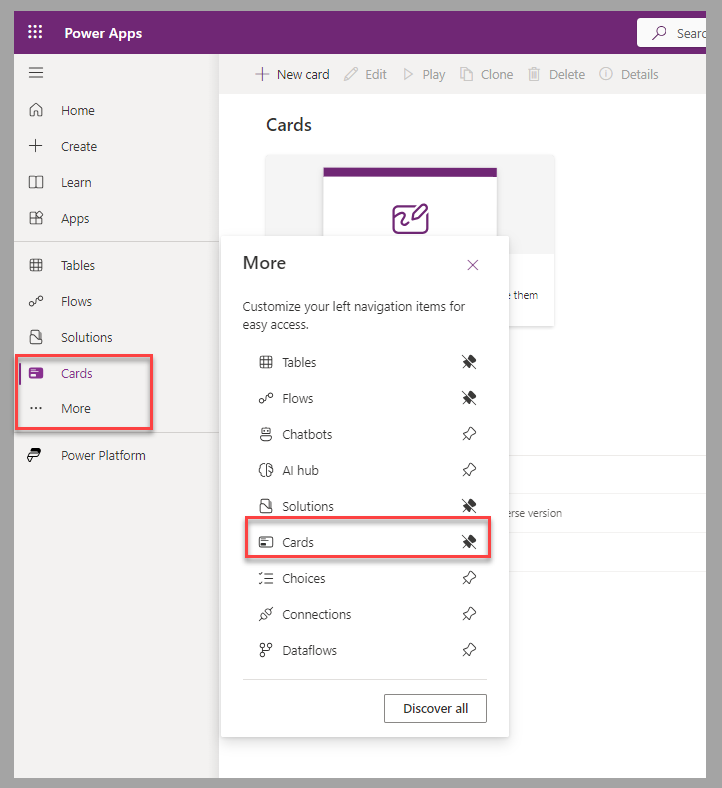
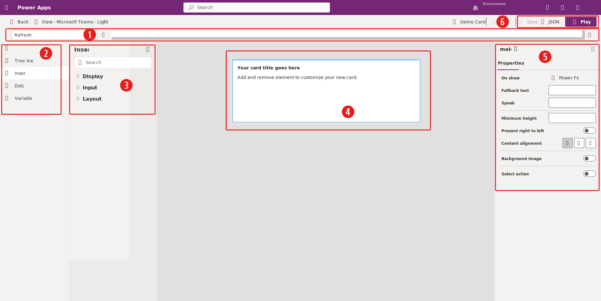

To design cards for Power Apps, you need to access the **Cards** section in the left navigation pane of [Power Apps Studio](https://make.powerapps.com/?azure-portal=true). If the option is unavailable, you can access and optionally pin it to the main navigation pane from the **More** menu option. To create cards within a Dataverse solution, select **Card** from the **New** menu in Power Apps Studio.

> [!div class="mx-imgBorder"]
> 

The Power Apps card designer studio contains the following areas (numbers corresponding with the ensuing screenshot):

1. Power Fx formula bar

1. Main navigation pane

1. Tool pane

1. Card canvas

1. Properties pane

1. Save and Play buttons

> [!div class="mx-imgBorder"]
> 

## Card design considerations

If you have experience creating canvas apps, the card designer studio might seem similar to the canvas app studio. Make sure that you understand and consider the following differences, even if it's your first time using Power Apps:

- The size of the card is automatically based on the content of the card and location in which it's shared.

- Multiple screens can be part of a card. You can manage navigation by using the **Navigate** and **Back** functions. Also, you can display a screen below the existing one by adding a **Button** control with a **Type** property set to **Show Screen**.

- To list multiple records, the **Repeat for every** property of a control must be bound to the data value that it references. The records can be from a Dataverse table or a collection variable.

- To help group controls together, containers are provided:

  - **Button set** for a group of button controls

  - **Column set** for a group of column controls

  - **Fact set** for a series of name/value pairs

  - **Image set** for a group of image controls

  - **Container** for a collection of different controls

- You can test cards in **light** or **dark** display modes.

- Variables in cards are always global and offer the following options, which are unavailable in canvas apps:

  - **Persistence** - You can set the variable as permanent; whenever the card is opened, the last set value remains.

  - **Customization** - You can set the variable as an input variable; the sender can set its value when the card is shared.

For more information, see [Controls and properties in cards | Microsoft Learn](/power-apps/cards/controls/control-reference/?azure-portal=true).

## Next steps

Now, you've learned how to design cards for Power Apps. Next, you'll apply those learned concepts and create a card to capture employee suggestions.
