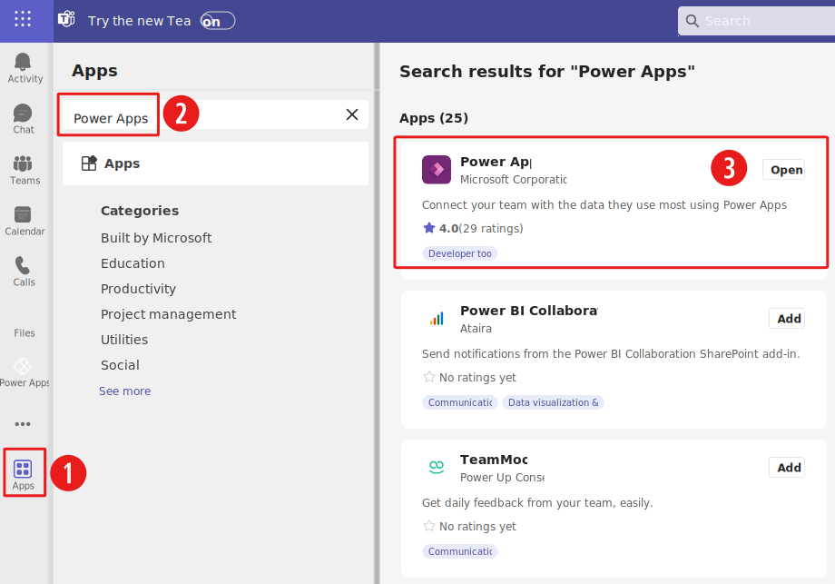
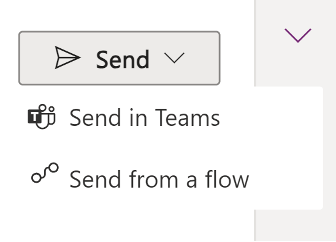
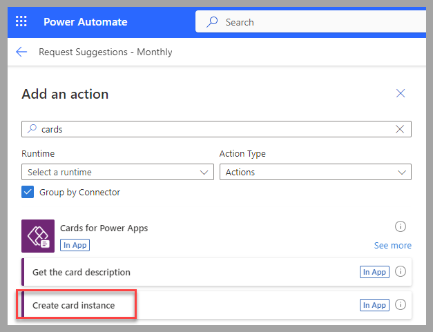

You can create cards for your personal use. However, many scenarios require input from people at the same organization as the maker.

You can display and share a Power Apps card in Microsoft Teams within the context of a chat, a meeting, or a channel.

To provide the interactive experience of the card, you need to ensure that Power Apps is installed in Teams.

> [!div class="mx-imgBorder"]
> 

The two methods for sending a card in Teams are:

- Copy the link from the **Play** option of the card designer studio.

  > [!div class="mx-imgBorder"]
  > 

- Use a Microsoft Power Automate cloud flow with the **Create card instance** action from the **Cards for Power Apps** connector.

  > [!div class="mx-imgBorder"]
  > 

The first method requires a manual intervention from the card maker. For scenarios where an automated process is required to send the card, such as **Send an approval card when a new vendor is created**, consider using the Power Automate cloud flow method.

## Next steps

You've now learned how to send a Power Apps card manually or automatically in a Teams channel, chat, or meeting. Next, you'll apply your learned knowledge to share the employee suggestions card that you previously created.
